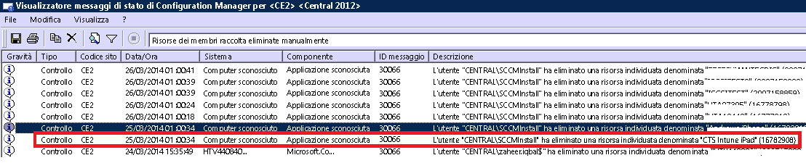

# Risolvere i problemi di registrazione dei dispositivi in Intune

Questo argomento contiene suggerimenti per la risoluzione dei problemi di registrazione dei dispositivi. Se queste informazioni non consentono di risolvere il problema, vedere [Come ottenere supporto per Microsoft Intune](how-to-get-support-for-microsoft-intune.md) per trovare altri modi per ottenere assistenza.

## Procedure iniziali per la risoluzione dei problemi

Prima di iniziare la risoluzione dei problemi, verificare di aver configurato Intune correttamente per consentire la registrazione. Per informazioni su tali requisiti di configurazione, vedere:

-   [Prepararsi alla registrazione dei dispositivi in Microsoft Intune](/intune/deploy-use/gprerequisites-for-enrollment.md)
-   [Configurare la gestione dei dispositivi iOS e Mac](/intune/deploy-use/set-up-ios-and-mac-management-with-microsoft-intune)
-   [Configurare la gestione di Windows Phone e Windows 10 Mobile con Microsoft Intune](/intune/deploy-use/set-up-windows-phone-management-with-microsoft-intune)
-   [Configurare la gestione dei dispositivi Windows](/intune/deploy-use/set-up-windows-device-management-with-microsoft-intune)

Gli utenti dei dispositivi gestiti possono raccogliere log di registrazione e diagnostica da sottoporre all'analisi dell'amministratore. Le istruzioni per raccogliere i log sono disponibili nell'articolo:

- [Send Android diagnostic data logs to your IT administrator using a USB cable (Inviare i log dei dati Android di diagnostica all'amministratore IT tramite un cavo USB)](/intune/enduser/send-diagnostic-data-logs-to-your-it-administrator-using-a-usb-cable-android)
- [Send Android diagnostic data logs to your IT administrator using email (Inviare i log dei dati Android di diagnostica all'amministratore IT tramite posta elettronica)](/intune/enduser/send-diagnostic-data-logs-to-your-it-administrator-using-email-android)
- [Send Android enrollment errors to your IT administrator (Inviare gli errori di registrazione Android all'amministratore IT)](/intune/enduser/send-enrollment-errors-to-your-it-administrator-android)
- [Send iOS enrollment errors to your IT administrator (Inviare gli errori di registrazione iOS all'amministratore IT)](/intune/enduser/send-errors-to-your-it-admin-ios)

## Problemi di registrazione generali
Questi problemi possono verificarsi in tutte le piattaforme di dispositivi.

### Numero massimo dispositivi raggiunto
**Problema**: durante la registrazione viene visualizzato un errore sul dispositivo, ad esempio **Portale aziendale temporaneamente non disponibile** su un dispositivo iOS, e DMPdownloader.log in Gestione configurazione contiene l'errore **Numero massimo dispositivi raggiunto**.

**Risoluzione:** per impostazione predefinita, gli utenti non possono registrare più di 5 dispositivi.

#### Verificare il numero di dispositivi registrati e consentiti.

1.  Nel portale di amministrazione di Intune verificare che l'utente non abbia più di 5 dispositivi assegnati.

2.  Nel portale di amministrazione di Intune (in Amministrazione\Gestione dei dispositivi mobili\Regole di registrazione) verificare che il limite di registrazione dei dispositivi sia impostato su 5.

Per eliminare i dispositivi, gli utenti possono accedere all'URL seguente: [https://byodtestservice.azurewebsites.net/](https://byodtestservice.azurewebsites.net/).

Gli amministratori possono eliminare i dispositivi nel portale di Azure Active Directory.

#### Per eliminare i dispositivi nel portale di Azure Active Directory

1.  Accedere a [http://aka.ms/accessaad](http://aka.ms/accessaad) oppure fare clic su** Amministrazione** &gt; **Azure AD** da [https://portal.office.com](https://portal.office.com).

2.  Accedere con l'ID organizzazione usando il collegamento sul lato sinistro della pagina.

3.  Creare una sottoscrizione di Azure, se non se ne possiede una. Se si dispone di un account a pagamento, questa operazione non richiede l'uso di una carta di credito né un pagamento. Fare clic sul collegamento per l'abbonamento relativo alla **registrazione gratuita di Azure Active Directory**.

4.  Selezionare **Active Directory** e quindi l'organizzazione.

5.  Selezionare la scheda **Utenti** .

6.  Selezionare l'utente di cui si desidera eliminare i dispositivi.

7.  Scegliere **Dispositivi**.

8.  Rimuovere i dispositivi nel modo opportuno, ad esempio quelli che non sono più in uso o quelli con definizioni errate.

> [!NOTE]

> È possibile evitare il limite di registrazione usando i manager di registrazione dispositivi, come descritto in [Registrare i dispositivi di proprietà dell'azienda con Manager di registrazione dispositivi in Microsoft Intune](/intune/deploy-use/enroll-corporate-owned-devices-with-the-device-enrollment-manager-in-microsoft-intune).
>
> Un account utente che viene aggiunto al gruppo Manager di registrazione dispositivi non sarà in grado di completare la registrazione quando vengono applicati i criteri di accesso condizionale per l'accesso utente specifico.

### Portale aziendale temporaneamente non disponibile
**Problema**: nel dispositivo viene visualizzato l'errore **Portale aziendale temporaneamente non disponibile**.

#### Risoluzione dell'errore Portale aziendale temporaneamente non disponibile

1.  Rimuovere l'app Portale aziendale di Intune dal dispositivo.

2.  Sul dispositivo aprire il browser, passare a [https://portal.manage.microsoft.com](https://portal.manage.microsoft.com)e provare ad accedere con un account utente.

3.  Se l'utente non riesce ad accedere, provare a usare un'altra rete.

4.  Se il problema persiste, verificare che le credenziali dell'utente siano sincronizzate correttamente con Azure Active Directory.

5.  Se l'utente accede correttamente, un dispositivo iOS richiede in genere di installare l'app Portale aziendale di Intune ed eseguire la registrazione. In un dispositivo Android è necessario installare manualmente l'app Portale aziendale di Intune e quindi ripetere il tentativo di registrazione.

### Autorità MDM non definita
**Problema**: viene visualizzato l'errore **Autorità MDM non definita**.

#### Risoluzione dell'errore Autorità MDM non definita

1.  Verificare che l'autorità MDM sia impostata correttamente per la versione del servizio Intune in uso, ovvero per Intune O365 MDM o System Center Configuration Manager con Intune. Per Intune, l'autorità MDM è impostata in **Amministratore** &gt; **Gestione dei dispositivi mobili**. Per Configuration Manager con Intune, è necessario impostare l'autorità MDM quando si configura il connettore Intune, mentre in O365 è un'impostazione di **Dispositivi mobili**.

    > [!NOTE]
    > Dopo aver impostato l'autorità MDM, è possibile modificarla solo contattando il supporto tecnico, come descritto in [Come ottenere supporto per Microsoft Intune](how-to-get-support-for-microsoft-intune.md).

2.  Verificare che le credenziali dell'utente siano sincronizzate correttamente con Azure Active Directory, controllando che il nome dell'entità utente corrisponda alle informazioni di Active Directory nel portale per gli account.
    Se il nome dell'entità utente non corrisponde alle informazioni di Active Directory:

    1.  Disattivare DirSync sul server locale.

    2.  Eliminare l'utente non corrispondente dall'elenco utenti del **portale per gli account di Intune** .

    3.  Attendere circa un'ora per consentire al servizio di Azure rimuovere i dati errati.

    4.  Attivare nuovamente DirSync e controllare se l'utente è ora sincronizzato correttamente.

3.  In uno scenario in cui si usa System Center Configuration Manager con Intune, verificare che l'utente disponga di un ID utente cloud valido:

    1.  Aprire SQL Management Studio.

    2.  Connettersi al database appropriato.

    3.  Aprire la cartella del database, quindi individuare e aprire la cartella **CM_DBName**, dove DBName è il nome del database del cliente.

    4.  Nella parte superiore fare clic su **Nuova query** ed eseguire le query seguenti:

        -   Per visualizzare tutti gli utenti: `select * from [CM_ DBName].[dbo].[User_DISC]`

        -   Per visualizzare utenti specifici, usare la query seguente, in cui %testuser1% rappresenta nomeutente@dominio.com per l'utente che si vuole cercare: `select * from [CM_ DBName].[dbo].[User_DISC] where User_Principal_Name0 like '%testuser1%'`

        Dopo aver scritto la query, fare clic su **Esegui**.
        Dopo che sono stati restituiti i risultati, cercare l'ID clouduser.  Se non viene trovato alcun ID, l'utente non dispone di una licenza per usare Intune.

### Non è possibile creare criteri o registrare dispositivi se il nome della società contiene caratteri speciali
**Problema:** non è possibile creare criteri o registrare dispositivi.

**Risoluzione:** nell'[interfaccia di amministrazione di Office 365](https://portal.office.com/) rimuovere i caratteri speciali dal nome della società e salvare le informazioni aziendali.

### Non è possibile accedere o registrare dispositivi quando si dispone di più domini verificati
**Problema:** quando si aggiunge un secondo dominio verificato ad AD FS, gli utenti con il suffisso del nome principale (UPN) dell'utente del secondo dominio potrebbero non essere in grado di accedere ai portali o di registrare dispositivi.

**Risoluzione:** i clienti di Microsoft Office 365 che usano l'accesso Single Sign-On (SSO) tramite AD FS 2.0 e dispongono di più domini di primo livello per i suffissi UPN degli utenti all'interno dell'organizzazione (ad esempio, @contoso.com o @fabrikam.com) devono distribuire un'istanza separata del Servizio federativo AD FS 2.0 per ogni suffisso.  È ora disponibile il [rollup per AD FS 2.0](http://support.microsoft.com/kb/2607496) che interagisce con l'opzione **SupportMultipleDomain** per consentire al server AD FS di supportare questo scenario senza richiedere altri server AD FS 2.0. Per altre informazioni, vedere [questo blog](https://blogs.technet.microsoft.com/abizerh/2013/02/05/supportmultipledomain-switch-when-managing-sso-to-office-365/).

## Problemi di Android
### Installazione profilo non riuscita
**Problema**: in un dispositivo Android un messaggio indica che **si è verificato un errore di installazione del profilo**.

### Risoluzione dell'errore di installazione del profilo

1.  Verificare che all'utente sia stata assegnata una licenza appropriata per la versione del servizio Intune in uso.

2.  Verificare che il dispositivo non sia già registrato con un altro provider MDM o che non sia già installato un profilo di gestione.

4.  Verificare che Chrome per Android sia configurato come browser predefinito e che i cookie siano abilitati.

### Problemi relativi ai certificati di Android

**Problema**: l'utente riceve il messaggio seguente nel dispositivo: *Non è possibile accedere perché un certificato necessario non è presente nel dispositivo.*

**Risoluzione**:

- L'utente può recuperare il certificato mancante seguendo [queste istruzioni](/intune/enduser/your-device-is-missing-a-required-certificate-android#your-device-is-missing-a-certificate-required-by-your-it-administrator).
- Se l'utente non è in grado di recuperare il certificato, è possibile che manchino i certificati intermedi nel server ADFS. I certificati intermedi sono richiesti da Android per considerare attendibile il server.

È possibile importare i certificati nell'archivio intermedio nel server ADFS o nei proxy come indicato di seguito:

1.  Nel server ADFS avviare **Microsoft Management Console** e aggiungere lo snap-in Certificati per l'**account Computer**.
5.  Trovare il certificato usato dal servizio ADFS e visualizzare il relativo certificato padre.
6.  Copiare il certificato padre e incollarlo in **Computer\Autorità di certificazione intermedie\Certificati**.
7.  Copiare i certificati ADFS, ADFS Decrypting e ADFS Signing, e incollarli nell'archivio personale per il servizio ADFS.
8.  Riavviare i server ADFS.

L'utente può ora accedere al Portale aziendale nel dispositivo Android.

## Problemi di iOS
### Installazione profilo non riuscita
**Problema**: in un dispositivo iOS un messaggio indica che **si è verificato un errore di installazione del profilo**.

### Risoluzione dell'errore di installazione del profilo

1.  Verificare che all'utente sia stata assegnata una licenza appropriata per la versione del servizio Intune in uso.

2.  Verificare che il dispositivo non sia già registrato con un altro provider MDM o che non sia già installato un profilo di gestione.

3.  Passare a [https://portal.manage.microsoft.com](https://portal.manage.microsoft.com) e provare a installare il profilo quando richiesto.

4.  Verificare che Safari per iOS sia configurato come browser predefinito e che i cookie siano abilitati.

### Il dispositivo iOS registrato non viene visualizzato nella console quando si usa System Center Configuration Manager con Intune
**Problema:** l'utente registra il dispositivo iOS, ma non viene visualizzato nella console di amministrazione di Configuration Manager. Il dispositivo non indica che è stato registrato. Cause possibili:

- È possibile che il connettore Intune sia stato registrato in un account e poi registrato in un altro account.
- È possibile che il certificato MDM sia stato scaricato da un account e usato con un altro account.

**Risoluzione:** attenersi alla procedura seguente:

1. Disabilitare iOS all'interno di Connettore Windows Intune.
    1. Fare clic con il pulsante destro del mouse sull'abbonamento di Intune e selezionare **Proprietà**.
    1. Nella scheda "iOS", deselezionare l'opzione "Abilita registrazione iOS".

1. In SQL, attenersi alla procedura seguente nel database CAS

    1. update SC_ClientComponent_Property set Value2 = '' where Name like '%APNS%'
    1. delete from MDMPolicy where PolicyType = 7
    1. delete from MDMPolicyAssignment where PolicyType = 7
    1. update SC_ClientComponent_Property set Value2 = '' where Name like '%APNS%'
    1. delete from MDMPolicy where PolicyType = 11
    1. delete from MDMPolicyAssignment where PolicyType = 11
    1. DELETE Drs_Signals
1. Riavviare il servizio SMS Executive o riavviare il server CM

1. Ottenere un nuovo certificato APN e caricarlo: fare doppio clic sulla sottoscrizione Intune nel riquadro a sinistra di Configuration Manager. Selezionare **Crea richiesta certificato per servizio APN** e seguire le istruzioni.
## Problemi durante l'uso di System Center Configuration Manager con Intune
### I dispositivi mobili scompaiono
**Problema:** dopo la registrazione in Configuration Manager, il dispositivo mobile viene eliminato dalla raccolta, ma conserva il profilo di gestione ed è elencato nel gateway CSS.

**Risoluzione**: questo problema può verificarsi perché è presente un processo personalizzato che rimuove i dispositivi non aggiunti a un dominio oppure perché l'utente ha ritirato il dispositivo dalla sottoscrizione. Per convalidare e verificare quale processo o account utente ha rimosso il dispositivo dalla console di Configuration Manager, attenersi alla procedura seguente.

#### Controllare in che modo è stato rimosso il dispositivo

1.  Nella console di amministrazione di Configuration Manager selezionare **Monitoraggio** &gt; **Stato del sistema** &gt; **Query messaggi di stato**.

2.  Fare clic con il pulsante destro del mouse su **Risorse dei membri raccolta eliminate manualmente** e scegliere **Mostra messaggi**.

3.  Selezionare una data e un'ora appropriate o le ultime 12 ore.

4.  Trovare il dispositivo in questione ed esaminare in che modo è stato rimosso. L'esempio seguente mostra che l'account SCCMInstall ha eliminato il dispositivo tramite un'applicazione sconosciuta.

    

5.  Verificare che in Configuration Manager non sia presente un'attività pianificata, uno script o un altro processo che potrebbe eliminare automaticamente dispositivi mobili o non appartenenti a un dominio oppure dispositivi correlati.

### Altri errori di registrazione di iOS
Nella sezione relativa agli [errori che si verificano durante la registrazione del dispositivo in Intune](/intune/enduser/using-your-ios-or-mac-os-x-device-with-intune) della documentazione dei dispositivi per gli utenti viene specificato un elenco di errori di registrazione di iOS.

## Problemi relativi al PC

### The machine is already enrolled (Il computer è già registrato) - Errore hr 0x8007064c
**Problema:** la registrazione ha esito negativo e genera l'errore **The machine is already enrolled** (Il computer è già registrato). Il log di registrazione visualizza l'errore **hr 0x8007064c**.

È possibile che sia dovuto al fatto che il computer è stato registrato in precedenza oppure è stata registrata l'immagine clonata di un computer. Il certificato dell'account precedente è ancora presente nel computer.

**Risoluzione:**

1. Dal menu **Start** scegliere **Esegui** -> **MMC**.
1. **File** -> **Aggiungi o rimuovi snap-in**.
1. Fare doppio clic su **Certificati**, scegliere **Account del computer**, **Avanti** e selezionare **Computer locale**.
1. Fare doppio clic su **Certificati (computer locale)** e scegliere **Certificati personali**.
1. Cercare il certificato Intune rilasciato da Sc_Online_Issuing ed eliminarlo se presente
1. Se esistente, eliminare la chiave di registro seguente: ** HKEY_LOCAL_MACHINE\SOFTWARE\Microsoft\OnlineManagement regkey** e tutte le sottochiavi.
1. Tentare nuovamente la registrazione.
1. Se il computer non può essere ancora registrato, cercare ed eliminare questa chiave, se esistente: **KEY_CLASSES_ROOT\Installer\Products\6985F0077D3EEB44AB6849B5D7913E95**.
1. Tentare nuovamente la registrazione.

    > [!IMPORTANT]
    > Questa sezione, metodo o attività contiene procedure che spiegano come modificare il Registro di sistema. L'errata modifica del Registro di sistema può tuttavia causare problemi gravi. Verificare quindi di attenersi attentamente alla procedura. Per una maggiore protezione, eseguire il backup del Registro di sistema prima di modificarlo. In caso di problemi, sarà quindi possibile ripristinare il Registro di sistema.
    > Per altre informazioni su come eseguire il backup e il ripristino del Registro di sistema, leggere [Come eseguire il backup e il ripristino del Registro di sistema in Windows](https://support.microsoft.com/en-us/kb/322756)

## Codici degli errori di registrazione generali

|Codice errore|Possibile problema|Soluzione suggerita|
|--------------|--------------------|----------------------------------------|
|0x80CF0437 |L'orologio del computer client non è impostato sull'ora corretta.|Assicurarsi che l'orologio e il fuso orario nel computer client siano impostati sull'ora e sul fuso orario corretti.|
|0x80240438, 0x80CF0438, 0x80CF402C|Impossibile connettersi al servizio Intune. Verificare le impostazioni proxy del client.|Verificare che la configurazione del proxy nel computer client sia supportata da Intune e che il computer client disponga di accesso a Internet.|
|0x80240438, 0x80CF0438|Non sono configurate impostazioni proxy in Internet Explorer e nel sistema locale.|Impossibile connettersi al servizio Intune. Controllare le impostazioni proxy del client e verificare che la configurazione proxy nel computer client sia supportata da Intune. Verificare anche che il computer client disponga dell'accesso a Internet.|
|0x80043001, 0x80CF3001, 0x80043004, 0x80CF3004|Il pacchetto di registrazione non è aggiornato.|Scaricare e installare il pacchetto del software client più recente dall'area di lavoro Amministrazione.|
|0x80043002, 0x80CF3002|L'account è in modalità di manutenzione.|Quando l'account è in modalità di manutenzione, non è possibile registrare nuovi computer client. Per visualizzare le impostazioni dell'account, accedere al proprio account.|
|0x80043003, 0x80CF3003|L'account è stato eliminato.|Verificare che l'account e la sottoscrizione a Intune siano ancora attivi. Per visualizzare le impostazioni dell'account, accedere al proprio account.|
|0x80043005, 0x80CF3005|Il computer client è stato rimosso.|Attendere alcune ore, rimuovere le versioni precedenti del software client dal computer, quindi riprovare a installare il software client.|
|0x80043006, 0x80CF3006|È stato raggiunto il numero massimo di postazioni consentito per l'account.|L'organizzazione deve acquistare ulteriori postazioni prima che sia possibile registrare più computer client nel servizio.|
|0x80043007, 0x80CF3007|Impossibile trovare il file del certificato nella stessa cartella del programma di installazione.|Estrarre tutti i file prima di avviare l'installazione. Non rinominare o spostare eventuali file estratti: tutti i file devono trovarsi nella stessa cartella altrimenti l'installazione non riuscirà.|
|0x8024D015, 0x00240005, 0x80070BC2, 0x80070BC9, 0x80CFD015|È impossibile installare il software perché un riavvio del computer client è in sospeso.|Riavviare il computer, quindi riprovare a installare il software client.|
|0x80070032|Uno o più prerequisiti per l'installazione del software client non sono stati individuati nel computer client.|Assicurarsi che tutti gli aggiornamenti necessari siano installati nel computer client, quindi riprovare a installare il software client.|
|0x80043008, 0x80CF3008|Impossibile avviare il servizio Microsoft Online Management Updates.|Contattare il supporto tecnico di Microsoft, come descritto in [Come ottenere supporto per Microsoft Intune](how-to-get-support-for-microsoft-intune.md).|
|0x80043009, 0x80CF3009|Il computer client è già registrato al servizio.|È necessario ritirare il computer client prima di potersi registrare nuovamente al servizio.|
|0x8004300B, 0x80CF300B|Impossibile eseguire l'installazione del software client perché la versione di Windows in esecuzione nel client non è supportata.|Intune non supporta la versione di Windows in esecuzione nel computer client.|
|0xAB2|Windows Installer non è in grado di accedere al runtime VBScript per un'azione personalizzata.|L'errore è causato da un'azione personalizzata basata sulle librerie a collegamento dinamico (DLL). Per la risoluzione dei problemi relativi alle DLL potrebbe essere necessario usare gli strumenti descritti in [Supporto tecnico Microsoft KB198038: Strumenti utili per pacchetto e problemi di distribuzione](https://support.microsoft.com/en-us/kb/198038).|
|0x80cf0440|La connessione all'endpoint del servizio è stata terminata.|L'account di valutazione o a pagamento è sospeso. Creare un nuovo account di prova o a pagamento ed eseguire nuovamente la registrazione.|

### Passaggi successivi
Se queste informazioni per la risoluzione dei problemi non sono utili, contattare il supporto Microsoft come descritto in [Come ottenere supporto per Microsoft Intune](how-to-get-support-for-microsoft-intune.md).

<!--HONumber=Sep16_HO4-->

