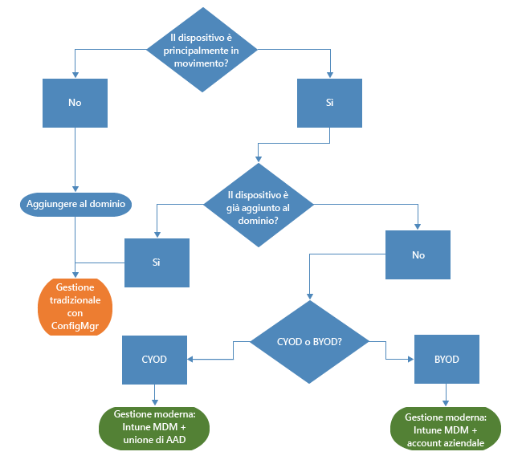
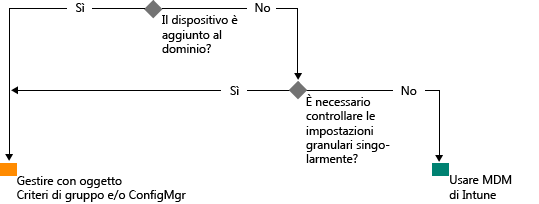

# Verso una gestione moderna di Windows Microsoft Intune

La tendenza a usare i dispositivi personali per il lavoro e a lavorare fuori ufficio sta modificando le modalità di gestione dei dispositivi nelle organizzazioni. Mentre parti specifiche di alcune organizzazioni possono avere l'esigenza di un controllo approfondito e granulare dei dispositivi, altre organizzazioni scelgono di adottare un approccio alla gestione più agile e basato su scenari per supportare le potenzialità della forza lavoro moderna.

In linea con la tradizione di Windows, Windows 10 è il sistema operativo con le migliori funzionalità di gestione per le organizzazioni. Windows supporta funzionalità complete per la gestibilità e la sicurezza grazie a tecnologie come Criteri di gruppo, Active Directory e System Center Configuration Manager. Il sistema offre inoltre un approccio di tipo "mobile-first, cloud-first" per una gestione moderna semplificata dei dispositivi mobili con soluzioni basate sul cloud, come Microsoft Enterprise Mobility Suite (EMS). Le future innovazioni per Windows, rese disponibili grazie a Windows as a Service, sono supportate da servizi cloud complementari e sempre all'avanguardia, come Microsoft Intune, Azure Active Directory, Azure Rights Management Service, Office 365 e Windows Store per le aziende.

Oltre a usufruire di una maggiore flessibilità, le organizzazioni IT hanno anche l'opportunità di sfruttare i vantaggi derivanti dall'innovazione e dal contenimento dei costi. Questo documento offre linee guida sulle strategie che è possibile adottare per la distribuzione e la gestione di Windows 10. Viene inoltre presentata la visione strategica di Microsoft in merito agli strumenti per la gestione dei dispositivi. Quando si esaminano i principi fondamentali della gestione e le relative modalità di applicazione a dispositivi diversi, è importante considerare le quattro fasi del ciclo di vita dei dispositivi:

## Distribuzione e provisioning

Mentre la distribuzione tradizionale del sistema operativo richiede complicate operazioni IT, la gestione dei dispositivi moderna apre le porte alla "gestione chiavi in mano". I reparti IT hanno l'esigenza di trasformare in modo semplice i nuovi dispositivi in dispositivi completamente configurati e gestiti, senza dover ricreare l'immagine.  Il provisioning dinamico è più facile che mai, grazie a servizi per la gestione dei dispositivi basati sul cloud come Microsoft Intune. È anche possibile creare pacchetti di provisioning completi compilati con Progettazione immagine e configurazione di Windows. Sono comunque ancora supportate le tecniche tradizionali per la creazione di immagini, in modo che le organizzazioni possano scegliere di distribuire immagini personalizzate con System Center Configuration Manager.

## Identità e autenticazione

Windows 10 e servizi come Azure Active Directory offrono nuove opportunità per l'identità, l'autenticazione e la gestione basate sul cloud. Nuovi scenari come BYOD e CYOD spingono le aziende a riprogettare le modalità di accesso degli utenti alle risorse e alle app aziendali. È possibile classificare la gestione degli utenti e dei dispositivi in due categorie:

- Dispositivi aziendali (CYOD) o personali (BYOD) usati dagli utenti mobili per app SaaS come Office 365.

  Windows 10 consente ai dipendenti di gestire in autonomia il provisioning dei dispositivi. I dispositivi aziendali possono essere configurati facilmente per l'accesso aziendale tramite l'aggiunta ad Azure AD. In modo analogo, una nuova e più semplice esperienza BYOD consente agli utenti di aggiungere l'account aziendale personale a Windows per accedere alle risorse di lavoro nei dispositivi personali. L'aggiunta ad Azure AD e la registrazione automatica nel sistema MDM di Intune permettono in combinazione di attivare uno stato aziendale gestito per i dispositivi con [un singolo semplice passaggio](https://blogs.technet.microsoft.com/ad/2015/08/14/windows-10-azure-ad-and-microsoft-intune-automatic-mdm-enrollment-powered-by-the-cloud/), interamente dal cloud. L'aggiunta ad Azure AD è anche una soluzione valida per il personale temporaneo, i partner o altri dipendenti part-time. Questi account possono essere mantenuti separati dal dominio AD locale, garantendo comunque l'accesso alle risorse aziendali necessarie.
- PC e tablet aggiunti a un dominio che usano applicazioni e risorse tradizionali per cui è necessaria l'autenticazione o che accedono a risorse altamente sensibili o classificate in locale

  I dispositivi Windows 10 aggiunti a un dominio di Active Directory locale vengono registrati automaticamente in Azure AD. Gli utenti potranno così sfruttare tutti i vantaggi aggiuntivi delle esperienze di Windows 10, come l'accesso Single Sign-On alle risorse nel cloud e locali da qualsiasi posizione, il roaming aziendale delle impostazioni, Microsoft Passport for Work e Windows Hello. Per gestire i PC e i tablet aggiunti a un dominio sarà necessario continuare a usare il client di System Center Configuration Manager o Criteri di gruppo.

Esaminare i ruoli all'interno dell'organizzazione e identificare gli utenti o i dispositivi che richiedono l'aggiunta al dominio, valutando la possibilità di passare gli altri ad Azure AD. In [questo articolo](https://azure.microsoft.com/en-us/documentation/articles/active-directory-azureadjoin-windows10-devices/) sono disponibili altre informazioni su come Windows 10 e Azure AD possono ottimizzare l'accesso alle risorse aziendali per varie combinazioni di dispositivi e scenari.

Ecco un esempio generalizzato di albero delle decisioni. Naturalmente, in alcuni casi si presenteranno delle eccezioni.

## Impostazioni e configurazione

I requisiti di configurazione dipendono dal livello di gestione necessario, dai dispositivi e i dati gestiti e dai requisiti del settore. I dipendenti, nel frattempo, sono spesso preoccupati per l'applicazione di criteri rigidi ai dispositivi personali, pur avendo l'esigenza di accedere alla posta elettronica e ai documenti aziendali. Windows 10 offre un set di configurazioni coerenti applicabili a PC, tablet e telefoni tramite un livello MDM comune. L'approccio con una soluzione MDM si basa su impostazioni in grado di raggiungere gli obiettivi dell'amministratore senza esporre tutte le impostazioni possibili. I Criteri di gruppo, al contrario, offrono impostazioni granulari controllabili una ad una dall'amministratore. Uno dei vantaggi di MDM è che consente agli amministratori di applicare impostazioni di privacy, sicurezza e gestione delle applicazioni di più ampia portata tramite strumenti più agili ed efficienti. Per questo motivo, MDM rappresenta la scelta ottimale per i dispositivi in continuo movimento.

Molte organizzazioni hanno ancora l'esigenza di gestire i computer aggiunti a un dominio a un livello granulare come quello consentito, ad esempio, dalle 1.500 impostazioni di Criteri di gruppo per Internet Explorer o da alcune regole molto specifiche di Windows Firewall. In questi casi, Criteri di gruppo e System Center Configuration Manager continuano a rappresentare soluzioni eccellenti per la gestione. Criteri di gruppo è il modo migliore per configurare in modo granulare i PC e i tablet Windows aggiunti a un dominio e connessi alla rete aziendale, tramite strumenti basati su Windows. In ogni nuova versione di Windows Microsoft aggiunge nuove impostazioni di Criteri di gruppo. Configuration Manager rimane la soluzione consigliata per esigenze di configurazione granulare con strumenti affidabili per la distribuzione del software, degli aggiornamenti di Windows e del sistema operativo.

## Aggiornamento dei dispositivi Windows

Con Windows as a Service, le organizzazioni IT non hanno più la necessità di eseguire processi complessi per la creazione dell'immagine (wipe-and-load) con ogni nuova versione di Windows. Se inclusi nel ramo CB (Current Branch) o CBB (Current Branch For Business) i dispositivi ricevono gli aggiornamenti qualitativi e delle funzionalità più recenti tramite processi di applicazione di patch semplici e spesso automatici. MDM e Intune offrono strumenti per l'applicazione degli aggiornamenti di Windows nei computer client dell'organizzazione. Configuration Manager include funzionalità avanzate per la gestione e il monitoraggio di questi aggiornamenti, tra cui le finestre di manutenzione e le regole di distribuzione automatica.

## Riepilogo

Per valutare il percorso da seguire per modernizzare la gestione dei dispositivi all'interno dell'organizzazione, è importante tenere conto dei passi necessari per intraprendere il viaggio.

1. **Investimenti attuabili sin da oggi.** Quali componenti per la gestione dei dispositivi tradizionale è necessario conservare e in quali aree è praticabile la modernizzazione? Che si tratti di prendere misure per ridurre al minimo la creazione di immagini personalizzate, riconsiderare la gestione delle impostazioni o rivalutare l'autenticazione e la conformità, i vantaggi possono essere immediati.

2. **Valutare i diversi casi d'uso nel proprio ambiente.** Sono presenti gruppi di dispositivi che possono trarre vantaggio da una gestione semplificata e più agile? I dispositivi BYOD, ad esempio, sono candidati naturali per la gestione basata sul cloud. Per l'autenticazione di utenti o dispositivi che gestiscono dati soggetti a una maggiore regolamentazione potrebbe essere richiesto un dominio di AD locale. Configuration Manager ed EMS offrono la flessibilità necessaria per gestire l'implementazione di scenari di gestione moderna, con i necessari adeguamenti per adattare i diversi dispositivi in modo ottimale alle specifiche esigenze aziendali. La scelta dipende da ogni cliente.

## Come procedere

- **Valutare le esigenze gestionali nel proprio ambiente.** Una soluzione standard potrebbe non essere adatta a tutte le esigenze che variano a seconda delle persone, dei requisiti di mobilità, dei dispositivi e dei dati a cui che accedono.
- **Tenere conto dei requisiti.** Con Windows 10, Configuration Manager ed Enterprise Mobility Suite si ottiene la flessibilità necessaria per gestire la creazione dell'immagine, l'autenticazione, le impostazioni e gli strumenti di gestione per qualsiasi scenario.
- **Procedere a piccoli passi.** Il passaggio alla gestione moderna dei dispositivi non deve essere necessariamente una trasformazione repentina.
- **Ottimizzare gli investimenti esistenti.** Nella fase di transizione dalla gestione tradizionale locale alla gestione moderna basata sul cloud, è possibile sfruttare i vantaggi dell'architettura ibrida e flessibile di Configuration Manager e Intune. Via via che nuove funzionalità diventano disponibili nel modello basato su identità nel cloud e MDM, Microsoft si impegna a delineare un percorso chiaro per la transizione dalla gestione tradizionale a quella moderna.

<!--HONumber=Oct16_HO4-->

