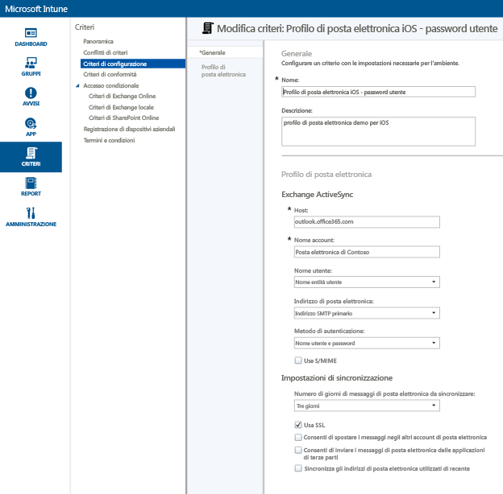
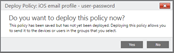
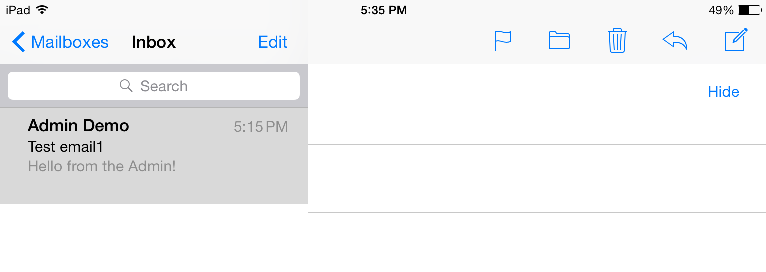
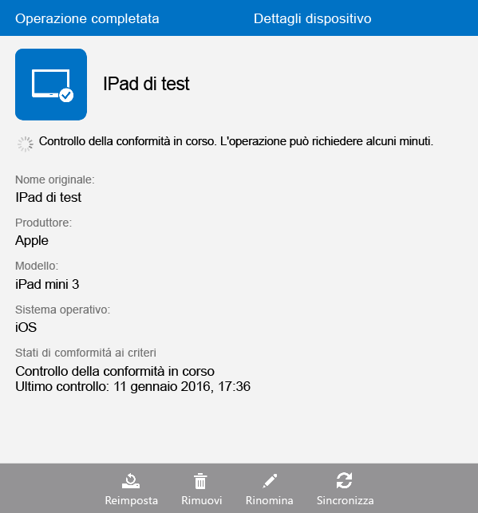

# Configurare l'accesso alla posta elettronica per i dispositivi iOS con Microsoft Intune
Quando i dispositivi vengono registrati con Intune, è possibile configurarli in modo che gli utenti possano accedere alla posta elettronica aziendale. Un modo per eseguire questa operazione per alcuni tipi di dispositivi specifici consiste nel creare e distribuire un **profilo di posta elettronica**. I profili di posta elettronica sono una tipologia di criteri di Intune per la configurazione del dispositivo di un utente e la relativa connessione al servizio di posta elettronica aziendale.
Con un profilo di posta elettronica è possibile automatizzare l'accesso alla posta elettronica per i dispositivi registrati, evitando di dover configurare manualmente il dispositivo. Un profilo di posta elettronica garantisce anche che tutti gli utenti finali configurino l'accesso allo stesso modo e con le stesse impostazioni di base.

## Obiettivi di questa procedura

- Per creare e distribuire un profilo di posta elettronica per i dispositivi iOS
- Per verificare che i criteri del profilo di posta elettronica siano stati applicati correttamente

## Elementi necessari prima di avviare questa procedura

- Un server Exchange, locale o ospitato in Azure, come parte della sottoscrizione Office/E3.
- Il nome host del server Exchange dell'azienda. Questo è il nome di dominio completo (FQDN), ad esempio **contosodemo55.onmicrosoft.com**.
- Un gruppo utenti in cui distribuire il profilo di posta elettronica. Se è stata completata la procedura descritta nella sezione relativa [all'avvio di una versione di valutazione di Microsoft Intune e alla distribuzione dei criteri PIN di iOS](start-a-microsoft-intune-trial-and-deploy-ios-pin-policy.md), è possibile usare il gruppo utenti **GroupDemo** creato appositamente.
- Dispositivi iOS registrati in cui distribuire il profilo. Di nuovo, il completamento della procedura descritta nella sezione relativa [all'avvio di una versione di valutazione di Microsoft Intune e alla distribuzione dei criteri PIN di iOS](start-a-microsoft-intune-trial-and-deploy-ios-pin-policy.md) consente la registrazione di alcuni dispositivi iOS.

## Procedura per la creazione e la distribuzione di un profilo di posta elettronica per i dispositivi iOS

Per questa procedura verrà usato il server Exchange ospitato fornito con la sottoscrizione a una versione di valutazione.
1. Nella console di Intune, fare clic su **Criteri**, quindi su **Aggiungi criterio**.

2. Nella finestra di dialogo **Crea un nuovo criterio**, espandere **iOS**, selezionare **Profilo di posta elettronica**, quindi fare clic su **Crea criterio**.

3. Nella pagina Crea criterio, immettere un nome per il criterio, ad esempio **Profilo di posta elettronica iOS - password utente**, insieme a una descrizione. Se si dispone di più profili di posta elettronica per diversi tipi di dispositivo e metodi di autenticazione, è possibile usare il nome per indicare la funzione del profilo.
4. Immettere il nome host di Exchange. Dal momento che si sta usando il server Exchange ospitato in Azure, come nome host basta inserire: **outlook.office365.com**

5. Immettere il nome dell'account relativo al dispositivo che verrà visualizzato agli utenti per consentire l'identificazione del servizio di posta elettronica. Ad esempio, **Posta elettronica Contoso**.
6. Poiché l'autenticazione dell'utente per il servizio di Exchange viene eseguita con nome utente e password, lasciare le impostazioni predefinite di nome utente e password.
7. Regolare le impostazioni di sincronizzazione in base alle esigenze. Usare per il momento le impostazioni predefinite a meno che non si intenda modificarne una specifica.  
8. Fare clic su **Salva criterio**.
9. Verrà visualizzata una finestra di dialogo per chiedere se si desidera distribuire subito il criterio. Fare clic su **Sì**.

10. Nella finestra successiva selezionare il gruppo utenti in cui si vuole distribuire il profilo di posta elettronica, fare clic su **Aggiungi** e quindi su **OK**.
 Dopo che si è fatto clic su **OK** il criterio inizierà a passare ai dispositivi registrati dopo uno o due minuti.

## Procedura per verificare che il profilo sia stato applicato correttamente

Per verificare che il profilo sia stato applicato, è necessario accedere a uno dei dispositivi in cui è stato distribuito il profilo di posta elettronica.
1. Nel dispositivo iOS, aprire l'app di posta elettronica.
L'app richiederà nome utente e password di posta elettronica dell'utente.

2. Immettere nome utente e password per l'account di posta elettronica di Exchange dell'utente, quindi toccare **OK**.
 L'app di posta elettronica aprirà l'account di Exchange e la posta elettronica inizierà a sincronizzarsi al dispositivo.

3. Selezionare le impostazioni dell'account per l'app di posta elettronica e verificare che il nome dell'account corrisponda a quello immesso nel profilo di posta elettronica, ad esempio **Posta elettronica Contoso**, e che le impostazioni di sincronizzazione siano corrette.

 Nel caso in cui il profilo di posta elettronica non sia stato applicato automaticamente al dispositivo, è possibile applicare i criteri manualmente tramite l'app Portale aziendale nel dispositivo stesso.
1. Aprire l'app Portale aziendale.
2. Toccare **I miei dispositivi**.
3. Toccare il nome del dispositivo.

4. Toccare **Sincronizza** > **Controlla conformità**.
 Dopo qualche istante il profilo di posta elettronica viene applicato al dispositivo. Successivamente, è possibile seguire la procedura di verifica per assicurarsi che il profilo sia stato applicato correttamente.

## Vedere anche
[Guida alla valutazione di Intune](get-started-with-a-30-day-trial-of-microsoft-intune.md)

<!--HONumber=Jun16_HO4-->

