# Avviare una versione di valutazione di Microsoft Intune e distribuire criteri PIN di iOS
Queste istruzioni dettagliate permettono di installare una versione di valutazione di Intune e configurare un criterio PIN per i dispositivi iOS. Per un elenco di altre comuni attività di valutazione di Intune da provare, vedere [Attività comuni di valutazione di Intune](common-microsoft-intune-evaluation-tasks.md).

## Esaminare i prerequisiti per questa attività

-   PC Windows con Internet Explorer - per l'esecuzione di attività amministrative

-   Dispositivo iOS 7.1 o versione successiva per il test di convalida dei criteri utente

-   Numero di telefono per autenticarsi durante l'iscrizione alla versione di valutazione

## Creare un account di valutazione gratuito di Intune
> [!NOTE]
> Se si ha già una sottoscrizione di Intune, ignorare questa sezione e passare a quella successiva.

1.  Usando un PC Windows, fare clic con il pulsante destro del mouse su **Internet Explorer** (IE) e selezionare **InPrivate Browsing**.

    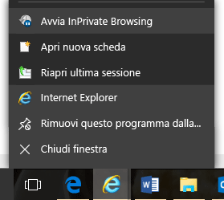

2.  Passare al [portale di iscrizione a Intune](https://portal.office.com/Signup/Signup.aspx?OfferId=40BE278A-DFD1-470a-9EF7-9F2596EA7FF9&dl=INTUNE_A&ali=1), fornire le informazioni richieste e fare clic su **Avanti**.

    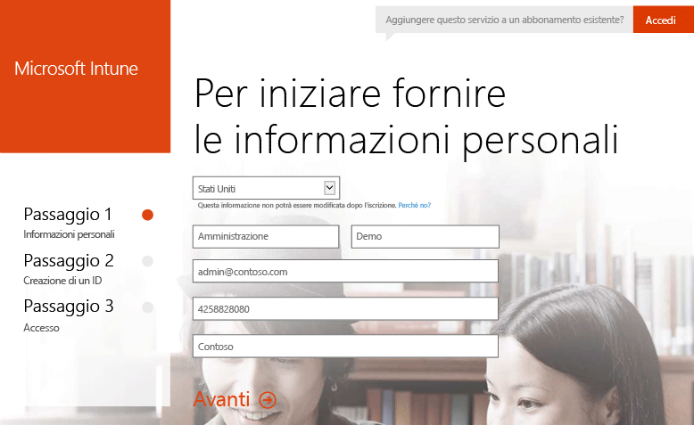

3.  Immettere un ID utente e una password per l'account amministratore e fare clic su **Avanti**. Si userà questo ID per accedere al portale di Intune per eseguire le attività di amministrazione.

    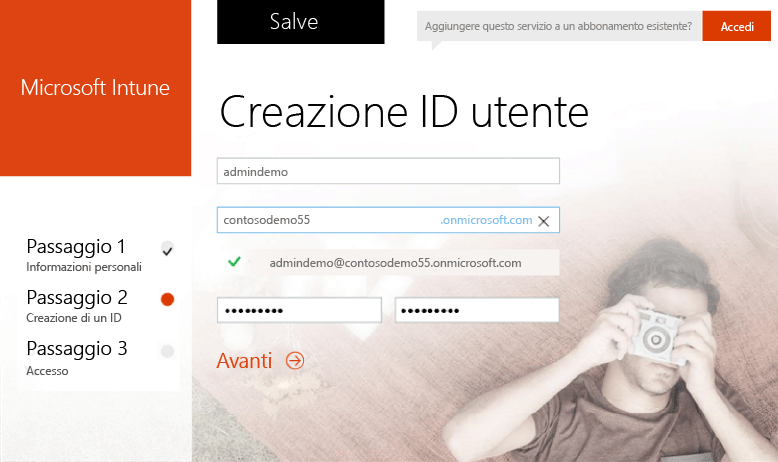

4.  Immettere il proprio numero di telefono cellulare e fare clic su **SMS** per convalidare il numero.

    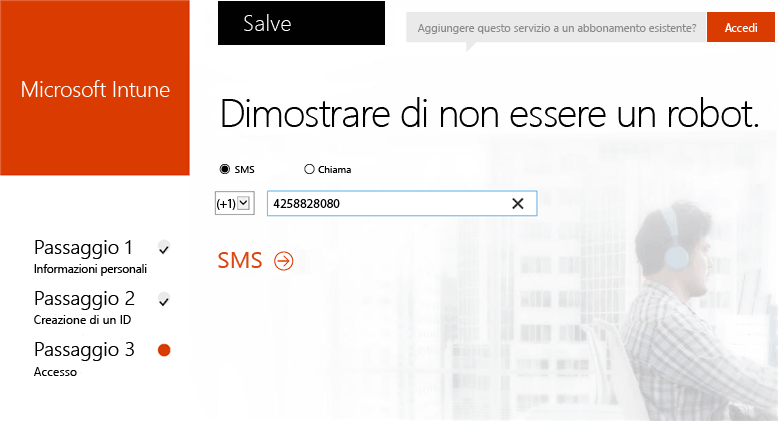

5.  Salvare le informazioni visualizzate sullo schermo e quindi fare clic su **È possibile continuare**.

    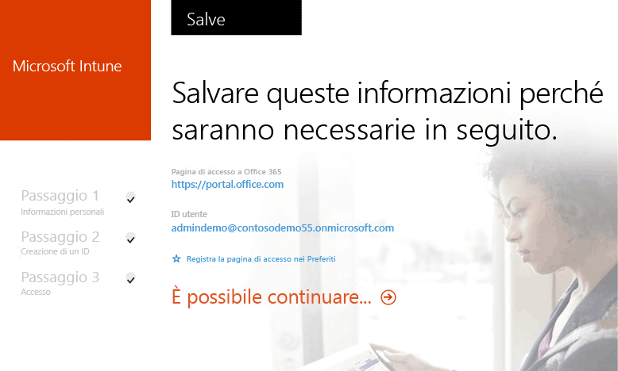

## Creare un utente test

1.  Usando un PC Windows, fare clic su **Start** per passare alla pagina di gestione degli utenti.

    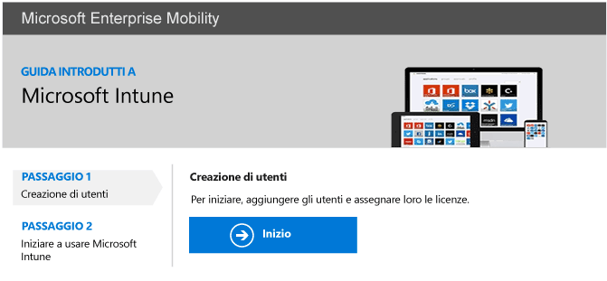

2.  Fare clic sul pulsante **+** per aggiungere un utente.

    

3.  Nella pagina di **creazione nuovo account utente**:

    1.  Fornire le informazioni sull'utente test.

    2.  Selezionare l'opzione che richiede di **digitare la password**.

    3.  Deselezionare la casella di controllo **Chiedere all'utente di cambiare la password al primo accesso**.

    4.  Scegliere **Crea**.

    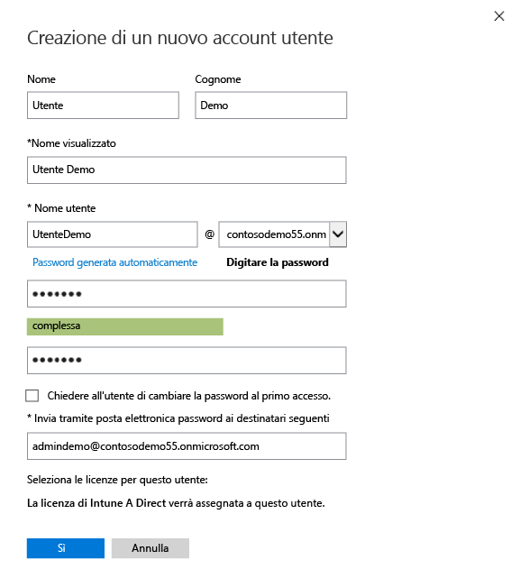

4.  Nella pagina di conferma della creazione utente, fare clic su **Chiudi**.

    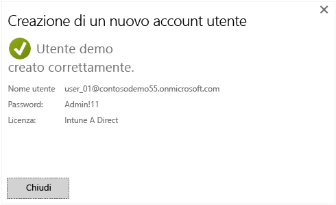

5.  Fare clic sul pulsante **Aggiorna** per visualizzare l'utente test creato.

    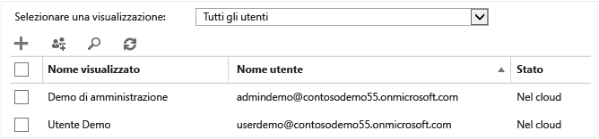

## Configurare un criterio PIN di iOS per l'utente test

1.  Usando un PC Windows, impostare l'autorità MDM su Intune:

    1.  Passare alla [console di gestione Intune](http://manage.microsoft.com/), accedere con l'account amministratore e fare clic su **Inizia a gestire i dispositivi mobili**. Viene aperta la pagina Autorità di gestione del dispositivo mobile.

        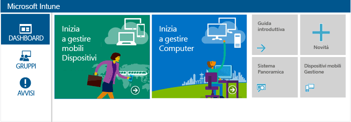

    2.  Fare clic sul collegamento **Imposta autorità di gestione del dispositivo mobile**.

        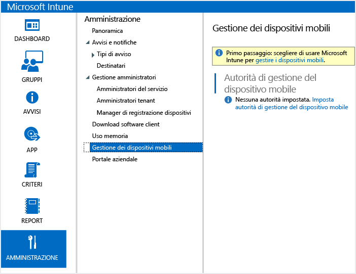

2.  Abilitare i dispositivi iOS alla registrazione. Questo processo imposta un certificato attendibile tra il servizio di notifica Push di Apple (APNs) e la sottoscrizione di Intune.

    1.  Fare clic su **Abilita la piattaforma iOS e Mac OS X**.

        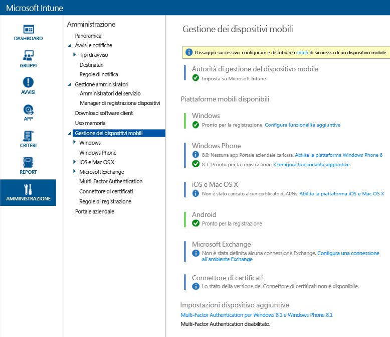

    2.  Fare clic su **Scarica richiesta di certificato APNs**.

        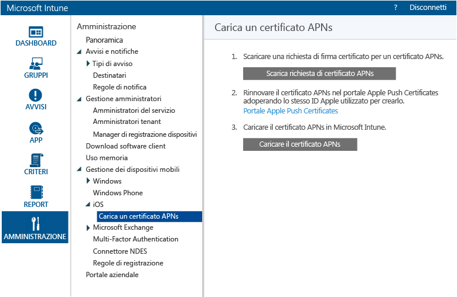

    3.  Specificare un nome e un percorso per la richiesta di firma del certificato (CSR, Certificate Signing Request) e quindi fare clic su **Salva**. Questo file contiene la chiave pubblica che corrisponde a una chiave privata usata dalla sottoscrizione a Intune.

        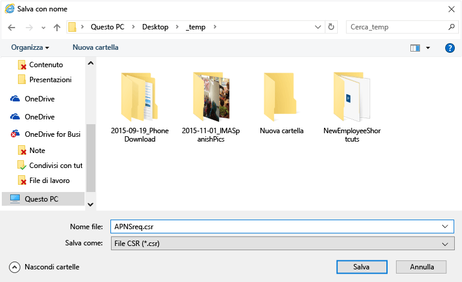

    4.  Fare clic su **Portale Apple Push Certificates** per aprire una nuova scheda.

        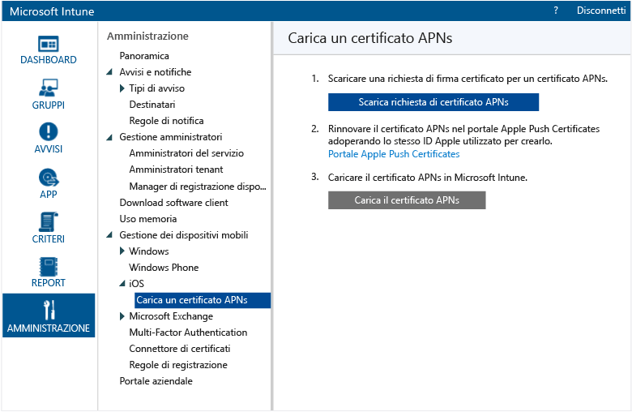

    5.  Immettere l'ID Apple e la password, quindi fare clic su **Accedi**. Questo ID può essere quello usato nel dispositivo iOS per scaricare le app dall'App Store di iOS.

        

    6.  Fare clic su **Create a Certificate**.

        

    7.  Leggere le Condizioni per l'utilizzo di Apple, selezionare la casella di controllo e fare clic su **Accept**.

        

    8.  Fare clic su **Browse**.

        

    9. Selezionare il file CSR salvato in precedenza e fare clic su **Open**.

        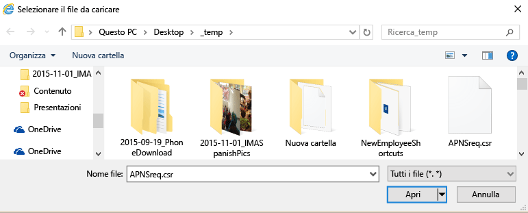

    10. Fare clic sul pulsante **Upload**.

        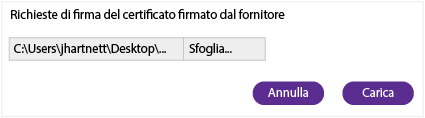

    11. Quando viene richiesto di sovrascrivere un file JSON, fare clic su **Save**.

        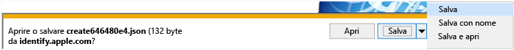

    12. Specificare un percorso per il file JSON e fare clic su **Save**.

        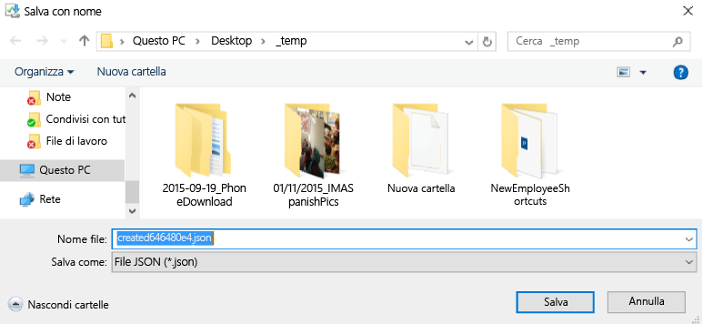

        Se la pagina non reindirizza automaticamente dopo alcuni secondi, fare clic su **Cancel**.

        

    13. Per recuperare il file del certificato appena creato, fare clic su **Download**.

        

    14. Quando viene richiesto di scaricare un file PEM, fare clic su **Save**.

        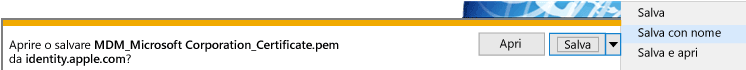

    15. Specificare un percorso per il file PEM e fare clic su **Save**.

        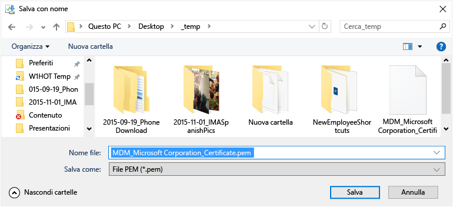

    16. Tornare alla scheda della Console di gestione di Intune e fare clic sui **Carica il certificato APNs**.

        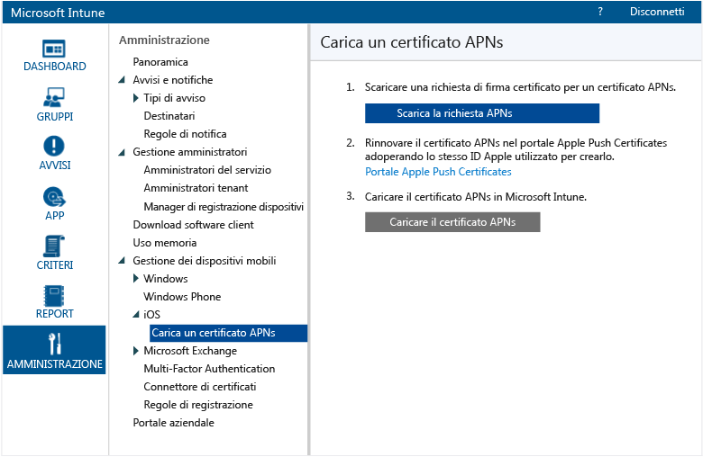

    17. Immettere l'ID Apple e fare clic su **Sfoglia**.

        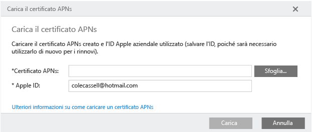

    18. Selezionare il file PEM appena salvato e fare clic su **Apri**.

        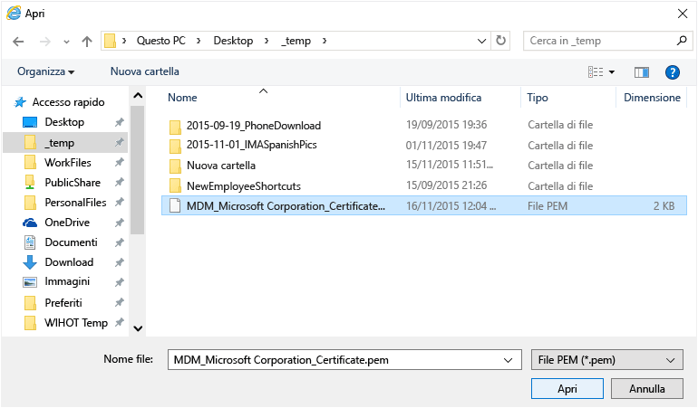

    19. Fare clic su **Carica**.

        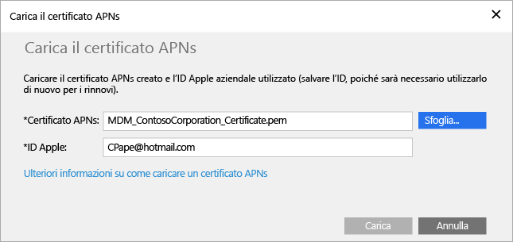

        Il certificato APNs è ora configurato.

        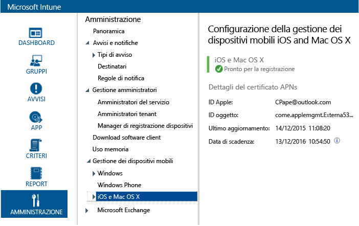

3.  Creare un gruppo di utenti test per la definizione dei criteri:

    1.  Nel riquadro di sinistra fare clic su **Gruppi**.

        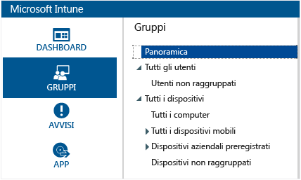

    2.  All'estrema destra, fare clic su **Crea gruppo**.

        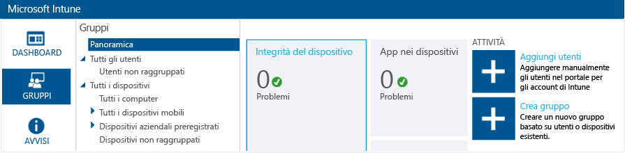

    3.  Specificare un nome di gruppo, selezionare **Tutti gli utenti** come gruppo padre e fare clic su **Avanti**.

        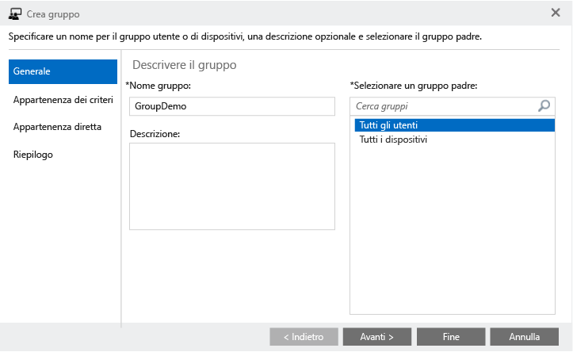

    4.  Nel campo **Iniziare l'appartenenza al gruppo con**, selezionare **Tutti gli utenti del gruppo padre** e fare clic su **Fine**.

        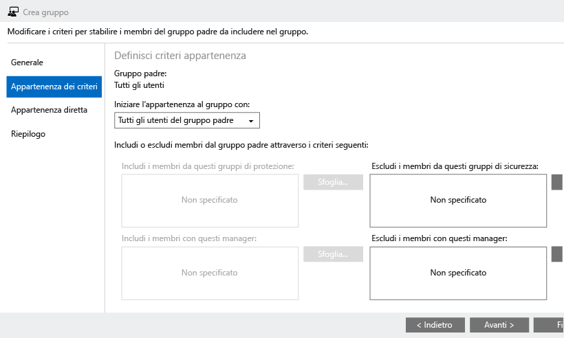

4.  Creare un criterio PIN iOS e definire la destinazione per il gruppo di utenti test:

    1.  Nel riquadro di sinistra fare clic su **Criteri**.

        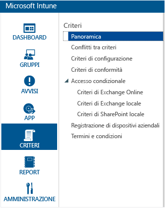

    2.  All'estrema destra, fare clic su **Aggiungi criterio**.

        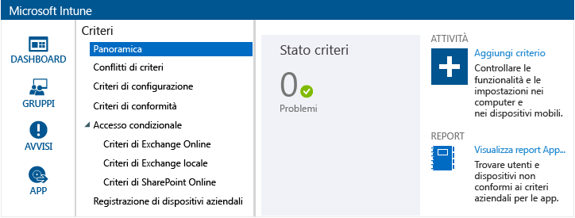

    3.  Espandere il nodo iOS, selezionare la riga **Configurazione generale** e fare clic su **Crea criterio**.

        

    4.  Digitare un nome per il criterio, attivare l'opzione **Richiedi una password per sbloccare i dispositivi mobili** e impostare la **Lunghezza minima password** su **4**.

        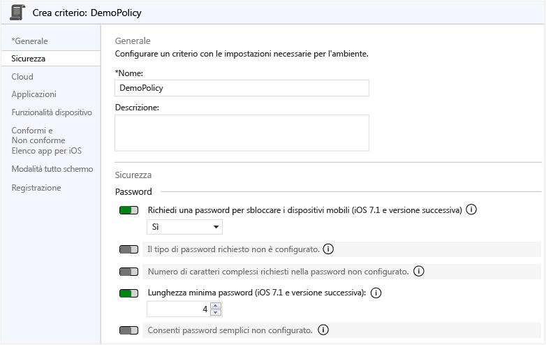

    5.  Fare clic su **Sì** per distribuire il criterio.

        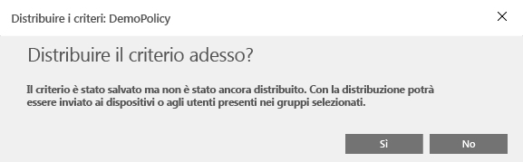

    6.  Fare clic sul gruppo utente creato in precedenza, fare clic su **Aggiungi** e fare clic su **OK**.

        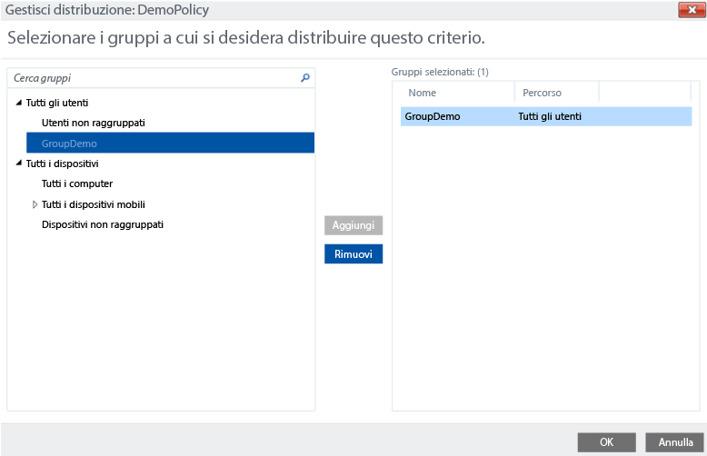

        È ora disponibile un criterio PIN iOS che fa riferimento al gruppo di utenti test.

        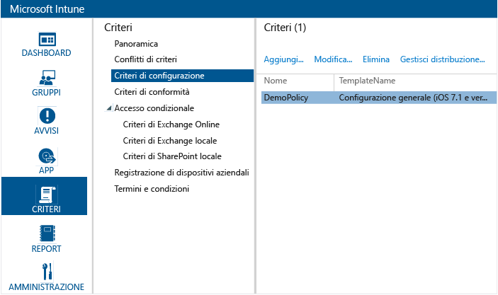

## Verificare che i criteri vengano applicati in un dispositivo iOS

1.  In un iPad, avviare l'App Store di iOS, installare l'app **Portale aziendale di Microsoft Intune** gratuita e aprirla.

    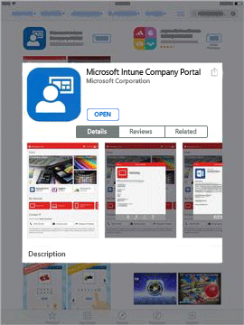

2.  Immettere il nome e la password dell'account utente test e toccare **Accedi**.

    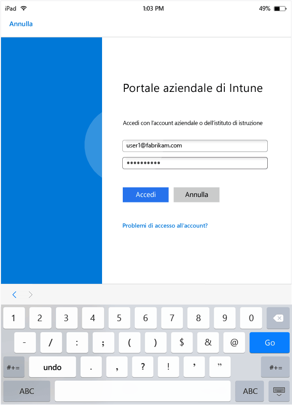

3.  Toccare **Registra** per iniziare a registrare il dispositivo in Intune.

    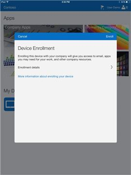

4.  Nella schermata **Installa profilo** toccare **Installa**.

    

5.  Nella finestra di dialogo **Installa profilo** toccare **Installa**.

    

6.  Nella schermata **Avviso** toccare **Installa**.

    

7.  Nella finestra di dialogo **Gestione remota** toccare **Attendibilità**.

    

8.  Al termine dell'installazione del profilo di gestione, toccare **Fine**. La registrazione è stata completata.

    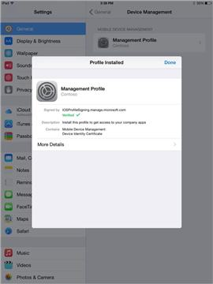

9. Una volta completata la registrazione, toccare **OK** e quindi chiudere l'app Portale aziendale.

    

10. Quando viene richiesto di configurare un passcode, toccare **Continua**.

    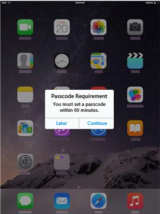

11. Immettere il passcode, toccare **Continua**, immettere di nuovo il passcode e toccare **Salva**.

    

12. Premere il pulsante di alimentazione per bloccare l'iPad, quindi farlo scorrere per sbloccarlo: a questo punto sarà necessario immettere il passcode per sbloccare il dispositivo.

### Vedere anche
[Guida alla valutazione di Intune](get-started-with-a-30-day-trial-of-microsoft-intune.md)

<!--HONumber=Jul16_HO3-->

