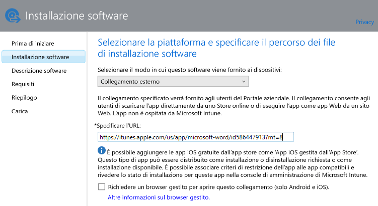
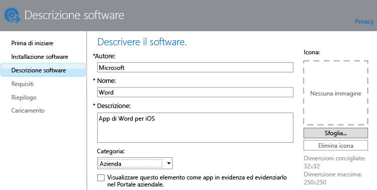

# Aggiungere app per dispositivi registrati in Intune

[!INCLUDE[classic-portal](../includes/classic-portal.md)]

Prima di distribuire o gestire un'app è necessario aggiungerla a Microsoft Intune. In questo argomento viene illustrato come aggiungere app per dispositivi registrati.

> [!IMPORTANT]
> Le informazioni in questo argomento semplificano l'aggiunta delle app che si vuole distribuire sui dispositivi e sui PC Windows registrati. Per aggiungere app per PC Windows gestiti tramite il software client di Intune, vedere [Aggiungere app sui PC Windows in Microsoft Intune](add-apps-for-windows-pcs-in-microsoft-intune.md).

## Aggiungere l'app
È possibile usare l'autore del software Intune per configurare le proprietà dell'app e, se opportuno, caricarla nello spazio di archiviazione cloud. Seguire questa procedura:

1.  Nella [console di amministrazione di Microsoft Intune](https://manage.microsoft.com) scegliere **App** &gt; **Aggiungi app** per avviare l'autore del software Intune.

    > [!TIP]
    > Per avviare questa funzionalità, può essere necessario immettere il nome utente e la password di Intune.

2.  Nella pagina **Installazione software** dell'autore scegliere una delle opzioni seguenti per **Selezionare il modo in cui questo software viene fornito ai dispositivi**:
    - **Programma di installazione software**, per app con estensione **msi**:
        - **Selezionare il tipo di file del programma di installazione software**. Indica il tipo di software da distribuire. Ad esempio, per installare un'app iOS scegliere **Pacchetto app iOS (file &#42;.ipa)**.
        - **Specificare il percorso dei file di installazione software**. Immettere il percorso dei file di installazione o scegliere **Sfoglia** per selezionare il percorso da un elenco.
        - **Includi sottocartelle e file aggiuntivi dalla stessa cartella**. Questa opzione è disponibile solo per il tipo di file **Windows Installer**. Alcuni programmi software che usano Windows Installer richiedono file di supporto, che in genere si trovano nella stessa cartella dei file di installazione. Selezionare questa opzione se si vogliono distribuire anche questi file. Questo tipo di installazione usa parte dello spazio di archiviazione cloud.

  -   **Collegamento esterno**, per le app da creare specificando un collegamento a un App Store:

        - **Specificare l'URL**. Specificare l'URL di uno degli elementi seguenti:
            - L'URL dell'App Store dell'app da distribuire. Ad esempio, per distribuire l'app Desktop remoto Microsoft per Android, specificare **https://play.google.com/store/apps/details?id=com.microsoft.rdc.android**. Per trovare l'URL dell'app, usare un motore di ricerca per individuare la pagina dell'App Store che contiene l'app. Ad esempio, per trovare l'app Desktop remoto, è possibile cercare **Desktop remoto Microsoft Android**.
            - Un sito Web. Intune distribuisce un'icona di collegamento al sito nel dispositivo, nota come clip Web.
            - Un'app sul Web. Intune distribuisce un'icona di collegamento all'app nel dispositivo.
        - **Richiedere un browser gestito per aprire questo collegamento (solo Android e iOS)**. Quando si distribuisce un collegamento a un'app Web o a un sito Web, gli utenti potranno aprirlo solo in Intune Managed Browser. Questo browser deve essere installato nel dispositivo. Per informazioni dettagliate su Managed Browser, vedere [Manage Internet access using managed browser policies with Microsoft Intune](manage-internet-access-using-managed-browser-policies.md) (Gestire l'accesso a Internet usando i criteri di Managed Browser con Microsoft Intune). Questo tipo di installazione non usa lo spazio di archiviazione cloud.

  -   **App iOS gestita dall'App Store** per app gratuite dell'iTunes store che si vuole gestire con i criteri di gestione di applicazioni mobili (MAM):

        - **Specificare l'URL**. Immettere l'URL dell'App Store dell'app da distribuire. Ad esempio, per distribuire l'app Cartelle di lavoro Microsoft per iOS, specificare **https://itunes.apple.com/us/app/work-folders/id950878067?mt=8**. Questo tipo di installazione non usa lo spazio di archiviazione cloud.

        Se ad esempio si vuole distribuire l'app Microsoft Word dall'iTunes store sui dispositivi, viene visualizzata una pagina simile alla seguente:

        

3.  Nella pagina **Descrizione software** configurare gli elementi seguenti:

    > [!TIP]
    > A seconda del tipo di programma di installazione in uso, è possibile che alcuni valori siano stati immessi automaticamente.

    - **Autore**. Immettere il nome dell'autore dell'app.
    - **Nome**. Immettere il nome dell'app che verrà visualizzato nel portale aziendale. Verificare che tutti i nomi di app usati siano univoci. Se il nome di un'app è usato due volte, solo una delle due app verrà visualizzata agli utenti nel portale aziendale.
    - **Descrizione**. Immettere una descrizione per l'app. La descrizione verrà visualizzata agli utenti nel portale aziendale.
    - **URL per le informazioni software**. Disponibile solo se si seleziona **Programma di installazione software**. Immettere l'URL di un sito Web che include informazioni sull'app (facoltativo). L'URL verrà visualizzato agli utenti nel portale aziendale.
    - **URL privacy**. Disponibile solo se si seleziona **Programma di installazione software**. Immettere l'URL di un sito Web che include informazioni sulla privacy per l'app (facoltativo). L'URL verrà visualizzato agli utenti nel portale aziendale.
    - **Categoria** (facoltativo). Selezionare una delle categorie predefinite dell'app. Ciò consentirà agli utenti di trovare più facilmente l'app nel portale aziendale.
    - **Visualizzare questo elemento come app in evidenza ed evidenziarlo nel portale aziendale**. Visualizzare chiaramente l'app nella pagina principale del portale aziendale quando gli utenti cercano le app.
    - **Icona** (facoltativo). Caricare un'icona che verrà associata all'app. Questa icona verrà visualizzata insieme all'app quando gli utenti visitano il portale aziendale.

        In questo esempio è stata configurata una descrizione per l'app di Microsoft Word per iOS:

        

4.  Nella pagina **Requisiti** selezionare i requisiti che devono essere soddisfatti per poter installare l'app in un dispositivo. Ad esempio, per un pacchetto di app per iOS è possibile selezionare la versione minima di iOS necessaria. È inoltre possibile selezionare il tipo di dispositivo, ad esempio un iPhone o un iPad.

    > [!TIP]
    > La pagina **Requisiti** non viene visualizzata per tutti i tipi di app.

5.  Quando si sceglie il tipo di file **Windows Installer**, vengono visualizzate altre pagine della procedura guidata. Questo tipo di file viene usato quando si distribuisce il software a computer con Windows 10 o versioni successive registrati con Intune.

6.  Nella pagina **Riepilogo** verificare le informazioni specificate. Al termine, scegliere **Carica**.

7.  Scegliere **Chiudi** per completare la procedura.

L'app viene visualizzata nel nodo **App** dell'area di lavoro **App**.

## Esempio: Distribuzione di applicazioni con estensione msi per dispositivi Windows 10
In questo video di quattro minuti viene illustrato come distribuire applicazioni Windows Installer (con estensione msi) a dispositivi registrati che eseguono Windows 10.  

<iframe src="https://channel9.msdn.com/Series/How-to-Control-the-Uncontrolled/6--How-to-Deploy-MSI-Applications-to-Windows-10-Using-Intune-and-Mobile-Device-Management-MDM/player" width="640" height="360" allowFullScreen frameBorder="0"></iframe>

## Passaggi successivi

Il passaggio successivo alla creazione di un'app è la distribuzione. Per altre informazioni, vedere [Distribuire le app con Microsoft Intune](deploy-apps.md).

<!--HONumber=Dec16_HO2-->

