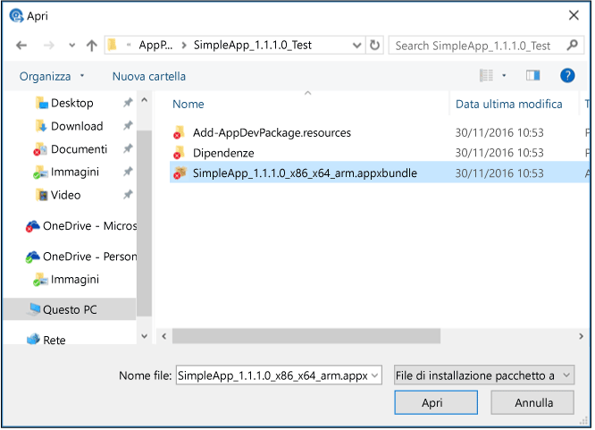

# Aggiungere app con Microsoft Intune

[!INCLUDE[classic-portal](../includes/classic-portal.md)]

Prima di iniziare la distribuzione di app con Microsoft Intune, prendersi il tempo necessario per acquisire familiarità con i concetti introdotti in questo argomento. Queste considerazioni consentono di comprendere quali app è possibile distribuire in quale piattaforma. Consentono inoltre di comprendere i prerequisiti che è necessario rispettare prima di procedere.

## Tipi di app che è possibile distribuire

### Programma di installazione software

|Tipo di App|Dettagli|
|----------------|-------|
|**Windows Installer (&#42;.exe, &#42;.msi)**|Questo tipo di app deve supportare l'installazione invisibile all'utente senza input dell'utente. La documentazione dell'app deve includere le opzioni della riga di comando rilevanti per l'installazione automatica dell'app, ad esempio, **/q**. Per un elenco di opzioni comuni della riga di comando, vedere [Opzioni della riga di comando per lo strumento Microsoft Windows Installer](https://support.microsoft.com/en-us/kb/227091).  Le cartelle e i file aggiuntivi richiesti dal programma di installazione dell'app devono essere disponibili nel percorso specificato per i file di installazione dell'app stessa.  Nella maggior parte dei casi, i file Windows Installer (con estensione msi) e Windows Installer Patch (con estensione msp) non richiedono l'installazione di alcun argomento della riga di comando da parte di Intune. Verificare la documentazione dell'app.  Se sono necessari argomenti di riga di comando, essi devono essere inseriti come coppia Nome=Valore (ad esempio TRANSFORMS=custom_transform.mst).|
|**Pacchetto app per Android (&#42;.apk)**|Per distribuire app per Android, è necessario un pacchetto con estensione apk valido.|
|**Pacchetto app per iOS (&#42;.ipa)**|Per distribuire le app per iOS, è necessario un pacchetto con estensione ipa valido.  Il pacchetto con estensione ipa deve essere stato firmato da Apple e la data di scadenza indicata nel profilo di provisioning deve essere valida. Intune è in grado di distribuire applicazioni iOS con certificato aziendale.  Non tutte le app Apple con certificato di sviluppatore sono supportate.  L'azienda deve essere registrata al programma iOS Developer Enterprise Program.  Verificare che il firewall dell'organizzazione consenta l'accesso ai siti Web di provisioning e certificazione iOS.  Non è necessario distribuire un file manifesto (con estensione plist) con l'app.|
|**Pacchetto app Windows Phone (&#42;.xap, .appx, .appxbundle)**|Per distribuire le app serve un certificato di firma codice mobile aziendale. Per altre informazioni vedere [Set up Windows Phone management with Microsoft Intune](set-up-windows-phone-management-with-microsoft-intune.md) (Configurare la gestione dei dispositivi Windows Phone con Microsoft Intune).|
|**Pacchetto app Windows (.appx, .appxbundle)**|Per distribuire le app serve un certificato di firma codice mobile aziendale. Per altre informazioni vedere [Set up Windows device management with Microsoft Intune](set-up-windows-device-management-with-microsoft-intune.md) (Configurare la gestione dei dispositivi Windows con Microsoft Intune).|
|**Windows Installer tramite MDM (&#42;.msi)**|È possibile usare questa app per creare e distribuire app basate su Windows Installer in PC registrati che eseguono Windows 10. Questi PC sono gestiti mediante MDM (Mobile Device Management).  È possibile caricare un solo file con estensione msi.  Per il rilevamento delle app vengono usati il codice e la versione prodotto del file.  Verrà usato il comportamento di riavvio predefinito dell'app. Intune non controlla questo comportamento.  I pacchetti MSI per utente vengono installati per un singolo utente.  I pacchetti MSI per computer vengono installati per tutti gli utenti del dispositivo.  I pacchetti MSI dual mode vengono attualmente installati soltanto per tutti gli utenti del dispositivo.  Gli aggiornamenti delle app sono supportati quando il codice prodotto MSI di ogni versione è lo stesso. 
Tutti i tipi di app del programma di installazione software vengono caricati nello spazio di archiviazione cloud.

### **Collegamento esterno**
Usare un collegamento esterno quando si dispone degli elementi seguenti:
- URL che consente agli utenti di scaricare un'app dall'App Store.
- Collegamento a un'app basata sul Web eseguita dal Web browser.

Le app basate su collegamenti esterni non sono archiviate nello spazio di archiviazione nel cloud Intune.
### **App iOS gestita dall'App Store**
È possibile usare app iOS gestite per gestire e distribuire app iOS gratuite dall'App Store. È anche possibile usare app iOS gestite per associare i [criteri di gestione delle applicazioni mobili](configure-and-deploy-mobile-application-management-policies-in-the-microsoft-intune-console.md) con [app compatibili](https://www.microsoft.com/en-us/server-cloud/products/microsoft-intune/partners.aspx) e controllarne lo stato nella console di amministrazione.  Le app iOS gestite non vengono archiviate nello spazio di memorizzazione cloud di Intune.

> [!TIP]
> Le opzioni per i dispositivi mobili non sono disponibili finché non si [imposta l'autorità MDM](prerequisites-for-enrollment.md) su Intune.

## Autore del software Intune
L'autore del software Microsoft Intune viene avviato quando si aggiungono o si modificano le app dalla console di amministrazione di Intune. Dall'autore del software è possibile selezionare e configurare un tipo di programma di installazione che eseguirà una delle operazioni seguenti:

- Caricamento delle app (programmi per computer o app per dispositivi mobili) da archiviare nell'archiviazione cloud di Intune.
- Collegamento a uno store online o a un'applicazione Web.

Prima di iniziare a usare Autore del software, è necessario installare la versione completa di [Microsoft .NET Framework 4.0](https://www.microsoft.com/download/details.aspx?id=17851). Dopo l'installazione, può essere necessario riavviare il computer per consentire la corretta apertura di Autore del software.

## Spazio di archiviazione nel cloud
Tutte le app create con il tipo di installazione del programma di installazione software, ad esempio un'app line-of-business, vengono compresse e caricate nello spazio di archiviazione cloud di Microsoft Intune. Una sottoscrizione di valutazione di Intune comprende 2 gigabyte (GB) di archiviazione nel cloud per l'archiviazione delle app gestite e degli aggiornamenti. Una sottoscrizione completa include 20 GB di spazio di archiviazione.

È possibile visualizzare la quantità di spazio usato nel nodo **Uso memoria** dell'area di lavoro **Amministratore**.

I requisiti dello spazio di archiviazione nel cloud sono i seguenti:

-   Tutti i file di installazione delle app devono trovarsi nella stessa cartella.
-   La dimensione massima dei file caricati è di 2 GB.

## Supporto per app della piattaforma UWP (Universal Windows Platform)
Nei PC Windows 10 non è necessario disporre di una chiave di sideload per installare le app line-of-business. Tuttavia, la chiave del Registro di sistema **HKEY_LOCAL_MACHINE\Software\Policies\Microsoft\Windows\Appx\AllowAllTrustedApps** deve avere un valore pari a **1** per abilitare il sideload.

Se la chiave del Registro di sistema non è configurata, Intune imposterà automaticamente questo valore su**1** la prima volta che si distribuisce un'app nel dispositivo. Se questo valore è stato impostato su **0**, Intune non potrà modificare automaticamente il valore e la distribuzione delle app line-of-business avrà esito negativo.

Le app line-of-business della piattaforma UWP devono essere firmate con un certificato di firma codice attendibile su ogni dispositivo in cui l'app viene distribuita. È possibile usare un certificato generato da un'infrastruttura a chiave pubblica (PKI) interna oppure un certificato basato su un certificato radice pubblico di terze parti installato nel dispositivo.

Nei dispositivi Windows 10 Mobile, è possibile usare un certificato di firma codice non Symantec per firmare le app universali con estensione **appx**. Per le app con estensione **xap** e per i pacchetti **appx** compilati per Windows Phone 8.1 che si vuole installare nei dispositivi Windows 10 Mobile, è necessario usare un certificato di firma codice Symantec.

### Dipendenze per le app UWP

Quando si aggiunge un pacchetto appxbundle di Windows 10 Universal a Intune, è necessario assicurarsi che vengano caricate tutte le dipendenze per l'applicazione.
A tale scopo, assicurarsi che la cartella **Dipendenze** creata quando l'app è stata compilata si trovi nella stessa cartella del file con estensione appxbundle.
In questo modo, quando si carica l'app in Intune, saranno caricati anche tutti i file presenti nella cartella **Dipendenze**. Questa operazione è illustrata nella schermata riportata di seguito:

## Passaggi successivi

Sarà necessario aggiungere le app nella console di Intune prima di distribuirle. È possibile aggiungere app sia per i [dispositivi registrati](add-apps-for-mobile-devices-in-microsoft-intune.md) sia per i [PC Windows gestiti con il software client di Intune](add-apps-for-windows-pcs-in-microsoft-intune.md).

<!--HONumber=Dec16_HO5-->

