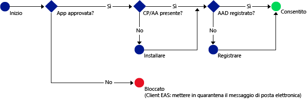

# Consentire solo alle app per dispositivi mobili che supportano i criteri di gestione delle app mobili di Intune di accedere ai servizi di Office 365
I [criteri di gestione delle app per dispositivi mobili di Intune](protect-apps-and-data-with-microsoft-intune.md) consentono di proteggere i dati aziendali sui dispositivi registrati per la gestione in Intune. I criteri di gestione delle app per dispositivi mobili possono essere usati anche nei **dispositivi di proprietà dei dipendenti non registrati per la gestione in Intune**.  In questo caso, anche se il dispositivo non viene gestito, è comunque necessario assicurarsi che i dati e le risorse aziendali siano protetti. Usando l'accesso condizionale per la gestione delle app per dispositivi mobili è possibile creare un criterio che consenta solo alle app per dispositivi mobili che supportano i criteri di gestione delle app per dispositivi mobili di Intune di accedere a servizi di Office 365 come Exchange Online.

Ad esempio, consentendo solo all'**app di Microsoft Outlook** di accedere a Exchange Online è possibile **bloccare le app di posta elettronica predefinite in iOS e Android** che non hanno la protezione dei dati dei criteri di gestione delle app per dispositivi mobili di Intune per ricevere la posta elettronica da **Exchange Online**.

Il diagramma seguente illustra il flusso usato dai criteri di accesso condizionale di gestione delle app mobili per determinare se consentire o bloccare l'accesso: .

Descrizione delle abbreviazioni usate nei diagrammi:
* **CP**: app Portale aziendale
* **AA**: app Azure Authenticator
* **AAD**: Azure Active Directory
* **EAS**: Exchange Active Sync

## Prerequisiti
**Prima** di configurare i criteri di accesso condizionale per la gestione delle app per dispositivi mobili è necessario avere un **abbonamento Enterprise Mobility + Security o un abbonamento Azure Active Directory Premium** e gli utenti devono avere la licenza per EMS o Azure AD. Per altre informazioni dettagliate, vedere la [pagina dei prezzi di Enterprise Mobility](https://www.microsoft.com/en-us/cloud-platform/enterprise-mobility-pricing) o la [pagina dei prezzi di Azure Active Directory](https://azure.microsoft.com/en-us/pricing/details/active-directory/).

## App supportate
**Exchange Online**: **Microsoft Outlook** per Android e iOS.

Per informazioni sull'esperienza utente con un'app che usa criteri di accesso condizionale di gestione delle app mobili, vedere [What to expect when using an app with MAM CA](use-apps-with-mam-ca.md) (Cosa aspettarsi quando si usa un'app con accesso condizionale di gestione delle app mobili).

## Passaggi successivi
[Create an Exchange Online Policy for MAM apps (Creare un criterio di Exchange Online per le app di gestione delle app per dispositivi mobili)](mam-ca-for-exchange-online.md)

[Block apps that do not have modern authentication (Bloccare le app che non usano l'autenticazione moderna)](block-apps-with-no-modern-authentication.md)

### Vedere anche

[Proteggere i dati delle app usando i criteri di gestione delle app per dispositivi mobili con Microsoft Intune](protect-app-data-using-mobile-app-management-policies-with-microsoft-intune.md)

<!--HONumber=Oct16_HO4-->

