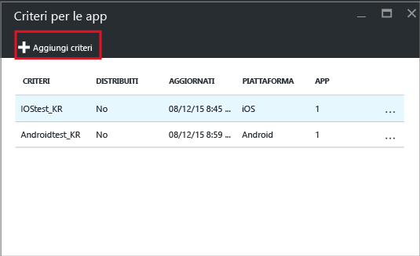
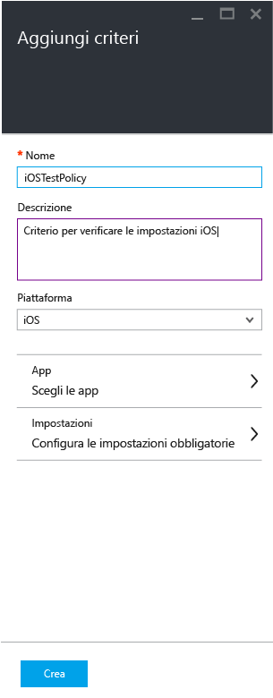
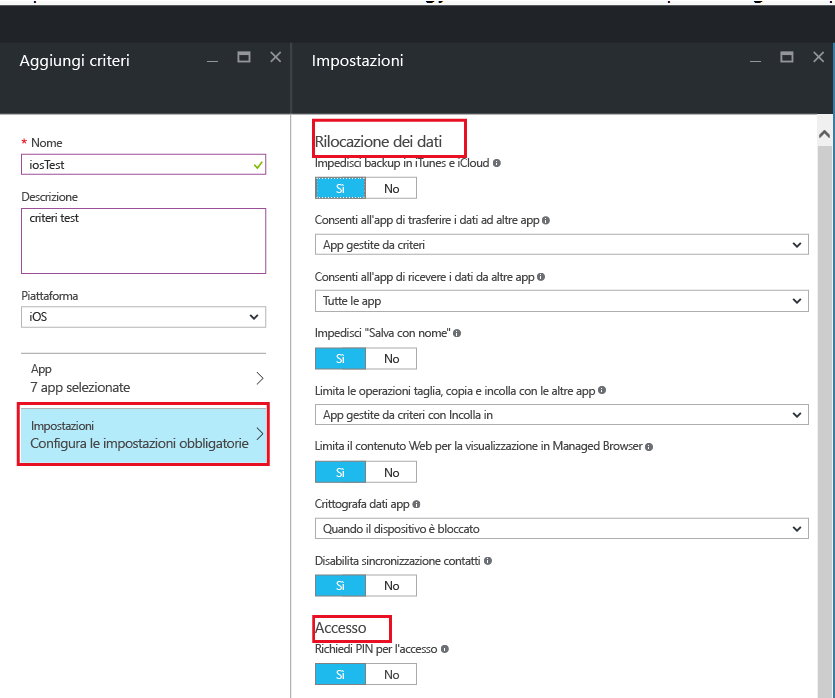
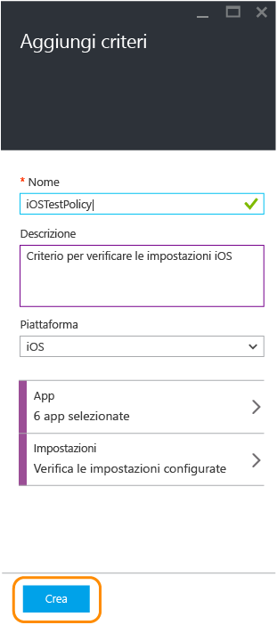
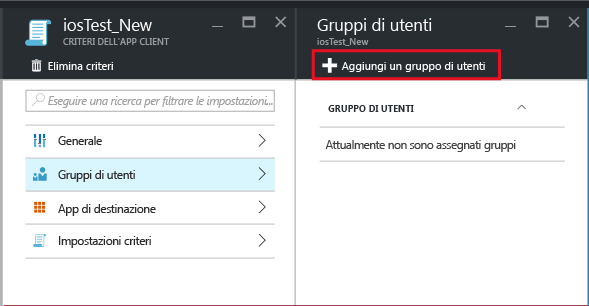
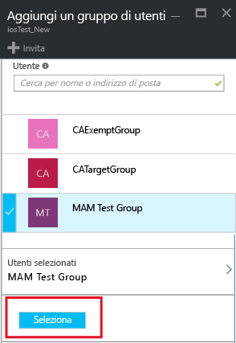
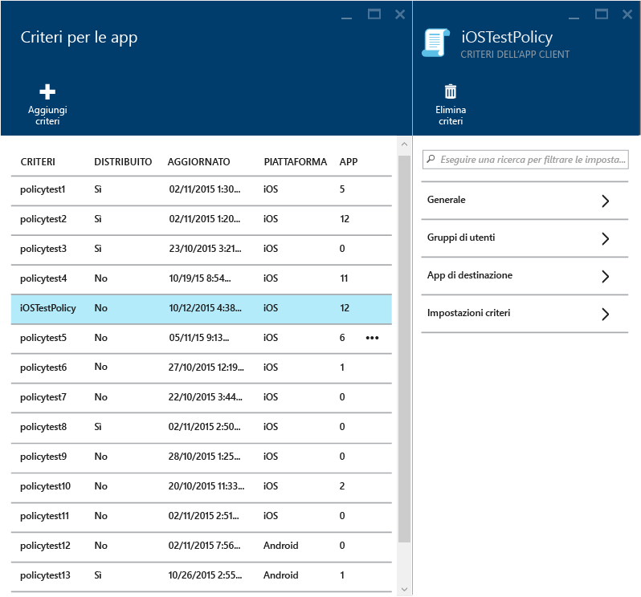
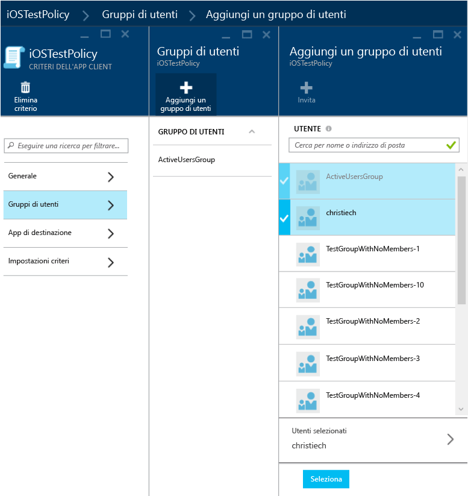
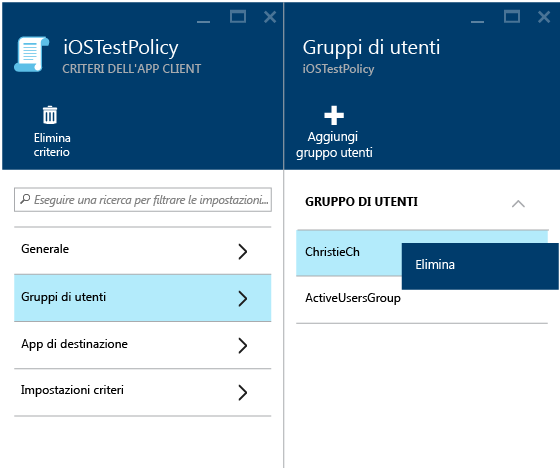
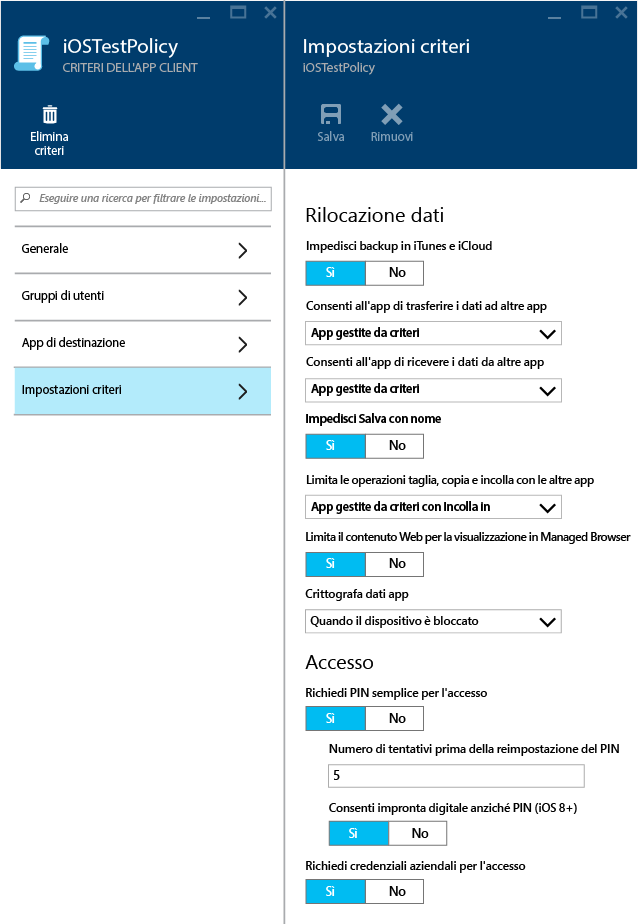

# Creare e distribuire i criteri di gestione delle app per dispositivi mobili con Microsoft Intune
I criteri MAM (Mobile app management, Gestione delle app mobili) possono essere adottati in applicazioni eseguite su dispositivi gestiti o non gestiti da Intune. Per una descrizione più dettagliata del funzionamento dei criteri MAM e degli scenari supportati dai criteri MAM di Intune, vedere [Proteggere i dati delle app usando i criteri di gestione delle app mobili con Microsoft Intune](protect-app-data-using-mobile-app-management-policies-with-microsoft-intune.md).

In questo argomento viene descritto il processo di creazione di un criterio MAM nel **portale di Azure**. Il portale di Azure è la nuova console di amministrazione per la creazione di criteri MAM. È consigliabile usare questo portale per creare criteri MAM. Il portale di Azure supporta gli scenari MAM seguenti:
- Dispositivi registrati in Intune.
- Dispositivi gestiti da una soluzione MDM di terze parti.
- Dispositivi non gestiti da nessuna soluzione MDM (BYOD).

>[!IMPORTANT]
Se si sta usando la **console di amministrazione di Intune** per gestire i dispositivi, tenere presente quanto segue:

> * È possibile creare un criterio MAM che supporta le app per i dispositivi registrati in Intune mediante la [console di amministrazione di Intune](configure-and-deploy-mobile-application-management-policies-in-the-microsoft-intune-console.md).
> * I criteri MAM creati nella console di amministrazione di Intune non possono essere importati nel portale di Azure.  Tali criteri devono essere ricreati nel portale di Azure.

> * È possibile che nella console di amministrazione di Intune non vengano visualizzate tutte le impostazioni dei criteri MAM. Il portale di Azure è la nuova console di amministrazione per la creazione dei criteri MAM.

> * Per distribuire app gestite, è necessario creare un criterio MAM nella console di amministrazione di Intune. In questo caso, può essere necessario creare criteri MAM sia nella console di amministrazione di Intune che nel portale di Azure: nella console di amministrazione di Intune per verificare la possibilità di distribuire app gestite e nel portale di Azure perché è la nuova console di amministrazione contenente tutte le impostazioni dei criteri MAM.

> * Se si creano criteri MAM sia nella console di amministrazione di Intune che nel portale di Azure, alle app vengono applicati i criteri creati in quest'ultimo.

Per visualizzare un elenco di impostazioni dei criteri supportate nelle piattaforme iOS e Android, selezionare una delle seguenti voci:

> [!div class="op_single_selector"]
- [Criteri iOS](ios-mam-policy-settings.md)
- [Criteri Android](android-mam-policy-settings.md)

##  Creare un criterio MAM
Prima di creare un criterio MAM, vedere le informazioni su [prerequisiti e supporto](get-ready-to-configure-mobile-app-management-policies-with-microsoft-intune.md).
1.  Scegliere **Gestione di applicazioni mobili di Intune &gt; Impostazioni** per aprire il pannello **Impostazioni**.

    

    > [!TIP]
    > Se si usa il portale di Azure per la prima volta, leggere [Portale di Azure per i criteri MAM di Microsoft Intune](azure-portal-for-microsoft-intune-mam-policies.md) per acquisire familiarità con il portale.

2.  Nel pannello **Impostazioni** scegliere **Criteri per le app**. Verrà visualizzato il pannello **Criteri per le app**, in cui sarà possibile creare nuovi criteri e modificare i criteri esistenti. Scegliere **Aggiungi criteri**.

    

3.  Digitare un nome per il criterio, aggiungere una breve descrizione e selezionare il tipo di piattaforma per creare un criterio per iOS e Android. È possibile creare più criteri per ogni piattaforma.

    

4.  Scegliere **App** per aprire il **pannello App**, che contiene l'elenco delle app disponibili. Selezionare una o più app dall'elenco che si vuole associare al criterio che si sta creando. Dopo avere selezionato le app, scegliere **Seleziona** nella parte inferiore del pannello **App** per salvare la selezione.

    > [!IMPORTANT]
    > È necessario selezionare almeno un'app per creare un criterio.

5.  Nel pannello **Aggiungi criteri** scegliere **Configurare le impostazioni necessarie** per aprire il pannello delle impostazioni dei criteri.

    Esistono due categorie di impostazioni dei criteri: **Rilocazione dati** e **Accesso**.  I criteri di rilocazione dati sono applicabili allo spostamento dei dati da e verso le app, mentre i criteri di accesso determinano il modo in cui l'utente finale accede alle applicazioni in un contesto aziendale.
    In questa introduzione le impostazioni dei criteri hanno valori predefiniti. Non è necessario apportare modifiche se i valori predefiniti soddisfano i requisiti.

    > [!TIP]
    > Queste impostazioni dei criteri vengono applicate solo quando si usano le app nel contesto aziendale.  Quando l'utente finale usa l'app per eseguire un'attività personale, questi criteri non hanno effetto.

    

6.  Scegliere **OK** per salvare la configurazione. Viene di nuovo visualizzato il pannello **Aggiungi un criterio** . Scegliere **Crea** per creare i criteri e salvare le impostazioni.

    

Dopo aver creato un criterio come descritto nella procedura precedente, non verrà distribuito a tutti gli utenti. Per distribuire un criterio, vedere la sezione seguente, "Distribuire un criterio agli utenti".

> [!IMPORTANT]
> Se si crea un criterio MAM per un'app con la console di amministrazione di Intune e un criterio MAM con il portale di Azure, il criterio creato nel portale di Azure ha la precedenza. Tuttavia, la creazione di report nella console di Intune o di Configuration Manager segnalerà le impostazioni dei criteri create dalla console di amministrazione di Intune. Ad esempio:
>
> -   L'utente ha creato un criterio MAM nella console di amministrazione di Intune che blocca la copia da un'app.
> -   L'utente ha creato un criterio MAM nella console di Azure che consente la copia da un'app.
> -   L'utente associa entrambi i criteri alla stessa app.
> -   Viene data la precedenza al criterio creato dalla console di Azure e viene consentita la copia.
> -   Tuttavia, lo stato e i report nella console di Intune indicheranno erroneamente che la copia è bloccata.

## Distribuire un criterio agli utenti

1.  Nel pannello **Criteri** scegliere **Gruppi di utenti** per aprire il pannello **Gruppi di utenti**. Fare clic su **Aggiungi un gruppo di utenti** nel pannello **Gruppi di utenti** per aprire il pannello **Aggiungi un gruppo di utenti**.

    

2.  Viene visualizzato un elenco dei gruppi di utenti nel pannello **Aggiungi un gruppo di utenti** . Si tratta di un elenco di tutti i gruppi di sicurezza in **Azure Active Directory**. Selezionare i gruppi di utenti a cui si vuole applicare questo criterio e quindi scegliere **Seleziona**. Se si sceglie **Seleziona** il criterio verrà distribuito agli utenti.

    

    A questo punto, l'utente ha creato un criterio e lo ha distribuito agli utenti.

Solo gli utenti a cui sono state assegnate licenze di [!INCLUDE[wit_nextref](../includes/wit_nextref_md.md)] sono interessati dai criteri. Gli utenti che appartengono al gruppo di sicurezza selezionato e ai quali non è stata assegnata una licenza di [!INCLUDE[wit_nextref](../includes/wit_nextref_md.md)] non saranno interessati dai criteri.

>[!IMPORTANT]
> Se si usa Intune con Configuration Manager per gestire i dispositivi Android e iOS, il criterio viene applicato solo agli utenti inclusi direttamente nel gruppo selezionato. I membri dei gruppi figlio annidati all'interno del gruppo selezionato non sono interessati.

Gli utenti finali possono scaricare le app dall'Apple Store o da Google Play. Per altre informazioni, vedere:
* [Aspettative dalla gestione dell'app per Android con criteri MAM](user-experience-for-mam-enabled-android-apps-with-microsoft-intune.md)
* [Aspettative dalla gestione dell'app per iOS con criteri MAM](user-experience-for-mam-enabled-ios-apps-with-microsoft-intune.md)

##  Modificare i criteri esistenti
È possibile modificare criteri esistenti e applicarli agli utenti di destinazione. Tuttavia, quando si modificano criteri esistenti, gli utenti che hanno già effettuato l'accesso alle app non vedranno le modifiche per un intervallo di tempo di 8 ore.

Per visualizzare immediatamente l'effetto delle modifiche, l'utente finale dovrà disconnettersi dall'app ed eseguire nuovamente l'accesso.

### Per modificare l'elenco delle app associate al criterio

1.  Nel pannello **Criteri per le app** scegliere il criterio che si vuole modificare. Verrà aperto un pannello specifico per il criterio appena selezionato.

    

2.  Nel pannello dei criteri, scegliere **App di destinazione** per aprire l'elenco delle app.

3.  Rimuovere o aggiungere app dall'elenco e scegliere l'icona **Salva** per salvare le modifiche.

### Per modificare l'elenco dei gruppi di utenti

1.  Nel pannello **Criteri per le app** scegliere il criterio che si vuole modificare. Verrà aperto il pannello specifico per il criterio selezionato.

2.  Nel pannello dei criteri, scegliere **Gruppi di utenti** per aprire il pannello **Gruppo di utenti**, che visualizza l'elenco dei gruppi di utenti che hanno questo criterio.

3.  Per aggiungere un nuovo gruppo di utenti al criterio, scegliere **Aggiungi un gruppo di utenti** e selezionare il gruppo di utenti. Scegliere **Seleziona** per distribuire il criterio al gruppo selezionato.

    

4.  Per eliminare un gruppo di utenti, evidenziare il gruppo di utenti che si vuole rimuovere. Scegliere i puntini di sospensione (...) e quindi scegliere **Elimina** per rimuovere il gruppo di utenti.

    

### Per modificare le impostazioni dei criteri

1.  Nel pannello **Criteri per le app** scegliere il criterio che si vuole modificare. Verrà aperto un pannello specifico per il criterio appena selezionato.

    

2.  Scegliere **Impostazioni criteri** per aprire il pannello **Impostazioni criteri**.

3.  Modificare le impostazioni e quindi scegliere l'icona **Salva** per salvare le modifiche.

    

## Impostazioni criteri
Per visualizzare l'elenco completo delle impostazioni dei criteri per iOS e Android, selezionare una delle seguenti voci:

> [!div class="op_single_selector"]
- [Criteri iOS](ios-mam-policy-settings.md)
- [Criteri Android](android-mam-policy-settings.md)

## Passaggi successivi
[Monitorare la conformità e lo stato utente](monitor-mobile-app-management-policies-with-microsoft-intune.md)

### Vedere anche
* [Aspettative dalla gestione dell'app per Android con criteri MAM](user-experience-for-mam-enabled-android-apps-with-microsoft-intune.md)
* [Aspettative dalla gestione dell'app per iOS con criteri MAM](user-experience-for-mam-enabled-ios-apps-with-microsoft-intune.md)

<!--HONumber=Nov16_HO3-->

