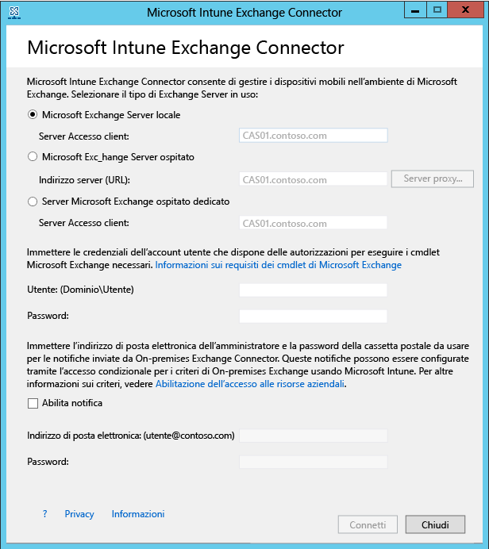

# Installare Intune On-premises Exchange Connector

[!INCLUDE[classic-portal](../includes/classic-portal.md)]

Per impostare una connessione che consenta a Microsoft Intune di comunicare con il server di Exchange Server in cui sono ospitate le cassette postali dei dispositivi mobili, è necessario scaricare e configurare On-Premises Exchange Connector dalla console di amministrazione di Intune. Intune supporta solo una connessione con Exchange Connector di qualsiasi tipo per ogni sottoscrizione.

## Requisiti per On-Premises Exchange Connector
Nella tabella seguente sono elencati i requisiti per il computer in cui viene installato On-premises Exchange Connector.

|Requisito|Altre informazioni|
|---------------|--------------------|
|Sistemi operativi|Intune supporta On-premises Exchange Connector su computer che eseguono qualsiasi edizione di Windows Server 2008 SP2 a 64 bit, Windows Server 2008 R2, Windows Server 2012 o Windows Server 2012 R2.  Il connettore non è supportato in tutte le installazioni Server Core.|
|Microsoft Exchange|On-Premises Connector richiede Microsoft Exchange 2010 SP1 o versioni successive oppure l'ambiente legacy Exchange Online dedicato. Per determinare se la configurazione dell'ambiente Exchange Online dedicato è **nuova** o **legacy**, contattare l'account manager.|
|Autorità di gestione dei dispositivi mobili| [Impostare l'autorità di gestione dei dispositivi mobili su Intune](prerequisites-for-enrollment.md#step-2-set-mdm-authority).|
|Hardware|Il computer in cui si installa il connettore richiede una CPU da 1,6 GHz con 2 GB di RAM e 10 GB di spazio libero sul disco.|
|Sincronizzazione di Active Directory|Prima di poter usare il connettore per collegare Intune all'istanza corrente di Exchange Server, è necessario [configurare la sincronizzazione di Active Directory](/intune/get-started/start-with-a-paid-subscription-to-microsoft-intune-step-3) in modo che gli utenti e i gruppi di sicurezza locali siano sincronizzati con l'istanza di Azure Active Directory.|
|Software aggiuntivo|Nel computer che ospita il connettore deve essere presente un'installazione completa di Microsoft .NET Framework 4.5 e Windows PowerShell 2.0.|
|Rete|Il computer in cui si installa il connettore deve essere in un dominio con una relazione di trust con il dominio che ospita l'istanza di Exchange Server.  Il computer deve essere configurato per poter accedere al servizio Intune attraverso firewall e server proxy sulle porte 80 e 443. I domini usati da Intune includono manage.microsoft.com, &#42;manage.microsoft.com e &#42;.manage.microsoft.com.|

### Requisiti dei cmdlet di Exchange

È necessario creare un account utente di Active Directory che viene usato da Intune Exchange Connector. L'account deve avere le autorizzazioni per eseguire i cmdlet Exchange di Windows PowerShell richiesti elencati di seguito.

 -   Get-ActiveSyncOrganizationSettings, Set-ActiveSyncOrganizationSettings
 -   Get-CasMailbox, Set-CasMailbox
 -   Get-ActiveSyncMailboxPolicy, Set-ActiveSyncMailboxPolicy, New-ActiveSyncMailboxPolicy, Remove-ActiveSyncMailboxPolicy
 -   Get-ActiveSyncDeviceAccessRule, Set-ActiveSyncDeviceAccessRule, New-ActiveSyncDeviceAccessRule, Remove-ActiveSyncDeviceAccessRule
 -   Get-ActiveSyncDeviceStatistics
 -   Get-ActiveSyncDevice
 -   Get-ExchangeServer
 -   Get-ActiveSyncDeviceClass
 -   Get-Recipient
 -   Clear-ActiveSyncDevice, Remove-ActiveSyncDevice
 -   Set-ADServerSettings
 -   Get-Command

## Scaricare il pacchetto di installazione di On-premises Exchange Connector

1. In un sistema operativo Windows Server supportato da On-premises Exchange Connector aprire la [console di amministrazione di Microsoft Intune](https://manage.microsoft.com) (https://manage.microsoft.com) con un account utente che è un amministratore nel tenant Exchange e dispone di una licenza per l'uso di Exchange Server.

2.  Nel riquadro dei collegamenti alle aree di lavoro scegliere **Amministrazione**>**Gestione dei dispositivi mobili** > **Microsoft Exchange**>**Configura connessione Exchange**.

3.  Nella pagina **Configura connessione Exchange** scegliere **Scarica On-Premises Connector**.

4.  On-premises Exchange Connector è contenuto in una cartella compressa (zip) che può essere aperta o salvata. Nella finestra di dialogo **Download del file** scegliere **Salva** per archiviare la cartella compressa in una posizione protetta.

> [!IMPORTANT]
> Non rinominare o spostare file all'interno della cartella di On-premises Exchange Connector. Se si sposta o si rinomina il contenuto della cartella l'installazione verrà interrotta.

## Installare e configurare Intune On-premises Exchange Connector
Eseguire la procedura seguente per installare Intune On-premises Exchange Connector. On-Premises Exchange Connector può essere installato una sola volta per ogni sottoscrizione di Intune e in un solo computer. Se si tenta di configurare un'istanza aggiuntiva di On-Premises Exchange Connector, la connessione originale sarà sostituita da quella nuova.

1.  In un sistema operativo supportato da On-Premises Connector estrarre i file inclusi in **Exchange_Connector_Setup.zip** in un percorso protetto.

2.  Dopo aver estratto i file, aprire la cartella estratta e fare doppio clic su **Exchange_Connector_Setup.exe** per installare On-Premises Exchange Connector.

    > [!IMPORTANT]
    > Se la cartella di destinazione non è una posizione sicura, è necessario eliminare il file di certificato **WindowsIntune.accountcert** dopo aver installato On-Premises Connector.

3.  Nella finestra di dialogo **Microsoft Intune Exchange Connector** selezionare **Microsoft Exchange Server locale** o **Microsoft Exchange Server ospitato**.

  

  Per un server Exchange locale specificare il nome del server o il nome di dominio completo del server Exchange in cui è ospitato il ruolo **Server Accesso client**.

  Per un server Exchange ospitato, specificare l'indirizzo del server Exchange. Per trovare l'URL del server Exchange ospitato:

    1. Aprire Outlook Web App per Office 365.

    2. Scegliere l'icona **?** in alto a sinistra e quindi selezionare **Informazioni su**.

    3. Individuare il valore di **Server esterno POP** .

    4. Scegliere **Server Proxy** per specificare le impostazioni del server proxy per il server Exchange ospitato.
        1. Selezionare **Utilizza un server proxy per la sincronizzazione delle informazioni del dispositivo mobile**.

        2. Immettere il **nome del server proxy** e il **numero di porta** da usare per accedere al server.

        3. Se è necessario specificare le credenziali utente per accedere al server proxy, selezionare **Utilizzare le credenziali per connettersi al server proxy** e quindi immettere **dominio\utente** e **password**.

        4. Scegliere **OK**.

    5. Nei campi **Utente (dominio\utente)** e **Password** immettere le credenziali necessarie per la connessione al server Exchange.

    6.  Fornire le credenziali amministrative necessarie per inviare le notifiche alla cassetta postale di Exchange Server di un utente. È possibile configurare queste notifiche con i criteri di accesso condizionale in Intune.

        Verificare che il servizio di individuazione automatica e i servizi Web Exchange siano configurati nel server Accesso client di Exchange. Per altre informazioni, vedere [Server Accesso client](https://technet.microsoft.com/library/dd298114.aspx).

    7.  Nel campo **Password** specificare la password per questo account, per abilitare Intune all'accesso a Exchange Server.

    8. Scegliere **Connetti**.

La configurazione della connessione può richiedere alcuni minuti.

Durante la configurazione, le impostazioni proxy vengono memorizzate da Exchange Connector per abilitare l'accesso a Internet. Se le impostazioni proxy cambiano, sarà necessario riconfigurare Exchange Connector per applicare le impostazioni proxy aggiornate.

Dopo aver configurato la connessione in Exchange Connector, i dispositivi mobili associati agli utenti gestiti in Exchange Connector vengono automaticamente sincronizzati e aggiunti a Exchange Connector. La sincronizzazione potrebbe richiedere parecchio tempo.

> [!NOTE]
> Se è stato installato On-Premises Exchange Connector e a un certo punto si elimina la connessione a Exchange, è necessario disinstallare On-Premises Exchange Connector dal computer in cui è stato installato.

## Convalidare la connessione di Exchange

Dopo aver configurato correttamente Exchange Connector, è possibile visualizzare lo stato della connessione e l'ultimo tentativo di sincronizzazione riuscito. Nella [console di amministrazione di Microsoft Intune](https://manage.microsoft.com) scegliere l'area di lavoro **Amministrazione**. In **Gestione dei dispositivi mobili** scegliere **Microsoft Exchange** e verificare che i dettagli specificati siano visualizzati in **Informazioni sulla connessione Exchange**.

È inoltre possibile verificare la data e ora dell'ultimo tentativo di sincronizzazione riuscito.

