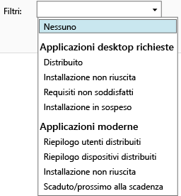

# Monitoraggio delle distribuzioni di app in Microsoft Intune

[!INCLUDE[classic-portal](../includes/classic-portal.md)]

## Monitorare la distribuzione di un'app
È possibile visualizzare le app gestite e lo stato di tutte le distribuzioni nella console di amministrazione di Intune. <!---App status is displayed in real-time. You don't have to wait for the device to check-in before you can see this.--->

### Per visualizzare le app gestite e il relativo stato
Nell'area di lavoro **App** selezionare il nodo **App**, quindi scegliere **App**.

Viene visualizzato l'elenco di app gestite. È possibile scegliere una qualsiasi app per visualizzare lo stato di installazione nel riquadro inferiore delle finestre della console. Per visualizzare altri dettagli, scegliere questo stato. Ad esempio, se lo stato è **1 utente dispone di questo software**, si può fare clic sul messaggio per visualizzare il nome dell'utente.

> [!TIP]
> È possibile usare l'elenco a discesa **Filtri** per visualizzare solo le app che soddisfano i criteri specificati, ad esempio le app la cui installazione non è riuscita o quelle distribuite correttamente.
>
> 

Inoltre, l'area di lavoro **Dashboard** include anche una panoramica dello stato delle app. Se si fa clic su un punto qualsiasi della panoramica, verrà visualizzato l'elenco di app.

## Per visualizzare informazioni più dettagliate su un'app
Nell'elenco di app selezionare un'app e quindi scegliere **Visualizza proprietà**.

Nella pagina **Proprietà software** dell'app scegliere una di queste schede: **Generale**, che contiene informazioni generali sull'app e sul relativo stato di installazione, **Dispositivi**, che indica i dispositivi su cui è installata una distribuzione di destinazione dell'app e **Utenti**, che indica gli utenti che hanno eseguito correttamente l'installazione di una distribuzione di destinazione dell'app nei propri dispositivi.

Come illustrato in precedenza, è possibile usare l'elenco a discesa **Filtri** per configurare i valori mostrati in ogni scheda.

<!--HONumber=Dec16_HO2-->

