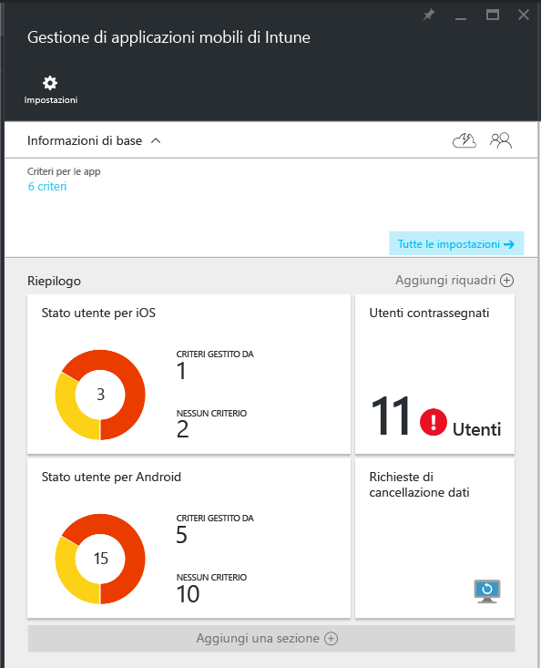
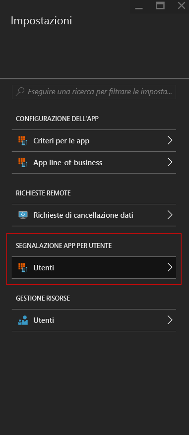
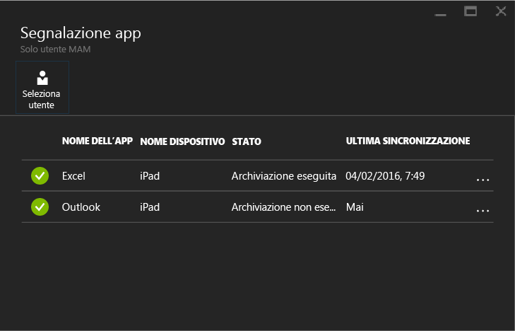

# Monitorare i criteri di gestione delle app per dispositivi mobili con Microsoft Intune

[!INCLUDE[classic-portal](../includes/classic-portal.md)]

Dopo aver configurato un criterio di gestione delle app mobili (MAM) e averlo applicato agli utenti, è possibile monitorare lo stato di conformità nel [portale di Azure](https://portal.azure.com). Il portale di Azure include informazioni sugli utenti interessati dai criteri, sullo stato di conformità e su eventuali problemi che potrebbero riscontrare gli utenti.
## Visualizzazione di riepilogo
Nel pannello **Gestione di applicazioni mobili di Intune** è possibile visualizzare un riepilogo dello stato di conformità:

-   **Utenti**: numero totale di utenti dell'azienda che usano le app associate ai criteri.

-   **Criteri Gestito da**: numero di utenti che hanno usato almeno una delle app nel contesto aziendale.

-   **Nessun criterio**: numero di utenti che usano le app associate ai criteri, ma non sono interessati dai criteri. È consigliabile aggiungere questi utenti ai criteri.

- **Utenti contrassegnati**: numero di utenti che riscontrano problemi. Al momento, in **Utenti contrassegnati** vengono indicati solo gli utenti con dispositivi jailbroken.

## Visualizzazione dettagliata
Per accedere alla visualizzazione dettagliata del riepilogo, scegliere il riquadro **Stato utente** e il riquadro **Utenti contrassegnati**.

### Stato utente
È possibile eseguire la ricerca di un singolo utente e controllare il relativo stato di conformità. Il pannello **Segnalazione app** mostra le informazioni seguenti per un utente selezionato:
- Dispositivi associati all'account utente

- App con criteri MAM nel dispositivo

- Stato:

  - **Archiviazione eseguita**: il criterio è stato distribuito all'utente e l'app è stata usata almeno una volta nel contesto aziendale.

  - **Archiviazione non eseguita**: il criterio è stato distribuito all'utente, ma l'app non è stata usata nel contesto aziendale da quel momento.

>[!NOTE]
> Se per l'utente cercato non è stato distribuito il criterio MAM, verrà visualizzato un messaggio che informa che l'utente non è assegnato ad alcun criterio dell'app.

Per visualizzare i report generati per un utente, seguire questa procedura:

1.  Per selezionare un utente, scegliere il riquadro **Riepilogo** o scegliere l'opzione **Segnalazione app per utente** nel pannello **Impostazioni**:

    

2. Nel pannello **Segnalazione app** che viene aperto scegliere **Seleziona utente** per cercare un utente di Azure Active Directory.

    

3. Selezionare un utente nell'elenco. Verranno visualizzati i dettagli dello stato di conformità per l'utente.

    

### Utenti contrassegnati
Nella visualizzazione dettagliata sono indicati il messaggio di errore, l'app a cui si è eseguito l'accesso quando si è verificato l'errore, la piattaforma del dispositivo e un timestamp.  

### Vedere anche
[Gestire il trasferimento di dati tra app iOS](manage-data-transfer-between-ios-apps-with-microsoft-intune.md)

* [Aspettative dalla gestione dell'app per Android con criteri MAM](user-experience-for-mam-enabled-android-apps-with-microsoft-intune.md)
* [Aspettative dalla gestione dell'app per iOS con criteri MAM](user-experience-for-mam-enabled-ios-apps-with-microsoft-intune.md)

<!--HONumber=Dec16_HO3-->

