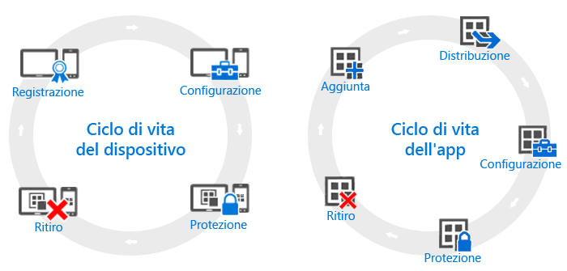

# Panoramica dei cicli di vita del dispositivo e dell'app

Anche se le esigenze delle singole organizzazioni possono essere diverse, esistono alcune operazioni comuni che tutte le organizzazioni devono eseguire con regolarità, indipendentemente dalle effettive esigenze operative. Tali operazioni possono essere raggruppate in due categorie principali, denominate **cicli di vita**. Il ciclo di vita di distribuzione seguito dipende dallo scenario che si vuole abilitare. Ad esempio, può essere necessario solo il ciclo di vita del dispositivo o solo il ciclo di vita dell'app, oppure possono essere necessari entrambi.

Ai fini della gestione, tutti i dispositivi hanno un ciclo di vita. Tale ciclo inizia con la registrazione del dispositivo e termina con il suo ritiro. Il [ciclo di gestione del dispositivo](overview-of-device-lifecycle-in-microsoft-intune.md) comprende la registrazione del dispositivo, la configurazione e la protezione dello stesso e quindi la sua rimozione dalla gestione.

Analogamente, le app usate hanno un proprio [ciclo di vita dell'app](overview-of-app-lifecycle-in-microsoft-intune.md) che include vari passaggi, dall'aggiunta di un'app a Intune fino alla rimozione quando non sono più necessarie.

<!--HONumber=Nov16_HO5-->

