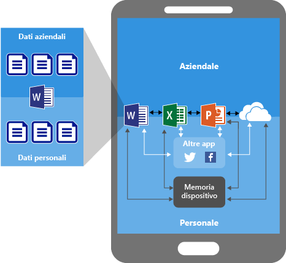
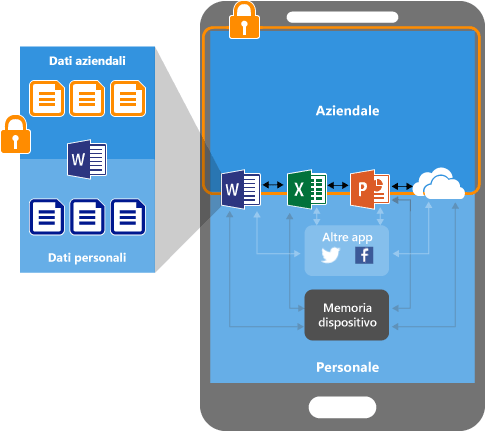
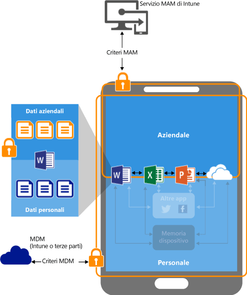
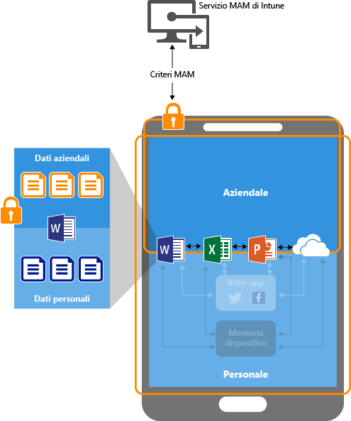

# Proteggere i dati delle app usando i criteri di gestione di applicazioni mobili con Microsoft Intune

## Protezione dei dati delle app
I dipendenti usano dispositivi mobili per le attività personali e aziendali. Se da una parte è necessario verificare la produttività dei dipendenti, dall'altra è indispensabile prevenire la perdita di dati, sia intenzionale sia non intenzionale.  Può inoltre essere utile proteggere i dati aziendali a cui i dipendenti hanno accesso mediante dispositivi non gestiti direttamente dall'amministratore.

Per proteggere i dati aziendali, è possibile usare i criteri di gestione delle applicazioni per dispositivi mobili (MAM) di Intune. Dal momento che i criteri MAM di Intune possono essere usati **in modo indipendente da qualsiasi soluzione di gestione di dispositivi mobili (MDM)**, è possibile usarli per proteggere i dati aziendali con o senza la registrazione di dispositivi in una soluzione di gestione dei dispositivi. Implementando i **criteri a livello di app** è possibile limitare l'accesso alle risorse aziendali e mantenere i dati all'interno del reparto IT.

È possibile configurare criteri MAM per app in esecuzione su dispositivi con le caratteristiche seguenti:

-   **Registrati in Microsoft Intune:** i dispositivi appartenenti a questa categoria sono in genere dispositivi di proprietà dell'azienda.

-   **Registrati in una soluzione di gestione di dispositivi mobili di terze parti:** i dispositivi appartenenti a questa categoria sono in genere dispositivi di proprietà dell'azienda.

  > [!NOTE]
  > L'uso di criteri MAM con soluzioni di gestione delle app per dispositivi mobili o di contenitore protetto di terze parti non è consigliato.

-   **Non registrati in alcuna soluzione di gestione di dispositivi mobili:** i dispositivi appartenenti a questa categoria sono in genere dispositivi di proprietà dei dipendenti non gestiti o registrati in Intune o altre soluzioni MDM.

> [!IMPORTANT]
> È possibile creare criteri di gestione delle applicazioni per dispositivi mobili per le app di Office per dispositivi mobili che si connettono ai servizi di Office 365. I criteri MAM non sono supportati per le app che si connettono ai servizi locali di Exchange, Skype for Business o SharePoint.

## Vantaggi dell'uso dei criteri MAM

-   **Consentono di proteggere i dati aziendali a livello di app.** Dal momento che la gestione delle applicazioni per dispositivi mobili non richiede la gestione dei dispositivi, è possibile proteggere i dati aziendali su dispositivi sia gestiti sia non gestiti. La gestione dei dati è incentrata sull'identità dell'utente che elimina il requisito della gestione dei dispositivi.

-   **La produttività dell'utente non è compromessa e i criteri non vengono applicati quando l'app viene usata in un contesto personale.** I criteri vengono applicati solo in un contesto aziendale, offrendo così la possibilità di proteggere i dati aziendali senza modificare i dati personali.

L'uso di soluzioni MDM con criteri MAM comporta vantaggi aggiuntivi e le aziende possono usare tali criteri con o senza soluzioni MDM allo stesso tempo. Ad esempio, un dipendente può usare un telefono rilasciato dall'azienda e un tablet personale. In questo caso, il telefono aziendale è registrato in MDM e protetto dai criteri MAM e il dispositivo personale è protetto solo dai criteri MAM.

- **MDM verifica che il dispositivo sia protetto.** Ad esempio, è possibile richiedere un PIN per accedere al dispositivo oppure distribuire le app gestite al dispositivo. È anche possibile distribuire app per dispositivi con la soluzione MDM, così da offrire maggiore controllo sulla gestione di app.

- **I criteri MAM garantiscono la presenza delle misure di sicurezza a livello di app.** Ad esempio, è possibile impostare un criterio in base a cui viene richiesto un PIN per aprire un'app in un contesto aziendale, viene impedita la condivisione di dati tra app e viene impedito il salvataggio di dati di un'app aziendale in un percorso di archiviazione personale.

## Dispositivi che supportano MAM
I criteri MAM sono attualmente supportati in:
-   iOS 8.1 o versioni successive
-   Android 4 o versioni successive

I dispositivi Windows non sono attualmente supportati.
##  Protezione dei dati delle app con i criteri MAM

###  App senza criteri MAM

Quando si usano le app senza restrizioni, può crearsi una commistione di dati aziendali e personali. I dati aziendali possono finire in percorsi come l'archivio personale o essere trasferiti ad app esterne all'ambito dell'utente, con possibile perdita di dati. Le frecce nel diagramma indicano lo spostamento senza restrizioni dei dati tra le app (aziendali e personali) e i percorsi di archiviazione.

### Protezione dei dati con i criteri MAM

È possibile usare i criteri MAM per impedire il salvataggio dei dati aziendali nell'archiviazione locale del dispositivo e limitare lo spostamento dei dati in altre app non protette dai criteri MAM. Le impostazioni dei criteri MAM includono:
- Criteri di rilocazione dei dati, ad esempio **Impedisci Salva con nome** e **Limita le operazioni taglia, copia e incolla**.
- Impostazioni dei criteri di accesso, ad esempio **Richiedi PIN semplice per l'accesso** e **Blocca l'esecuzione delle app gestite nei dispositivi jailbroken o rooted**.

### Protezione dei dati con criteri MAM nei dispositivi gestiti da una soluzione MDM

**Per i dispositivi registrati in una soluzione MDM**: l'immagine precedente mostra i livelli di protezione offerti dalla soluzione MDM e dai criteri MAM.

La soluzione MDM:

-   Registra il dispositivo.

-   Distribuisce le app al dispositivo.

-   Assicura la conformità e la gestione continua del dispositivo.

**I criteri MAM aggiungono valore nei modi seguenti:**

-   Aiutano a proteggere i dati aziendali dalla divulgazione alle app e ai servizi consumer.

-   Applicano restrizioni (salvataggio con nome, Appunti, PIN e così via) alle app per dispositivi mobili.

-   Cancellano i dati aziendali dalle app senza rimuoverle dal dispositivo.

### Protezione dei dati con i criteri MAM per dispositivi senza registrazione

L'immagine precedente illustra il funzionamento dei criteri di protezione dei dati a livello di app senza MDM.

Per i dispositivi BYOD non registrati in alcuna soluzione MDM, i criteri MAM possono aiutare a proteggere i dati aziendali a livello di app.

Esistono tuttavia alcune limitazioni da tenere in considerazione, ad esempio:

-   Non è possibile distribuire le app al dispositivo. L'utente finale deve ottenere le app dallo Store.

-   Non è possibile eseguire il provisioning dei profili certificato in questi dispositivi.

-   Non è possibile specificare le impostazioni Wi-FI e VPN aziendali in questi dispositivi.

## Supporto per identità multiple

Le app che supportano identità multiple consentono di usare account differenti, aziendale e personale, per accedere alle stesse app, mentre i criteri MAM vengono applicati quando le app vengono usate nel contesto aziendale.  

Ad esempio, quando un utente avvia l'app OneDrive usando il proprio account aziendale, non può spostare i file in un percorso di archiviazione personale. Tuttavia, quando tale utente usa OneDrive con il proprio account personale, può copiare e spostare i dati da OneDrive senza restrizioni.  

Tutte le app di Office per dispositivi mobili supportano l'accesso con più identità.

##  Passaggi successivi
- [Prepararsi per la configurazione dei criteri di gestione delle applicazioni mobili](get-ready-to-configure-mobile-app-management-policies-with-microsoft-intune.md)

- [Creare e distribuire i criteri di gestione di applicazioni per dispositivi mobili con Microsoft Intune](create-and-deploy-mobile-app-management-policies-with-microsoft-intune.md)

<!--HONumber=Dec16_HO2-->

