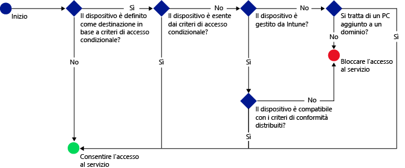

# Proteggere l'accesso alla posta elettronica, a Office 365 e ad altri servizi con Microsoft Intune

[!INCLUDE[classic-portal](../includes/classic-portal.md)]

È possibile proteggere l'accesso alla posta elettronica aziendale, a servizi di Office 365 come **Exchange locale**, **Exchange Online**, **Exchange Online dedicato**, **SharePoint Online**, **Skype for Business Online** e ad altri servizi tramite l'accesso condizionale di Enterprise Mobility + Security (EMS). Questa funzionalità consente di assicurarsi che l'accesso alla posta elettronica aziendale e ai servizi di Office 365 venga limitato ai dispositivi conformi alle regole di accesso condizionale impostate nella console di amministrazione di Intune o nel portale classico di Azure.
## Come funziona l'accesso condizionale?
È possibile usare le impostazioni dei criteri di conformità per valutare la conformità di un dispositivo. I criteri di accesso condizionale usano la versione di valutazione per limitare o consentire l'accesso a un servizio specifico. Quando i criteri di accesso condizionale vengono usati in combinazione con i criteri di conformità dei dispositivi, possono accedere al servizio solo i dispositivi conformi. I criteri di conformità e di accesso condizionale vengono distribuiti all'utente. Di qualsiasi dispositivo usato dall'utente per accedere ai servizi viene verificata la conformità ai criteri.

> [!IMPORTANT]
> Tenere presente che l'utente che usa il dispositivo deve disporre di criteri di conformità distribuiti, così da consentire la valutazione della conformità del dispositivo stesso.
> Se all'utente non viene distribuito alcun criterio di conformità, il dispositivo viene considerato conforme e non vengono applicate restrizioni di accesso.

Se i dispositivi non soddisfano le condizioni definite nei criteri, l'utente finale viene guidato nel processo di registrazione del dispositivo e di risoluzione del problema che impedisce la conformità del dispositivo.

Un flusso di accesso condizionale tipico:

## Considerazioni sulla configurazione

### Licenze

Microsoft Intune e Azure Active Directory (Azure AD) Premium sono perfettamente integrati per offrire più livelli di controllo tramite l'accesso condizionale EMS. Se si vogliono distribuire criteri di accesso condizionale con Intune, è necessario avere una licenza per entrambi i prodotti.

Le **licenze di Azure AD Premium** possono essere acquistate come servizio autonomo oppure (insieme a Intune) come parte del contratto aziendale. Se si distribuiscono criteri di accesso condizionale con Intune, assicurarsi di avere ottenuto le licenze appropriate per Azure AD Premium o **EMS**.

- Per altre informazioni, vedere la [pagina dei prezzi di Enterprise Mobility](https://www.microsoft.com/cloud-platform/enterprise-mobility-pricing) o la [pagina dei prezzi di Azure Active Directory](https://azure.microsoft.com/pricing/details/active-directory/).

Assicurarsi inoltre di avere [assegnato licenze di Azure AD Premium o EMS](/Intune/get-started/start-with-a-paid-subscription-to-microsoft-intune-step-4.md) agli utenti a cui si prevede di applicare i criteri di accesso condizionale.

### Impostazioni di conformità del dispositivo

Per impostare l'accesso condizionale, configurare i criteri di conformità del dispositivo e i criteri di accesso condizionale. I criteri di conformità includono impostazioni quali passcode e crittografia e la specifica se un dispositivo è jailbroken. Per poter essere considerato conforme, il dispositivo deve soddisfare le regole seguenti.

- Vedere altre informazioni sui [criteri di conformità del dispositivo e il relativo funzionamento](introduction-to-device-compliance-policies-in-microsoft-intune.md).

### Criteri di accesso condizionale

È possibile impostare criteri di accesso condizionale per proteggere l'accesso in base a:
- Stato di conformità del dispositivo.
- Piattaforma in esecuzione nel dispositivo.
- Tipo di app usate per l'accesso ai servizi.

A differenza degli altri criteri di Intune, i criteri di accesso condizionale non vengono distribuiti. Dopo aver configurato i criteri e aver selezionato gli utenti che devono disporre di tali criteri, questi vengono applicati a tutti gli utenti destinatari. Per poter accedere alle risorse, un utente di destinazione di un criterio deve usare solo dispositivi conformi.

## Passaggi successivi

2. [Creare criteri di conformità dei dispositivi](create-a-device-compliance-policy-in-microsoft-intune.md).

2.  È possibile creare criteri di accesso condizionale per uno dei servizi cloud/prodotti Microsoft seguenti:

  - [Creare criteri di accesso condizionale per Exchange Online](restrict-access-to-exchange-online-with-microsoft-intune.md)
  - [Creare criteri di accesso condizionale per Exchange locale](restrict-access-to-exchange-onpremises-with-microsoft-intune.md)
  - [Creare criteri di accesso condizionale per il nuovo ambiente Exchange Online dedicato](restrict-access-to-exchange-online-with-microsoft-intune.md)
  - [Creare criteri di accesso condizionale per l'ambiente legacy Exchange Online dedicato](restrict-access-to-exchange-onpremises-with-microsoft-intune.md)
  - [Creare criteri di accesso condizionale per SharePoint Online](restrict-access-to-sharepoint-online-with-microsoft-intune.md)
  - [Creare criteri di accesso condizionale per Skype for Business Online](restrict-access-to-skype-for-business-online-with-microsoft-intune.md)
  - [Creare criteri di accesso condizionale per Dynamics CRM Online](restrict-access-to-dynamics-crm-online-with-microsoft-intune.md)

