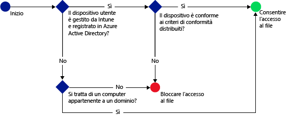

# Limitare l'accesso a SharePoint Online con Microsoft Intune
Usare l'accesso condizionale di [!INCLUDE[wit_firstref](../includes/wit_firstref_md.md)] per controllare l'accesso ai file in SharePoint Online.
L'accesso condizionale è costituito da due componenti:
- Criteri di conformità che il dispositivo deve soddisfare per essere considerato conforme.
- Criteri di accesso condizionale in cui si specificano le condizioni che il dispositivo deve soddisfare per poter accedere al servizio.
Per altre informazioni sul funzionamento dell'accesso condizionale, leggere l'argomento relativo alla [limitazione dell'accesso alla posta elettronica, a Office 365 e ad altri servizi](restrict-access-to-email-and-o365-services-with-microsoft-intune.md).

Distribuire i criteri di conformità e di accesso condizionale agli utenti. Viene verificata la conformità ai criteri di qualsiasi dispositivo usato dall'utente per accedere ai servizi.

Quando un utente prova a connettersi a un file usando un'app supportata, come OneDrive, installata nel dispositivo, vengono effettuate le valutazioni seguenti:

**Prima** di configurare i criteri di accesso condizionale per SharePoint Online è necessario:
- Avere una **sottoscrizione a SharePoint Online** e gli utenti devono avere una licenza per SharePoint Online.
- Avere una **sottoscrizione di Enterprise Mobility + Security (EMS)** o una **sottoscrizione di Azure Active Directory Premium (Azure AD)** e gli utenti devono essere licenziatari di EMS o Azure AD. Per altre informazioni dettagliate, vedere la [pagina dei prezzi di Enterprise Mobility](https://www.microsoft.com/en-us/cloud-platform/enterprise-mobility-pricing) o la [pagina dei prezzi di Azure Active Directory](https://azure.microsoft.com/en-us/pricing/details/active-directory/).

  Per connettersi ai file richiesti, un dispositivo deve essere:
-   **Registrato** con [!INCLUDE[wit_nextref](../includes/wit_nextref_md.md)] o un PC aggiunto a un dominio.

-   **Registrato** in Azure Active Directory. Questo avviene automaticamente quando il dispositivo viene registrato con [!INCLUDE[wit_nextref](../includes/wit_nextref_md.md)].

-   **Compatibile** con i criteri di conformità di [!INCLUDE[wit_nextref](../includes/wit_nextref_md.md)] distribuiti.

Lo stato del dispositivo viene archiviato in Azure Active Directory che consente o blocca l'accesso ai file, in base alle condizioni specificate.

Se non viene soddisfatta una condizione, quando esegue l'accesso l'utente vede uno dei messaggi seguenti:

-   Se il dispositivo non è registrato con [!INCLUDE[wit_nextref](../includes/wit_nextref_md.md)] oppure non è registrato in Azure Active Directory, viene visualizzato un messaggio contenente istruzioni su come installare l'app Portale aziendale ed eseguire la registrazione.

-   Se il dispositivo non è conforme, viene visualizzato un messaggio che indirizza l'utente al sito Web del portale aziendale di [!INCLUDE[wit_nextref](../includes/wit_nextref_md.md)] dove sono disponibili informazioni sul problema e su come risolverlo.

**L'accesso condizionale non si applica alla condivisione esterna**. Per informazioni su come impedire la condivisione esterna nel tenant o in una raccolta siti, vedere [Gestire la condivisione esterna per l'ambiente di SharePoint Online](https://support.office.com/en-us/article/Manage-external-sharing-for-your-SharePoint-Online-environment-C8A462EB-0723-4B0B-8D0A-70FEAFE4BE85?ui=en-US&rs=en-US&ad=US).

>[!NOTE]
>Se si abilita l'accesso condizionale per SharePoint Online, è consigliabile disabilitare il dominio nell'elenco come descritto nell'argomento [Remove-SPOTenantSyncClientRestriction](https://technet.microsoft.com/en-us/library/dn917451.aspx).  

## Supporto per dispositivi mobili
Sono supportati:
- iOS 8.0 e versioni successive
- Android 4.0 e versioni successive, Samsung Knox Standard 4.0 o versioni successive
- Windows Phone 8.1 e versioni successive

È possibile limitare l'accesso a SharePoint Online quando i dispositivi **iOS** e **Android** vi accedono da un browser. L'accesso è consentito solo dai browser supportati su dispositivi conformi:
* Safari (iOS)
* Chrome (Android)
* Intune Managed Browser (iOS e Android 5.0 e versioni successive)

**I browser non supportati sono bloccati**.

## Supporto per PC
Sono supportati:
- Windows 8.1 e versioni successive (se i PC sono registrati con Intune)
- Windows 7.0, Windows 8.1 o Windows 10 (se i PC sono aggiunti a un dominio)
> [!NOTE]
>Per usare l'accesso condizionale con PC Windows 10, è necessario aggiornare i PC con Windows 10 Anniversary Update.

  - È necessario configurare PC aggiunti a un dominio in modo che vengano [registrati automaticamente](https://azure.microsoft.com/en-us/documentation/articles/active-directory-conditional-access-automatic-device-registration/) con Azure Active Directory. Il servizio Registrazione dispositivo di Azure AD verrà attivato automaticamente per i clienti di Intune e Office 365. I clienti che hanno già distribuito il servizio di registrazione dei dispositivi di ADFS non visualizzeranno i dispositivi registrati in Active Directory locale.

  - Se i criteri sono impostati in modo da richiedere l'aggiunta a un dominio e il PC non è aggiunto a un dominio, viene visualizzato un messaggio che indica di contattare l'amministratore IT.

  - Se i criteri sono impostati in modo da richiedere l'aggiunta a un dominio o la conformità e il PC non soddisfa questi requisiti, viene visualizzato un messaggio contenente istruzioni su come installare l'app Portale aziendale ed eseguire la registrazione.
  >[!NOTE]
  >L'accesso condizionale non è supportato nei computer che eseguono il client dei computer Intune.

[L'autenticazione moderna di Office 365 deve essere abilitata](https://support.office.com/en-US/article/Using-Office-365-modern-authentication-with-Office-clients-776c0036-66fd-41cb-8928-5495c0f9168a) ed è necessario avere tutti gli aggiornamenti di Office più recenti.

L'autenticazione moderna consente l'accesso basato su Active Directory Authentication Library (ADAL) ai client Windows con Office 2013 e offre migliori opzioni di sicurezza, come l'**autenticazione a più fattori** e l'**autenticazione basata sui certificati**.

## Configurare l'accesso condizionale per SharePoint Online

### Passaggio 1: Configurare i gruppi di sicurezza di Active Directory
Prima di iniziare configurare i gruppi di sicurezza di Azure Active Directory per i criteri di accesso condizionale. È possibile configurare questi gruppi nel **centro di amministrazione di Office 365**o nel **portale per gli account di Intune**. I gruppi vengono usati per definire gli utenti come destinazione dei criteri o per esentarli da questi ultimi. Per poter accedere alle risorse, un utente di destinazione in un criterio deve usare solo dispositivi conformi.

In un criterio di SharePoint Online è possibile specificare due tipi di gruppi:

-   **Gruppi di destinazione**: contiene i gruppi di utenti per i quali si applicano i criteri.

-   **Gruppi di esenzione**: contiene i gruppi di utenti esclusi dai criteri.

Se un utente si trova in entrambi i gruppi, sarà esentato dai criteri.

### Passaggio 2: Configurare e distribuire i criteri di conformità
Se questa operazione non è ancora stata eseguita, creare i criteri di conformità e distribuirli agli utenti a cui sono destinati i criteri di SharePoint Online.

> [!NOTE]
> Mentre i criteri di conformità vengono distribuiti nei gruppi di [!INCLUDE[wit_nextref](../includes/wit_nextref_md.md)], i criteri di accesso condizionale sono destinati ai gruppi di sicurezza di Azure Active Directory.

Per informazioni dettagliate su come configurare i criteri di conformità, vedere [Creare i criteri di conformità](create-a-device-compliance-policy-in-microsoft-intune.md).

> [!IMPORTANT]
> Se i criteri di conformità non sono stati distribuiti, i dispositivi vengono considerati conformi.

Quando si è pronti, continuare con il **Passaggio 3**.

### Passaggio 3: Configurare i criteri di SharePoint Online
A questo punto, configurare i criteri in modo che solo i dispositivi gestiti e conformi possano accedere a SharePoint Online. Questi criteri sono archiviati in Azure Active Directory.

#### 

>[!NOTE]
> È anche possibile creare i criteri di accesso condizionale per i dispositivi Intune nella console di gestione di Azure AD (definiti come **criteri di accesso condizionale basato su dispositivo** in Azure AD), oltre ad altri criteri di accesso condizionale come l'autenticazione a più fattori. È anche possibile impostare i criteri di accesso condizionale per app aziendali di terze parti supportate da Azure AD, come Salesforce e Box. Per altre informazioni dettagliate, vedere [Come impostare criteri di accesso condizionale basato su dispositivo di Azure Active Directory per controllare gli accessi delle applicazioni connesse ad Azure Active Directory](https://azure.microsoft.com/en-us/documentation/articles/active-directory-conditional-access-policy-connected-applications/).

1.  Nella [console di amministrazione di Microsoft Intune](https://manage.microsoft.com) scegliere **Criteri** > **Accesso condizionale** > **Criteri di SharePoint Online**.

2.  Selezionare **Abilita criteri di accesso condizionale per SharePoint Online**.

3.  In **Accesso all'applicazione** è possibile scegliere di applicare i criteri di accesso condizionale a:

    -   **Tutte le piattaforme**

        Tutti i dispositivi usati per accedere a **SharePoint Online** devono essere registrati in Intune e devono essere conformi ai criteri. Qualsiasi applicazione client che usa l'**autenticazione moderna** è soggetta ai criteri di accesso condizionale. Se la piattaforma non è attualmente supportata da Intune, l'accesso a **SharePoint Online** è bloccato.

        La selezione dell'opzione **Tutte le piattaforme** indica che Azure Active Directory applica questo criterio a tutte le richieste di autenticazione, indipendentemente dalla piattaforma segnalata dall'applicazione client. Tutte le piattaforme devono essere registrate e conformi, ad eccezione di:
        *   Dispositivi Windows, che dovranno essere registrati e conformi e/o aggiunti a un dominio con Active Directory locale.
        * Piattaforme non supportate come Mac. Tuttavia, le app che usano l'autenticazione moderna da queste piattaforme sono comunque bloccate.

    -   **Piattaforme specifiche**

         I criteri di accesso condizionale si applicano a tutte le app client che usano l'autenticazione moderna nelle piattaforme specificate.

     Per i PC Windows, i PC devono essere aggiunti a un dominio oppure registrati e conformi a [!INCLUDE[wit_nextref](../includes/wit_nextref_md.md)]. È possibile impostare i requisiti seguenti:

     -   **I dispositivi devono essere aggiunti a un dominio o conformi.** Se i PC devono essere aggiunti a un dominio o conformi ai criteri impostati in [!INCLUDE[wit_nextref](../includes/wit_nextref_md.md)], scegliere questa opzione. Se un PC non soddisfa uno di questi requisiti, all'utente verrà richiesto di registrare il dispositivo in [!INCLUDE[wit_nextref](../includes/wit_nextref_md.md)].

     -   **I dispositivi devono essere aggiunti a un dominio.** Per aggiungere i PC a un dominio per l'accesso a Exchange Online, scegliere questa opzione. Se un PC non è aggiunto a un dominio, l'accesso alla posta elettronica viene bloccato e all'utente viene richiesto di contattare l'amministratore IT.

     -   **I dispositivi devono essere conformi.** Affinché i PC siano registrati in [!INCLUDE[wit_nextref](../includes/wit_nextref_md.md)] e conformi, scegliere questa opzione. Se un PC non è registrato, viene visualizzato un messaggio contenente le istruzioni su come eseguire la registrazione.

4.   In **Accesso browser** a SharePoint Online e OneDrive for Business è possibile scegliere di consentire l'accesso a Exchange Online solo dai browser supportati: Safari (iOS) e Chrome (Android). Non è possibile accedere da altri browser. Vengono applicate le stesse restrizioni di piattaforma selezionate per l'accesso all'applicazione per OneDrive.

  Nei dispositivi **Android** gli utenti devono abilitare l'accesso al browser. Per eseguire questa operazione, l'utente deve scegliere l'opzione **Abilita l'accesso al browser** sul dispositivo registrato come indicato di seguito:
  1.    Aprire l'app **Portale aziendale**.
  2.    Passare alla pagina **Impostazioni** dai puntini di sospensione (...) o usando il pulsante di menu hardware.
  3.    Premere il pulsante **Abilita l'accesso al browser**.
  4.    Nel browser Chrome disconnettersi da Office 365 e riavviare Chrome.

  Nelle piattaforme **iOS** e **Android**, per identificare il dispositivo usato per accedere al servizio, Azure Active Directory emette un certificato TLS (Transport Layer Security) per il dispositivo. Il dispositivo visualizza il certificato richiedendo all'utente la selezione del certificato, come illustrato nelle schermate seguenti. Per usare il browser è necessario che l'utente selezioni il certificato.

  **iOS**

  

  **Android**

  
5.  In **Gruppi di destinazione** scegliere **Modifica** per selezionare i gruppi di sicurezza di Azure Active Directory ai quali vengono applicati i criteri. È possibile scegliere di applicare questa opzione a tutti gli utenti o solo a un gruppo di utenti selezionato.

6.  Facoltativamente, in **Gruppi esentati** scegliere **Modifica** per selezionare i gruppi di sicurezza di Azure Active Directory esentati da questi criteri.

7.  Al termine dell'operazione scegliere **Salva**.

Non è necessario distribuire i criteri di accesso condizionale perché diventano immediatamente effettivi.

### Passaggio 4: Monitorare i criteri di conformità e di accesso condizionale
Nell'area di lavoro **Gruppi** è possibile visualizzare lo stato dei dispositivi.

Scegliere un gruppo qualsiasi di dispositivi mobili e quindi nella scheda **Dispositivi** scegliere uno dei **filtri** seguenti:

-   **Dispositivi non registrati con AAD**. Questi dispositivi non possono accedere a SharePoint Online.

-   **Dispositivi non conformi**. Questi dispositivi non possono accedere a SharePoint Online.

-   **Dispositivi conformi e registrati con AAD**. Questi dispositivi possono accedere a SharePoint Online.

### Vedere anche
[Limitare l'accesso alla posta elettronica e ai servizi di Office 365 con Microsoft Intune](restrict-access-to-email-and-o365-services-with-microsoft-intune.md)

<!--HONumber=Dec16_HO2-->

