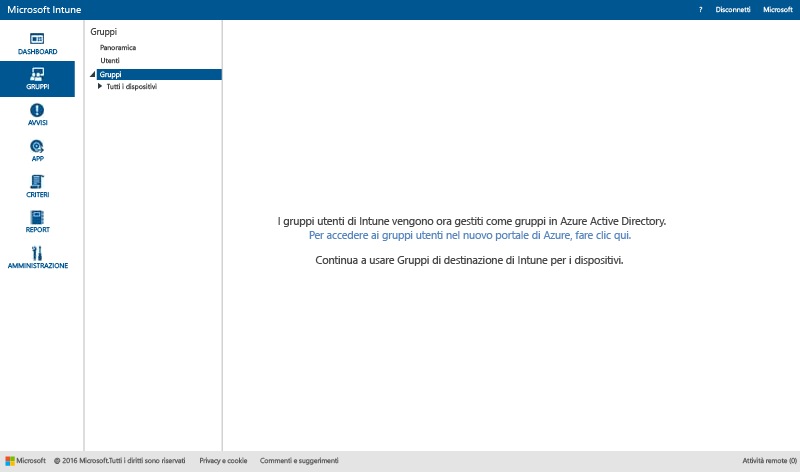

# Usare gruppi per gestire utenti e dispositivi in Microsoft Intune

Questo argomento descrive come creare gruppi in Intune. Fornisce inoltre informazioni su come verrà modificata la gestione dei gruppi nei prossimi mesi. 

>[!IMPORTANT]
>
>Se si apre l'area di lavoro Gruppi nel portale di Intune ed è disponibile un collegamento al portale di Azure Active Directory (Azure AD), questo indica che è già in uso il *nuovo* approccio alla gestione dei gruppi in Intune basato sui gruppi di sicurezza di Azure AD, descritto in [Avviso sui miglioramenti che verranno apportati alle funzionalità di amministrazione per i gruppi](#notice-of-upcoming-improvements-to-the-admin-experience-for-groups). Fare clic sul collegamento al portale di Azure AD per creare e gestire i gruppi.
>
> 
>
>Se non è disponibile il collegamento al portale di Azure AD, si sta ancora usando l'approccio *corrente* alla gestione dei gruppi, descritto in [Creare gruppi per gestire utenti e dispositivi con Microsoft Intune](#Create-groups-to-manage-users-and-devices-with-Microsoft-Intune) in questo argomento.

## Avviso sui miglioramenti che verranno apportati alle funzionalità di amministrazione per i gruppi

I clienti ci hanno comunicato che vorrebbero usare un'esperienza unica per il raggruppamento e l'assegnazione della destinazione in Enterprise Mobility + Security. Abbiamo ascoltato queste richieste e in base al feedback dei clienti convertiremo presto i gruppi di Intune in gruppi di sicurezza basati su Azure Active Directory. Con questa modifica la gestione dei gruppi verrà unificata in Intune e Azure Active Directory (Azure AD). La nuova esperienza significa che non sarà necessario duplicare i gruppi tra i servizi. Ciò garantirà anche l'estendibilità, grazie alle opzioni per l'uso di Windows PowerShell e Microsoft Graph.

### Quali sono le conseguenze immediate di questa modifica?
Attualmente la modifica non ha alcun effetto sui clienti esistenti di Intune, ma ecco gli sviluppi futuri previsti:

-   I nuovi account useranno i gruppi di sicurezza di Azure AD anziché i gruppi *Utente* di Intune.   
-   A novembre 2016 i nuovi account di cui è stato eseguito il provisioning dopo il rilascio mensile del servizio gestiranno sia i gruppi basati sugli utenti sia quelli basati sui dispositivi nel portale di Azure AD. Non è previsto alcun effetto per i clienti esistenti.
-   A dicembre 2016 il team di prodotto Intune inizierà la migrazione dei clienti esistenti alla nuova esperienza di gestione dei gruppi basata su Azure AD. Verrà eseguita la migrazione di tutti i gruppi di utenti e dispositivi attualmente esistenti in Intune a gruppi di sicurezza di Azure AD. Microsoft non inizierà la migrazione senza prima aver ridotto al minimo l'impatto sulle attività quotidiane degli utenti e fino a quando non sarà previsto alcun impatto sugli utenti finali. Verrà inoltre inviata notifica prima della migrazione degli account.

### Come e quando sarà possibile eseguire la migrazione ai nuovi gruppi?
La migrazione dei clienti di Intune correnti verrà eseguita in un certo lasso di tempo. Microsoft sta finalizzando la pianificazione della migrazione. Questo argomento verrà aggiornato tra qualche settimana per fornire ulteriori dettagli. Invieremo notifica ai clienti prima della migrazione. Per domande e chiarimenti sulla migrazione, contattare il team addetto all'indirizzo [intunegrps@microsoft.com](mailto:intunegrps@microsoft.com). Per informazioni dettagliate sulla modalità in cui verrà eseguita la migrazione dei gruppi, vedere [Migrazione ai gruppi di Azure Active Directory](migrating-groups-to-azure-active-directory.md).

### Cosa accade ai gruppi di utenti e dispositivi esistenti?
 Verrà eseguita la migrazione dei gruppi di utenti e dispositivi creati dagli utenti in Intune a gruppi di sicurezza di Azure AD. Verrà eseguita la migrazione dei gruppi di Intune predefiniti, ad esempio il gruppo Tutti gli utenti, solo se al momento della migrazione sono usati in distribuzioni. La migrazione può rivelarsi più complessa per particolari gruppi. Se sono necessari passaggi aggiuntivi per la migrazione all'interno di specifiche organizzazioni, Microsoft provvederà a inviare una notifica.

### Quali saranno le nuove funzionalità disponibili?
Ecco le nuove funzionalità che verranno introdotte con la migrazione da Intune ad Azure Active Directory:

-    I gruppi di sicurezza di Azure AD saranno supportati in Intune per tutti i tipi di distribuzione.
-    I gruppi di sicurezza di Azure AD supporteranno il raggruppamento sia di dispositivi che di utenti.
-    I gruppi di sicurezza di Azure AD supporteranno i gruppi dinamici con attributi dei dispositivi di Intune. Ad esempio, sarà possibile raggruppare dinamicamente i dispositivi in base alla piattaforma, ad esempio iOS. Quando nell'organizzazione viene registrato un nuovo dispositivo iOS, tale dispositivo verrà aggiunto automaticamente al gruppo dinamico di dispositivi iOS.
-    Sarà disponibile un'esperienza di amministrazione condivisa per la gestione dei gruppi in Azure AD e Intune.
- Ad Azure AD verrà aggiunto il ruolo di amministratore del servizio di Intune, in modo che gli amministratori del servizio Intune possano eseguire attività di gestione dei gruppi in Azure AD.

### Quali funzionalità di Intune non saranno disponibili?
Anche se l'esperienza per i gruppi registrerà dei miglioramenti, alcune funzionalità di Intune non saranno disponibili dopo la migrazione dell'organizzazione dai gruppi di Intune ai gruppi di sicurezza di Azure AD.

#### Funzionalità di gestione dei gruppi

-   Dopo la migrazione, non sarà possibile escludere membri o gruppi quando si crea un nuovo gruppo. I gruppi dinamici di Azure AD, tuttavia, consentiranno di usare gli attributi per creare regole avanzate per escludere i membri da un gruppo sulla base dei criteri impostati.
-   I gruppi Utenti non raggruppati e Dispositivi non raggruppati non saranno supportati. Non verrà eseguita la migrazione di tali gruppi da Intune ad Azure AD.

#### Funzionalità dipendenti dai gruppi

-   Il ruolo Amministratore del servizio non disporrà delle autorizzazioni di tipo **Gestisci gruppi**.
-   Non sarà possibile raggruppare dispositivi Exchange ActiveSync. Il gruppo All EAS Managed Devices (Tutti i dispositivi gestiti da EAS) verrà convertito in visualizzazione di report.
-  La trasformazione in report tramite Pivot con gruppi non sarà disponibile.
-  La possibilità di scegliere gruppi personalizzati come destinazione delle regole di notifica non sarà supportata.

### Quali operazioni è necessario eseguire in preparazione del cambiamento?
 Di seguito sono indicati alcuni accorgimenti che consentiranno di facilitare la migrazione:

- Prima della migrazione, eliminare i gruppi di Intune non desiderati o non necessari.
- Valutare la possibilità di usare la funzionalità di esclusione nei gruppi e di riprogettare i gruppi stessi in modo che non sia necessario fare ricorso all'esclusione.
-  Se sono presenti amministratori che non dispongono delle autorizzazioni per la creazione di gruppi in Azure AD, chiedere all'amministratore di Azure AD di aggiungerli al ruolo di amministratore del servizio di Intune di Azure AD.

## Creare gruppi per gestire utenti e dispositivi con Microsoft Intune

Questa sezione descrive come creare gruppi di Intune nella console di amministrazione di Intune.

È possibile creare e gestire i gruppi nell'area di lavoro **Gruppi** nella console di amministrazione Microsoft Intune. La pagina **Panoramica gruppi** mostra riepiloghi dello stato utili per identificare i problemi che richiedono attenzione e definirne le priorità. Sono disponibili riepiloghi dello stato per le aree seguenti:

-   Avvisi
-   Aggiornamenti software
-   Endpoint Protection
-   Criteri
-   Gestione software

Anche la gerarchia dei gruppi mostra riepiloghi dello stato che consentono di identificare e risolvere i problemi per i membri di un gruppo selezionato.

## Creare i gruppi

> [!TIP]
> Quando si creano gruppi, tenere conto del modo in cui verranno applicati i criteri. Ad esempio, si possono applicare criteri specifici dei sistemi operativi dei dispositivi e criteri specifici per ruoli diversi nell'organizzazione o per differenti unità organizzative già definiti in Active Directory. Potrebbe essere utile avere gruppi di dispositivi separati per iOS, Android e Windows, oltre a un gruppo di utenti per ogni ruolo dell'organizzazione.
>
> Sarà probabilmente anche utile creare criteri predefiniti applicabili a tutti i gruppi e i dispositivi, per stabilire i requisiti di conformità di base dell'organizzazione. Sarà quindi possibile creare criteri più specifici per categorie più ampie di utenti e dispositivi, ad esempio criteri di posta elettronica per ogni sistema operativo per i dispositivi.
>
> Prestare attenzione ai nomi assegnati ai criteri in modo da poterli identificare facilmente in un secondo momento. Ad esempio, un nome descrittivo appropriato per i criteri è **Criteri di posta elettronica WP per l'intera azienda**.
>
> Ogni volta che si crea un criterio restrittivo, è opportuno comunicarlo agli utenti. Dopo aver creato gruppi e criteri più generali, prestare attenzione a come vengono creati i gruppi più piccoli in modo che sia possibile ridurre le comunicazioni non necessarie.

### Per creare un gruppo di dispositivi

1.  Nella console di amministrazione Intune scegliere **Gruppi** &gt; **Panoramica** &gt; **Crea gruppo**.

2.  Immettere un nome e una descrizione facoltativa per il gruppo e quindi selezionare un gruppo di dispositivi come gruppo padre. Scegliere **Avanti**.

3.  Nella pagina **Definisci criteri appartenenza** selezionare il tipo di dispositivi da includere nel gruppo. Sono disponibili ulteriori opzioni per la configurazione dei gruppi in base ai tipi di dispositivi che si sceglie di includere:

    -   **Computer**. Specificare se includere tutti i membri del gruppo padre, le unità organizzative da includere o escludere e i domini da includere o escludere. È possibile ottenere le informazioni sulle unità organizzative e sul dominio per un computer dall'inventario.

    -   **Dispositivi mobili**. Specificare se includere i dispositivi mobili gestiti da Intune, quelli gestiti da Exchange ActiveSync o entrambi.

    -   **Tutti i dispositivi**. Questa opzione include tutti i dispositivi senza esclusioni in base ai criteri.

4.  Nella pagina **Definisci appartenenza diretta** scegliere **Sfoglia** per selezionare i singoli dispositivi da includere o escludere. Se si selezionano dispositivi che non sono inclusi nel gruppo padre specificato, Intune li aggiungerà automaticamente al gruppo padre.

5.  Nella pagina **Riepilogo** verificare le opzioni selezionate e quindi scegliere **Fine**.

Il gruppo appena creato viene visualizzato nell'elenco **Gruppi** nell'area di lavoro **Gruppi** nel gruppo padre. Da qui è anche possibile modificare o eliminare il gruppo.

### Per creare un gruppo di utenti

1.  Nella console di amministrazione Intune scegliere **Gruppi** &gt; **Panoramica** &gt; **Crea gruppo**.

2.  Specificare un nome e una descrizione facoltativa per il gruppo e quindi selezionare un gruppo di utenti come gruppo padre. Scegliere **Avanti**.

3.  Nella pagina **Definisci criteri appartenenza** scegliere se includere tutti i membri del gruppo padre o iniziare con un gruppo vuoto. Includere o escludere quindi i membri in base ai gruppi di sicurezza degli utenti configurati manualmente nell'[interfaccia di amministrazione di Office 365](http://go.microsoft.com/fwlink/?LinkId=698854) o sincronizzati da Active Directory locale. Se cambia l'appartenenza di un gruppo di sicurezza, potrebbe cambiare anche l'appartenenza dei gruppi di utenti che si basano su quel gruppo di sicurezza.

    > [!IMPORTANT]
    > Attualmente, se il gruppo include i membri da specifici gruppi di sicurezza o gruppi di manager e si escludono i membri da alcuni gruppi, i membri inizialmente inclusi verranno rimossi. Per creare un gruppo in cui siano presenti membri inclusi ed esclusi, è consigliabile creare innanzitutto un gruppo padre con i membri inclusi e quindi creare un gruppo figlio per il gruppo padre. Nel nuovo gruppo figlio elencare i membri esclusi. Usare quindi il gruppo figlio per gestire i criteri, i profili e la distribuzione di app di Intune.

    > [!NOTE]
    > Nel portale di Azure è possibile creare un gruppo in base al manager a cui gli utenti fanno riferimento. Questo tipo di gruppo è dinamico e verrà modificato man mano che i dipendenti vengono aggiunti o rimossi dal team di un manager in Azure Active Directory. La procedura per la creazione di un gruppo di Azure in base al nome di un manager è descritta in [Uso di attributi per la creazione di regole avanzate](https://azure.microsoft.com/en-us/documentation/articles/active-directory-accessmanagement-groups-with-advanced-rules/) nella sezione **Per configurare un gruppo come gruppo "Manager"**.

4.  Nella pagina **Definisci appartenenza diretta** scegliere **Sfoglia** per selezionare i singoli utenti da includere o escludere. Se si selezionano utenti non inclusi nel gruppo padre specificato, tali utenti verranno aggiunti automaticamente al gruppo padre. L'opzione per aggiungere manualmente un utente è disponibile nella parte inferiore della finestra di dialogo **Seleziona membri**. Ciò è utile se si desidera aggiungere un utente che non dispone ancora di un dispositivo registrato.

5.  Nella pagina **Riepilogo** verificare le opzioni selezionate e quindi scegliere **Fine**.

Il gruppo appena creato viene visualizzato nell'elenco **Gruppi** nell'area di lavoro **Gruppi** nel gruppo padre. Da qui è anche possibile modificare o eliminare il gruppo.

> [!TIP]
> I gruppi di sicurezza sono un'ottima risorsa per il popolamento dei gruppi di utenti. Dato che i gruppi di sicurezza definiscono chi ha accesso a quali risorse, tali gruppi possono essere convertiti perfettamente in gruppi di utenti di Intune. I gruppi di sicurezza sincronizzati da Active Directory in Azure Active Directory, o creati direttamente in Azure Active Directory con l'interfaccia di amministrazione di Office 365 o il portale di Azure, sono tutti disponibili per la creazione di gruppi di utenti in Intune.

## Filtrare le visualizzazioni amministrative in base al ruolo
Nelle visualizzazioni di gruppi filtrati è possibile personalizzare ciò che può vedere un amministratore IT in base al ruolo dell'amministratore. È anche possibile limitare i gruppi che ogni amministratore IT può gestire. Questa impostazione può essere utile nei casi seguenti:

-   Si vuole che gli amministratori IT possano solo distribuire elementi a utenti e dispositivi specifici
-   Si vuole che gli amministratori IT possano visualizzare solo i gruppi rilevanti per ogni amministratore

È possibile configurare le visualizzazioni di gruppi filtrati per gli amministratori del servizio nella console di amministrazione Intune. Per informazioni dettagliate, vedere [Informazioni preliminari per l'uso di Microsoft Intune](/intune/get-started/what-to-know-before-you-start-microsoft-intune).

Dopo aver configurato le visualizzazioni di gruppi filtrati per un amministratore del servizio, quando l'amministratore distribuisce software o criteri o esegue report, l'amministratore può visualizzare e selezionare solo i gruppi specificati. L'amministratore non vede inoltre informazioni sullo stato in queste pagine della console di amministrazione:

-   **Panoramica sistema**
-   **Panoramica gruppi**
-   **Panoramica Endpoint Protection**
-   **Panoramica avvisi**
-   **Panoramica software**
-   **Panoramica criteri**

### Per creare una visualizzazione di gruppi filtrati

1.  Nella console di amministrazione Intune scegliere **Amministrazione** &gt; **Gestione amministratori** &gt; **Amministratori del servizio**.

2.  Selezionare l'amministratore del servizio per cui creare una visualizzazione di gruppi filtrati e quindi scegliere **Gestisci gruppi**.

3.  Nella finestra di dialogo **Seleziona i gruppi visualizzabili dall'amministratore del servizio** aggiungere i gruppi cui l'amministratore del servizio potrà accedere e quindi scegliere **OK**.

Dopo aver configurato le visualizzazioni di gruppi filtrati, l'amministratore IT sarà in grado di visualizzare e selezionare solo i gruppi indicati.

## Gestione dei gruppi
Dopo aver creato i gruppi, è possibile continuare a gestirli in base alle esigenze dell'organizzazione.

È possibile modificare il gruppo per modificare il nome o la descrizione oppure i membri del gruppo.

È possibile eliminare un gruppo che non è più necessario per l'organizzazione. La cancellazione di un gruppo non elimina gli utenti che appartengono a tale gruppo.

## Passaggi successivi
Dopo aver impostato i gruppi e i criteri, controllare le implicazioni pratiche della progettazione esaminando il **Valore previsto** e lo **Stato**.

### Per controllare la progettazione

1. Selezionare qualsiasi dispositivo da un gruppo di dispositivi e visualizzare le categorie di informazioni nella parte superiore della pagina.
2. Scegliere **Criteri**. Verrà visualizzato qualcosa di simile a questa schermata delle impostazioni di criteri di un dispositivo Android.

Ogni criterio dispone di un **previsto valore** e **stato**. Il valore previsto è quello che si intendeva ottenere al momento dell'assegnazione dei criteri. Lo stato è ciò che si ottiene quando tutti i criteri applicati al dispositivo, oltre alle restrizioni e ai requisiti di hardware e del sistema operativo, vengono considerati insieme. In questo screenshot è possibile visualizzare due chiari esempi:

-   **Consentire password semplici** è impostato su **Sì**, come illustrato nella colonna **del valore previsto** ma lo **stato** è **non applicabile**. Infatti, le password semplici non sono supportate per i dispositivi Android.
-   Analogamente, l'elemento dei criteri espanso, **Impostazioni posta elettronica per i dispositivi iOS**, non viene applicato al dispositivo, visto che è un dispositivo Android.

> [!NOTE]
> Tenere presente che quando due criteri con livelli di restrizione diversi vengono applicati allo stesso dispositivo o utente, viene di fatto applicato il criterio più restrittivo.

<!--HONumber=Nov16_HO1-->

