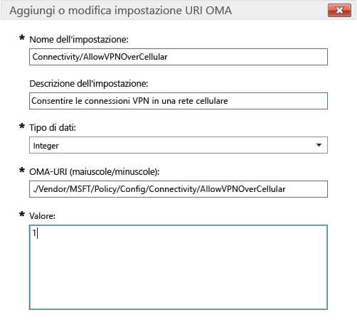

# Impostazioni dei criteri di Intune per i dispositivi Windows 10 in Microsoft Intune

Questo argomento contiene informazioni che consentono di comprendere le impostazioni dei criteri di Intune che è possibile usare per gestire i dispositivi Windows 10. Leggere questo argomento insieme alle procedure descritte in [Gestire impostazioni e funzionalità nei dispositivi con i criteri di Microsoft Intune](manage-settings-and-features-on-your-devices-with-microsoft-intune-policies.md) per configurare le impostazioni predefinite e personalizzate per i dispositivi Windows 10 Desktop e Windows 10 Mobile registrati. Non è possibile usare questi criteri con PC che eseguono il [software client per PC di Intune](/intune/get-started/windows-pc-management-capabilities-in-microsoft-intune).

È possibile scegliere tra due tipi di criteri:

- **Criteri personalizzati**: usare i **criteri personalizzati** di Microsoft Intune per Windows 10 e Windows 10 Mobile per distribuire impostazioni URI OMA (Open Mobile Alliance Uniform Resource Identifier) che possono essere usate per controllare le funzionalità nei dispositivi. Windows 10 rende disponibili molte impostazioni tramite il [provider del servizio di configurazione dei criteri](https://technet.microsoft.com/itpro/windows/manage/how-it-pros-can-use-configuration-service-providers).
- **Criteri di configurazione generali**: usare questo tipo di criteri quando si vogliono selezionare le impostazioni dall'elenco predefinito fornito con Microsoft Intune.

## Impostazioni di criteri personalizzati

Specificare le impostazioni seguenti in un criterio personalizzato.

### Generale

Immettere un nome e una descrizione facoltativa per i criteri che consenta di identificarli nella console di Intune.

### Impostazioni OMA-URI

Per ogni impostazione URI OMA che si vuole aggiungere, immettere le informazioni seguenti. Usare il [riferimento alle impostazioni URI di Windows 10](/intune/deploy-use/windows-10-policy-settings-in-microsoft-intune#Windows-10-URI-settings) in questo argomento per informazioni sulle impostazioni che è possibile usare:

- **Nome impostazione**: immettere un nome univoco per l'impostazione URI OMA per identificarla nell'elenco delle impostazioni.
- **Descrizione impostazione**: immettere facoltativamente una descrizione per l'impostazione.
- **Tipo di dati**: scegliere tra i tipi di dati seguenti:
    - **Stringa**
    - **Stringa (XML)**
    - **Data e ora**
    - **Intero**
    - **A virgola mobile**
    - **Booleano**
- **URI OMA (maiuscole/minuscole)**: specificare l'URI OMA per cui si vuole fornire un'impostazione.
- **Valore**: specificare il valore da associare all'URI OMA immesso.

### Esempio
Nella schermata seguente è stata abilitata l'impostazione **Connectivity/AllowVPNOverCellular**. Ciò consente a un dispositivo Windows 10 di aprire una connessione VPN quando si trova in una rete cellulare.

> 

## Impostazioni URI di Windows 10
Usare questa sezione per informazioni sulle impostazioni URI OMA che è possibile configurare con un **criterio personalizzato di Windows 10**.

### Criteri

|Nome e URI criteri|Dettagli|
|---------------|------------|-----------|
|**Allow Auto Update** ./Vendor/MSFT/Policy/Config/Update/AllowAutoUpdate|Solo Desktop **Tipo di dati:** Integer **Valori:** **0** - **5** (predefinito: **1**)|
|**Schedule Install Day** ./Vendor/MSFT/Policy/Config/Update/ScheduledInstallDay|Solo Mobile **Tipo di dati:** Integer **Valori:** **0** - Tutti i giorni (impostazione predefinita) **1** - domenica **2** - lunedì **3** - martedì **4** - mercoledì **5** - giovedì **6** - venerdì **7** - sabato|
|**Schedule Install Time** ./Vendor/MSFT/Policy/Config/Update/ScheduledInstallTime|Desktop e Mobile **Tipo di dati:** Integer **Valori:**  **0** – **23** ore (**0** corrisponde a mezzanotte) (impostazione predefinita: **3**)|
|**DeviceLock/AllowIdleReturnWithoutPassword** ./Vendor/MSFT/Policy/Config/DeviceLock/AllowIdleReturnWithoutPassword|Solo Mobile **Tipo di dati:** Integer **Valori:** **0**: l'utente non può impostare il timer del periodo di tolleranza della password; il valore è impostato su "ogni ora" **1**: l'utente può impostare il timer del periodo di tolleranza della password (impostazione predefinita)|
|**WiFi/AllowWiFi** ./Vendor/MSFT/Policy/Config/WiFi/AllowWiFi|Solo Mobile **Tipo di dati:** Integer **Valori:** **0**: non consente **l'uso della connessione Wi-Fi** **1**: **consente l'uso della connessione Wi-Fi** (impostazione predefinita)|
|**WiFi/AllowInternetSharing** ./Vendor/MSFT/Policy/Config/WiFi/AllowInternetSharing|Desktop e Mobile **Tipo di dati:** Integer **Valori: ** **0**: non consente Internet condiviso   **1**: consente Internet condiviso (impostazione predefinita)|
|**WiFi/AllowAutoConnectToWiFiSenseHotspots** ./Vendor/MSFT/Policy/Config/WiFi/AllowAutoConnectToWiFiSenseHotspots|Desktop e Mobile **Tipo di dati:** Integer **Valori: ** **0**: non consentito  **1**: consentito (impostazione predefinita)|
|**WiFi/AllowManualWiFiConfiguration** ./Vendor/MSFT/Policy/Config/WiFi/AllowManualWiFiConfiguration|Solo Mobile **Tipo di dati:** Integer **Valori:** **0**: consente solo le connessioni Wi-Fi configurate con MDM. **1**: l'aggiunta di nuovi SSID di rete, oltre a quelli già creati da MDM, è consentita (impostazione predefinita)|
|**System/AllowLocation** ./Vendor/MSFT/Policy/Config/System/AllowLocation|Desktop e Mobile **Tipo di dati:** Integer **Valori: ** **0**: non consentito  **1**: consentito (impostazione predefinita)|
|**System/AllowTelemetry** ./Vendor/MSFT/Policy/Config/System/AllowTelemetry|Desktop e Mobile **Tipo di dati:** Integer **Valori:** **0**: non consentito (solo impostazione aziendale) **1** : limitato **2**: completo (impostazione predefinita) **3**: completo e informazioni sulla diagnostica|
|**System/AllowExperimentation** ./Vendor/MSFT/Policy/Config/System/AllowExperimentation|Desktop e Mobile **Tipo di dati:** Integer **Valori:** **0** : non consentito **1**: solo impostazioni (impostazione predefinita) **2**: impostazioni e sperimentazione|
|**Security/AntiTheftMode** ./Vendor/MSFT/Policy/Config/Security/AntiTheftMode|Solo Mobile **Tipo di dati:** Integer **Valori:** **0**: non consente la modalità AntiTheft **1**: preferenza utente (impostazione predefinita)|
|**Connectivity/AllowUSBConnection** ./Vendor/MSFT/Policy/Config/Connectivity/AllowUSBConnection|Solo Mobile **Tipo di dati:** Integer **Valori ** **0**: non consentito  **1**: consentito (impostazione predefinita)|
|**System/AllowUserToResetPhone** ./Vendor/MSFT/Policy/Config/System/AllowUserToResetPhone|Solo Mobile **Tipo di dati:** Integer **Valori: ** **0**: non consentito **1**: consentito (impostazione predefinita)|
|**Connectivity/AllowCellularDataRoaming** ./Vendor/MSFT/Policy/Config/Connectivity/AllowCellularDataRoaming|Desktop e Mobile **Tipo di dati:** Integer **Valori: ** **0**: non consentito  **1**: consentito (impostazione predefinita)|
|**Connectivity/AllowVPNOverCellular** ./Vendor/MSFT/Policy/Config/Connectivity/AllowVPNOverCellular|Desktop e Mobile **Tipo di dati:** Integer **Valori:** **0**: la VPN non è consentita sulla connessione cellulare **1**: la VPN può usare qualsiasi connessione, inclusa la connessione cellulare (impostazione predefinita)|
|**Connectivity/AllowVPNRoamingOverCellular** ./Vendor/MSFT/Policy/Config/Connectivity/AllowVPNRoamingOverCellular|Solo Mobile **Tipo di dati:** Integer **Valori: ** **0**: non consentito  **1**: consentito (impostazione predefinita)|
|**Connectivity/AllowVPNRoamingOverCellular** ./Vendor/MSFT/Policy/Config/Connectivity/AllowVPNRoamingOverCellular|Solo Mobile **Tipo di dati:** Integer **Valori: ** **0**: non consentito  **1**: consentito (impostazione predefinita)|
|**Connectivity/AllowBluetooth** ./Vendor/MSFT/Policy/Config/Connectivity/AllowBluetooth|Desktop e Mobile **Tipo di dati:** Integer **Valori:** **0**: non consente all'utente di attivare la funzione Bluetooth. **1**: riservato. L'utente può attivare e configurare la funzione Bluetooth (non supportata in Windows Phone 8.1 per MDM, EAS, Windows 10 Desktop o Windows 10 Mobile). **2**: consentito. L'utente può attivare e configurare la funzione Bluetooth (impostazione predefinita).|
|**Experience/AllowScreenCapture** ./Vendor/MSFT/Policy/Config/Experience/AllowScreenCapture|Solo Mobile **Tipo di dati:** Integer **Valori: ** **0**: non consentito  **1**: consentito (impostazione predefinita)|
|**Experience/AllowTaskSwitcher** ./Vendor/MSFT/Policy/Config/Experience/AllowTaskSwitcher|Solo Mobile **Tipo di dati:** Integer **Valori: ** **0**: non consentito  **1**: consentito (impostazione predefinita)|
|**Experience/AllowVoiceRecording** ./Vendor/MSFT/Policy/Config/Experience/AllowVoiceRecording|Solo Mobile **Tipo di dati:** Integer **Valori: ** **0**: non consentito  **1**: consentito (impostazione predefinita)|
|**Experience/AllowSyncMySettings** ./Vendor/MSFT/Policy/Config/Experience/AllowSyncMySettings|Solo Mobile **Tipo di dati:** Integer **Valori: ** **0**: non consentire il roaming  **1**: consenti il roaming (impostazione predefinita)|
|**Experience/AllowManualMDMUnenrollment** ./Vendor/MSFT/Policy/Config/Experience/AllowManualMDMUnenrollment|Desktop e Mobile **Tipo di dati:** Integer **Valori: ** **0**: non consentito  **1**: consentito (impostazione predefinita)|
|**Accounts/AllowMicrosoftAccountConnection** ./Vendor/MSFT/Policy/Config/Accounts/AllowMicrosoftAccountConnection|Desktop e Mobile **Tipo di dati:** Integer **Valori:**  **0** : non consentito  **1**: consentito (impostazione predefinita)|
|**Accounts/AllowAddingNonMicrosoftAccountsManually** ./Vendor/MSFT/Policy/Config/Accounts/AllowAddingNonMicrosoftAccountsManually|Desktop e Mobile **Tipo di dati:** Integer **Valori:**  **0** : non consentito  **1**: consentito (impostazione predefinita)|
|**Security/AllowManualRootCertificateInstallation** ./Vendor/MSFT/Policy/Config/Security/AllowManualRootCertificateInstallation|Solo Mobile **Tipo di dati:** Integer **Valori: ** **0**: non consentito  **1**: consentito (impostazione predefinita)|
|**Security/AllowAddProvisioningPackages** ./Vendor/MSFT/Policy/Config/Security/AllowAddProvisioningPackages|Desktop e Mobile **Tipo di dati:** Integer **Valori: ** **0**: non consentito  **1**: consentito (impostazione predefinita)|
|**Search/DisableBackoff** ./Vendor/MSFT/Policy/Config/Search/DisableBackoff|Desktop e Mobile **Tipo di dati:** Integer **Valori:**  **0** (impostazione predefinita)  **1**|
|**Search/PreventRemoteQueries** ./Vendor/MSFT/Policy/Config/Search/PreventRemoteQueries|Desktop e Mobile **Tipo di dati:** Integer **Valori:**  **0**  **1** (impostazione predefinita)|
|**Search/AllowUsingDiacritics** ./Vendor/MSFT/Policy/Config/Search/AllowUsingDiacritics|Desktop e Mobile **Tipo di dati:** Integer **Valori:**  **0** (impostazione predefinita)  **1**|
|**Search/AlwaysUseAutoLangDetection** ./Vendor/MSFT/Policy/Config/Search/AlwaysUseAutoLangDetection|Desktop e Mobile **Tipo di dati:** Integer **Valori:**  **0** (impostazione predefinita)  **1**|
|**Search/DisableRemovableDriveIndexing** ./Vendor/MSFT/Policy/Config/Search/DisableRemovableDriveIndexing|Desktop e Mobile **Tipo di dati:** Integer **Valori: ** **0** (impostazione predefinita)  **1**|
|**Search/PreventIndexingLowDiskSpaceMB** ./Vendor/MSFT/Policy/Config/Search/PreventIndexingLowDiskSpaceMB|Desktop e Mobile **Tipo di dati:** Integer **Valori:**  **0**  **1** (impostazione predefinita)|
|**Search/AllowIndexingEncryptedStoresOrItems** ./Vendor/MSFT/Policy/Config/Search/AllowIndexingEncryptedStoresOrItems|Desktop e Mobile **Tipo di dati:** Integer **Valori:**  **0** (impostazione predefinita)  **1**|
|**Security/AllowRemoveProvisioningPackage** ./Vendor/MSFT/Policy/Config/Security/AllowRemoveProvisioningPackage|Desktop e Mobile **Tipo di dati:** Integer **Valori: ** **0**: non consentito  **1**: consentito (impostazione predefinita)|
|**Security/RequireProvisioningPackageSignature** ./Vendor/MSFT/Policy/Config/Security/RequireProvisioningPackageSignature|Desktop e Mobile **Tipo di dati:** Integer **Valori: ** **0** (impostazione predefinita)  **1**|
|**AboveLock/AllowActionCenterNotifications** ./Vendor/MSFT/Policy/Config/AboveLock/AllowActionCenterNotifications|Desktop e Mobile **Tipo di dati:** Integer **Valori: ** **0**: non consentito  **1**: consentito (impostazione predefinita)|
|**TextInput/AllowIMENetworkAccess** ./Vendor/MSFT/Policy/Config/TextInput/AllowIMENetworkAccess|Solo Desktop **Tipo di dati:** Integer **Valori:** **0**: non consente. Open Extended Dictionary è disattivato. Un utente non può: -Aggiungere un nuovo Open Extended Dictionary -Aggiungere un nuovo file di configurazione di integrazione di ricerca - Usare la funzionalità per i candidati dal cloud. -Inviare parole registrate dall'utente. **1**: consenti Open Extended Dictionary può essere aggiunto e usato per impostazione predefinita. Inoltre, la funzione di integrazione ricerca può essere usata per impostazione predefinita. Un utente può: - Usare la funzionalità per i candidati dal cloud.|
|**TextInput/AllowIMELogging** ./Vendor/MSFT/Policy/Config/TextInput/AllowIMELogging|Solo Desktop **Tipo di dati:** Integer **Valori:** **0**: la registrazione di conversioni errate è disabilitata **1**: la registrazione di conversioni errate è abilitata (impostazione predefinita)|
|**TextInput/AllowJapaneseNonPublishingStandardGlyph** ./Vendor/MSFT/Policy/Config/TextInput/AllowJapaneseNonPublishingStandardGlyph|Solo Desktop **Tipo di dati:** Integer **Valori: ** **0**: non consentito  **1**: consentito (impostazione predefinita)|
|**TextInput/AllowJapaneseIVSCharacters** ./Vendor/MSFT/Policy/Config/TextInput/AllowJapaneseIVSCharacters|Solo Desktop **Tipo di dati:** Integer **Valori: ** **0**: non consentito  **1**: consentito (impostazione predefinita)|
|**TextInput/AllowJapaneseUserDictionary** ./Vendor/MSFT/Policy/Config/TextInput/AllowJapaneseUserDictionary|Solo Desktop **Tipo di dati:** Integer **Valori: ** **0**: non consentito  **1**: consentito (impostazione predefinita)|
|**TextInput/AllowJapaneseIMESurrogatePairCharacters** ./Vendor/MSFT/Policy/Config/TextInput/AllowJapaneseIMESurrogatePairCharacters|Solo Desktop **Tipo di dati:** Integer **Valori: ** **0**: non consentito  **1**: consentito (impostazione predefinita)|
|**TextInput/ExcludeJapaneseIMEExceptShiftJIS** ./Vendor/MSFT/Policy/Config/TextInput/ExcludeJapaneseIMEExceptShiftJIS|Solo Desktop **Tipo di dati:** Integer **Valori:** **0**: nessun carattere viene filtrato (impostazione predefinita) **1**: tutti i caratteri vengono filtrati, ad eccezione dei caratteri Shift JIS|
|**TextInput/ExcludeJapaneseIMEExceptJIS0208** ./Vendor/MSFT/Policy/Config/TextInput/ExcludeJapaneseIMEExceptJIS0208|Solo Desktop **Tipo di dati:** Integer **Valori:** **0**: nessun carattere viene filtrato (impostazione predefinita) **1**: tutti i caratteri vengono filtrati, ad eccezione dei caratteri JIS0208|
|**TextInput/ExcludeJapaneseIMEExceptJIS0208andEUDC** ./Vendor/MSFT/Policy/Config/TextInput/ExcludeJapaneseIMEExceptJIS0208andEUDC|Solo Desktop **Tipo di dati:** Integer **Valori:** **0**: nessun carattere viene filtrato (impostazione predefinita) **1**: tutti i caratteri vengono filtrati, ad eccezione dei caratteri JIS0208 o EUDC|
|**TextInput/AllowInputPanel** ./Vendor/MSFT/Policy/Config/TextInput/AllowInputPanel|Solo Desktop **Tipo di dati:** Integer **Valori: ** **0**: non consentito  **1**: consentito (impostazione predefinita)|
|**Bluetooth/AllowDiscoverableMode** ./Vendor/MSFT/Policy/Config/Bluetooth/AllowDiscoverableMode|Desktop e Mobile **Tipo di dati:** Integer **Valori: ** **0**: non consentito  **1**: consentito (impostazione predefinita)|
|**Bluetooth/AllowAdvertising** ./Vendor/MSFT/Policy/Config/Bluetooth/AllowAdvertising|Desktop e Mobile **Tipo di dati:** Integer **Valori: ** **0**: non consentito  **1**: consentito (impostazione predefinita)|
|**Settings/AllowDataSense** ./Vendor/MSFT/Policy/Config/Settings/AllowDataSense|Desktop e Mobile **Tipo di dati:** Integer **Valori: ** **0**: non consentito  **1**: consentito (impostazione predefinita)|
|**Settings/AllowVPN** ./Vendor/MSFT/Policy/Config/Settings/AllowVPN|Desktop e Mobile **Tipo di dati:** Integer **Valori: ** **0**: non consentito  **1**: consentito (impostazione predefinita)|
|**Settings/AllowWorkplace** ./Vendor/MSFT/Policy/Config/Settings/AllowWorkplace|Solo Desktop **Tipo di dati:** Integer **Valori ** **0**: non consentito  **1**: consentito (impostazione predefinita)|
|**Settings/AllowDateTime** ./Vendor/MSFT/Policy/Config/Settings/AllowDateTime|Desktop e Mobile **Tipo di dati:** Integer **Valori ** **0**: non consentito  **1**: consentito (impostazione predefinita)|
|**Settings/AllowLanguage** ./Vendor/MSFT/Policy/Config/Settings/AllowLanguage|Solo Desktop **Tipo di dati:** Integer **Valori: ** **0**: non consentito  **1**: consentito (impostazione predefinita)|
|**Settings/AllowRegion** ./Vendor/MSFT/Policy/Config/Settings/AllowRegion|Solo Desktop **Tipo di dati:** Integer **Valori: ** **0**: non consentito  **1**: consentito (impostazione predefinita)|
|**Settings/AllowSignInOptions** ./Vendor/MSFT/Policy/Config/Settings/AllowSignInOptions|Solo Desktop **Tipo di dati:** Integer **Valori: ** **0**: non consentito  **1**: consentito (impostazione predefinita)|
|**Settings/AllowYourAccount** ./Vendor/MSFT/Policy/Config/Settings/AllowYourAccount|Desktop e Mobile **Tipo di dati:** Integer **Valori: ** **0**: non consentito  **1**: consentito (impostazione predefinita)|
|**Settings/AllowPowerSleep** ./Vendor/MSFT/Policy/Config/Settings/AllowPowerSleep|Solo Desktop **Tipo di dati:** Integer **Valori: ** **0**: non consentito  **1**: consentito (impostazione predefinita)|
|**Settings/AllowAutoPlay** ./Vendor/MSFT/Policy/Config/Settings/AllowAutoPlay|Solo Desktop **Tipo di dati:** Integer **Valori: ** **0**: non consentito  **1**: consentito (impostazione predefinita)|
|**Experience/AllowCortana** ./Vendor/MSFT/Policy/Config/Experience/AllowCortana|Desktop e Mobile **Tipo di dati:** Integer **Valori: ** **0**: non consentito  **1**: consentito (impostazione predefinita)|
|**Search/SafeSearchPermissions** ./Vendor/MSFT/Policy/Config/Search/SafeSearchPermissions|Solo Mobile **Tipo di dati:** Integer **Valori:** **0** : rigido, filtro massimo del contenuto per adulti **1**: moderato, filtro moderato del contenuto per adulti, i risultati di ricerca validi non verranno filtrati (impostazione predefinita)|
|**Experience/AllowCopyPaste** ./Vendor/MSFT/Policy/Config/Experience/AllowCopyPaste|Solo Desktop **Tipo di dati:** Integer **Valori: ** **0**: non consentito  **1**: consentito (impostazione predefinita)|
|**Force Start Size** ./Vendor/MSFT/Policy/Config/Start/ForceStartSize|Solo Mobile **Tipo di dati:** Integer **Valori:** **0**: consente all'utente di modificare le dimensioni (impostazione predefinita) **1**: forza la modalità a schermo non intero **2**: forza la modalità a schermo intero|
|**Update/RequireDeferUpgrade** ./Vendor/MSFT/Policy/Config/Update/RequireDeferUpgrade|Desktop e Mobile **Tipo di dati:** Integer **Valori:** **0**: non rinvia l'aggiornamento, rimane nel Current Branch, CB (impostazione predefinita) **1**: abilita il rinvio degli aggiornamenti (il dispositivo segue le regole del Current Branch for Business, CBB) Per informazioni dettagliate, vedere: [Introduzione alla manutenzione di Windows 10](https://technet.microsoft.com/library/mt598226.aspx) [Pianificare la distribuzione di Windows 10](https://technet.microsoft.com/library/mt574241.aspx)|
|**Update/DeferUpdatePeriod** ./Vendor/MSFT/Policy/Config/Update/DeferUpdatePeriod|Desktop e Mobile **Descrizione:** criterio per rinviare gli aggiornamenti software per un massimo di quattro settimane **Tipo di dati:** Integer **Valori:**  **0**: applica immediatamente gli aggiornamenti (impostazione predefinita) **1**-**4**: numero di settimane di rinvio degli aggiornamenti software Per informazioni dettagliate, vedere: [Introduzione alla manutenzione di Windows 10](https://technet.microsoft.com/library/mt598226.aspx) [Pianificare la distribuzione di Windows 10](https://technet.microsoft.com/library/mt574241.aspx)|
|**Update/DeferUpgradePeriod** ./Vendor/MSFT/Policy/Config/Update/DeferUpgradePeriod|Desktop e Mobile **Descrizione:** criterio per rinviare gli aggiornamenti delle funzionalità per un massimo di otto mesi **Tipo di dati:** Integer **Valori:** **0**: applica immediatamente gli aggiornamenti (impostazione predefinita) **1**-**8**: numero di mesi di rinvio degli aggiornamenti delle funzionalità Per informazioni dettagliate, vedere: [Introduzione alla manutenzione di Windows 10](https://technet.microsoft.com/library/mt598226.aspx) [Pianificare la distribuzione di Windows 10](https://technet.microsoft.com/library/mt574241.aspx)|
|**Update/PauseDeferrals** ./Vendor/MSFT/Policy/Config/Update/PauseDeferrals|Desktop e Mobile **Descrizione:** consente a un dispositivo di non ricevere più gli aggiornamenti per cinque settimane. **Tipo di dati:** Integer **Valori:** **0**: applica immediatamente gli aggiornamenti (impostazione predefinita) **1**: sospende gli aggiornamenti (scade dopo cinque settimane)|

### Windows Defender

|Nome e URI criteri|Dettagli|
|---------------|-----------|
|**AllowRealtimeMonitoring** ./Vendor/MSFT/Policy/Config/Defender/AllowRealtimeMonitoring|Solo Desktop **Tipo di dati:** Integer **Valori: ** **0**: non consentito  **1**: consentito (impostazione predefinita)|
|**AllowBehaviorMonitoring** ./Vendor/MSFT/Policy/Config/Defender/AllowBehaviorMonitoring|Solo Desktop **Tipo di dati:** Integer **Valori: ** **0**: non consentito  **1**: consentito (impostazione predefinita)|
|**AllowIntrusionPreventionSystem** ./Vendor/MSFT/Policy/Config/Defender/AllowIntrusionPreventionSystem|Solo Desktop **Tipo di dati:** Integer **Valori: ** **0**: non consentito  **1**: consentito (impostazione predefinita)|
|**AllowIOAVProtection** ./Vendor/MSFT/Policy/Config/Defender/AllowIOAVProtection|Solo Desktop **Tipo di dati:** Integer **Valori:**  **0** : non consentito  **1**: consentito (impostazione predefinita)|
|**AllowScriptScanning** ./Vendor/MSFT/Policy/Config/Defender/AllowScriptScanning|Solo Desktop **Tipo di dati:** Integer **Valori: ** **0**: non consentito  **1**: consentito (impostazione predefinita)|
|**AllowOnAccessProtection** ./Vendor/MSFT/Policy/Config/Defender/AllowOnAccessProtection|Solo Desktop **Tipo di dati:** Integer **Valori: ** **0**: non consentito  **1**: consentito (impostazione predefinita)|
|**RealTimeScanDirection** ./Vendor/MSFT/Policy/Config/Defender/RealTimeScanDirection|Solo Desktop **Tipo di dati:** Integer **Valori:** **0**: monitora tutti i file (impostazione predefinita) **1** : esegue il monitoraggio dei file in ingresso **2** : esegue il monitoraggio dei file in uscita|
|**DaysToRetainCleanedMalware** ./Vendor/MSFT/Policy/Config/Defender/DaysToRetainCleanedMalware|Solo Desktop **Tipo di dati:** Integer **Valori:** **0** - **90**: indica per quanto tempo verrà conservato il malware **0**: conserva per sempre il malware nella cartella di quarantena e non lo rimuove automaticamente (impostazione predefinita)|
|**AllowUserUIAccess** ./Vendor/MSFT/Policy/Config/Defender/AllowUserUIAccess|Solo Desktop **Tipo di dati:** Integer **Valori: ** **0**: non consentito  **1**: consentito (impostazione predefinita)|
|**ScanParameter** ./Vendor/MSFT/Policy/Config/Defender/ScanParameter|Solo Desktop **Tipo di dati:** Integer **Valori:** **1**: analisi veloce (impostazione predefinita) **2**: analisi completa|
|**ScheduleScanDay** ./Vendor/MSFT/Policy/Config/Defender/ScheduleScanDay|Solo Desktop **Tipo di dati:** Integer **Valori:** **0**: tutti i giorni (impostazione predefinita) **1**: lunedì **2**: martedì **3**: mercoledì **4**: giovedì **5**: venerdì **6**: sabato **7**: domenica **8** : nessuna analisi pianificata|
|**ScheduleScanTime** ./Vendor/MSFT/Policy/Config/Defender/ScheduleScanTime|Solo Desktop **Tipo di dati:** Integer **Valori:** **0** – 12:00 **60** – 1:00 **120** – 2:00 (impostazione predefinita) **180** – 3:00 **240** – 4:00 **300** – 5:00 **360** – 6:00 **420** – 7:00 **480** – 8:00 **540** – 9:00 **600** – 10:00 **660** – 11:00 **720** – 12:00 **780** – 13:00 **840** – 14:00 **900** – 15:00 **960** – 16:00 **1020** – 17:00 **1080** – 18:00 **1140** – 19:00 **1200** – 20:00 **1260** – 21:00 **1320** – 22:00 **1381** -Finestra di manutenzione|
|**ScheduleQuickScanTime** ./Vendor/MSFT/Policy/Config/Defender/ScheduleQuickScanTime|Solo Desktop **Tipo di dati:** Integer **Valori:** **0** – 12:00 **60** – 1:00 **120** – 2:00 (impostazione predefinita) **180** – 3:00 **240** – 4:00 **300** – 5:00 **360** – 6:00 **420** – 7:00 **480** – 8:00 **540** – 9:00 **600** – 10:00 **660** – 11:00 **720** – 12:00 **780** – 13:00 **840** – 14:00 **900** – 15:00 **960** – 16:00 **1020** – 17:00 **1080** – 18:00 **1140** – 19:00 **1200** – 20:00 **1260** – 21:00 **1320** – 22:00 **1380** – 22:00|
|**AVGCPULoadFactor** ./Vendor/MSFT/Policy/Config/Defender/AVGCPULoadFactor|Solo Desktop **Tipo di dati:** Integer **Valori: ** **0** - **100** (impostazione predefinita: **50**)|
|**AllowArchiveScanning** ./Vendor/MSFT/Policy/Config/Defender/AllowArchiveScanning|Solo Desktop **Tipo di dati:** Integer **Valori: ** **0**: non consentito  **1**: consentito (impostazione predefinita)|
|**AllowEmailScanning** ./Vendor/MSFT/Policy/Config/Defender/AllowEmailScanning|Solo Desktop **Tipo di dati:** Integer **Valori: ** **0**: non consentito (impostazione predefinita)  **1**: consentito|
|**AllowFullScanRemovableDriveScanning** ./Vendor/MSFT/Policy/Config/Defender/AllowFullScanRemovableDriveScanning|Solo Desktop **Tipo di dati:** Integer **Valori: ** **0**: non consentito (impostazione predefinita)  **1**: consentito|
|**AllowFullScanOnMappedNetworkDrives** ./Vendor/MSFT/Policy/Config/Defender/AllowFullScanOnMappedNetworkDrives|Solo Desktop **Tipo di dati:** Integer **Valori: ** **0**: non consentito  **1**: consentito (impostazione predefinita)|
|**AllowScanningNetworkFiles** ./Vendor/MSFT/Policy/Config/Defender/AllowScanningNetworkFiles|Solo Desktop **Tipo di dati:** Integer **Valori: ** **0**: non consentito  **1**: consentito (impostazione predefinita). Se impostato su consentito, viene eseguito anche quando RTP è attivo|
|**SignatureUpdateInterval** ./Vendor/MSFT/Policy/Config/Defender/SignatureUpdateInterval|Solo Desktop **Tipo di dati:** Integer **Valori:** **0**: non controlla le firme in un intervallo **1**: controlla le firme ogni ora **2**: controlla ogni due ore  **24**: controlla tutti i giorni **8:** controlla ogni otto ore (impostazione predefinita)|
|**AllowCloudProtection** ./Vendor/MSFT/Policy/Config/Defender/AllowCloudProtection|Solo Desktop **Tipo di dati:** Integer **Valori: ** **0**: non consentito  **1**: consentito (impostazione predefinita)|
|**SubmitSamplesConsent** ./Vendor/MSFT/Policy/Config/Defender/SubmitSamplesConsent|Solo Desktop **Tipo di dati:** Integer **Valori:** **0**: richiedere sempre (impostazione predefinita) **1** : inviare campioni sicuri automaticamente **2** : non inviare mai **3** : inviare tutti i campioni automaticamente|
|**ExcludedExtensions** ./Vendor/MSFT/Policy/Config/Defender/ExcludedExtensions|Solo Desktop **Tipo di dati:** stringa **Valori:** *&lt;Elenco di estensioni separate da punto e virgola&gt;* Ad esempio: **obj;lib** **Valore predefinito**: nessuna estensione viene esclusa|
|**ExcludedPaths** ./Vendor/MSFT/Policy/Config/Defender/ExcludedPaths|Solo Desktop **Tipo di dati:** stringa **Valori:** *&lt;Elenco di percorsi separati da punto e virgola&gt;* Esempio: **c:\test;c:\test1.exe** **Valore predefinito**: nessun percorso viene escluso|
|**ExcludedProcesses** ./Vendor/MSFT/Policy/Config/Defender/ExcludedProcesses|Solo Desktop **Tipo di dati:** stringa **Valori:** *&lt;Elenco di percorsi separati da punto e virgola&gt;* Esempio: **c:\test.exe;c:\test1.exe** **Valore predefinito**: nessun processo viene escluso|

### Browser Edge

|Nome e URI criteri|Dettagli|
|---------------|------------|-----------|
|**Allow Browser** ./Vendor/MSFT/Policy/Config/Browser/AllowBrowser|Solo Mobile **Tipo di dati:** Integer **Valori: ** **0**: esplorazione disabilitata  **1**: esplorazione abilitata (impostazione predefinita)|
|**AllowSearchSuggestionsinAddressBar** ./Vendor/MSFT/Policy/Config/Browser/AllowSearchSuggestionsinAddressBar|Desktop e Mobile **Tipo di dati:** Integer **Valori: ** **0**: non visualizza i suggerimenti  **1**: visualizza i suggerimenti (impostazione predefinita)|
|**SendIntranetTraffictoInternetExplorer** ./Vendor/MSFT/Policy/Config/Browser/SendIntranetTraffictoInternetExplorer|Solo Desktop **Tipo di dati:** Integer **Valori:** **0**: disabilitato, apre i siti Intranet nel browser Microsoft Edge (impostazione predefinita) **1**: abilitato, apre i siti Intranet in Internet Explorer|
|**Allow Do Not Track** ./Vendor/MSFT/Policy/Config/Browser/AllowDoNotTrack|Desktop e Mobile **Tipo di dati:** Integer **Valori: ** **0**: disabilitato, DNT non inviato (impostazione predefinita)  **1**: abilitato, DNT inviato|
|**Configure SmartScreen** ./Vendor/MSFT/Policy/Config/Browser/AllowSmartScreen|Desktop e Mobile **Tipo di dati:** Integer **Valori: ** **0**: non consentire  **1**: consentito (impostazione predefinita)|
|**Allow Pop-ups** ./Vendor/MSFT/Policy/Config/Browser/AllowPopups|Solo Desktop **Tipo di dati:** Integer **Valori: ** **0**: blocca finestre popup (impostazione predefinita)  **1**: consente finestre popup|
|**Allow Cookies** ./Vendor/MSFT/Policy/Config/Browser/AllowCookies|Desktop e Mobile **Tipo di dati:** Integer **Valori:** **0**: consente i cookie provenienti da tutti i siti Web (impostazione predefinita) **1**: blocca solo i cookie di terze parti **2**: blocca tutti i cookie|
|**Allow Save Password** ./Vendor/MSFT/Policy/Config/Browser/AllowPasswordManager|Desktop e Mobile **Tipo di dati:** Integer **Valori:** **0**: lo strumento per la gestione delle password è disabilitato  **1**: lo strumento per la gestione delle password è abilitato (impostazione predefinita)|
|**Allow Autofill** ./Vendor/MSFT/Policy/Config/Browser/AllowAutofill|Solo Desktop **Tipo di dati:** Integer **Valori**:  **0**: disabilitato (impostazione predefinita)  **1**: abilitato|
|**Configure Enterprise Site List** ./Vendor/MSFT/Policy/Config/Browser/EnterpriseModeSiteList|Solo Desktop **Tipo di dati:** stringa **Valori:** **0**: non configurato **1**: se configurato, usa l'elenco dei siti della modalità Enterprise di Internet Explorer (impostazione predefinita) **2**: consente di specificare il percorso dell'elenco dei siti Enterprise|

## Impostazioni dei criteri di configurazione generali

Usare i **criteri di configurazione generale** di Microsoft Intune per Windows 10 per configurare le impostazioni predefinite per dispositivi registrati Windows 10 Desktop e Mobile.

### Password

|Nome impostazione|Informazioni aggiuntive (se richieste)|
|----------------|----------------------|
|**Richiedi una password per sbloccare i dispositivi**|-|
|**Tipo di password richiesto**|Specifica se la password deve essere alfanumerica o solo numerica|
|**Tipo di password richiesto** - **Numero minimo di set di caratteri**| Specifica quanti set di caratteri (lettere minuscole, lettere maiuscole, numeri e simboli) devono essere inclusi nella password|
|**Lunghezza minima password**|Si applica solo a Windows 10 Mobile|
|**Numero di errori di accesso ripetuti consentiti prima della cancellazione del dispositivo**.|Per i dispositivi che eseguono Windows 10: se nel dispositivo è abilitato BitLocker, viene inserita la modalità di ripristino di BitLocker se l'accesso non riesce per il numero di volte specificato. Se nel dispositivo non è abilitato BitLocker, questa impostazione non si applica. Per i dispositivi che eseguono Windows 10 Mobile: se l'accesso non riesce per il numero di volte specificato, il dispositivo viene cancellato.|
|**Minuti di inattività prima dello spegnimento dello schermo**|Specifica per quanto tempo il dispositivo deve rimanere inattivo prima che lo schermo venga bloccato|
|**Scadenza password (giorni)**|Specifica l'intervallo di tempo dopo il quale è necessario modificare la password del dispositivo|
|**Ricorda cronologia password**|Specifica se impedire all'utente di creare password già usate in precedenza|
|**Ricorda cronologia password** - **Impedisci riutilizzo delle password precedenti**|Specifica il numero di password usate in precedenza che il dispositivo deve ricordare|
|**Richiedi una password quando il dispositivo torna attivo dopo uno stato di inattività**|Specifica che l'utente deve inserire una password per sbloccare il dispositivo (solo Windows 10 Mobile)|

### Crittografia

|Nome impostazione|Informazioni aggiuntive (se richieste)|
|----------------|----------------------|
|**Richiedi crittografia sui dispositivi mobili**|Abilita la crittografia sui dispositivi di destinazione (Solo Windows 10 Mobile)|

### Sistema

|Nome impostazione|Informazioni aggiuntive (se richieste)|
|----------------|----------------------|
|**Consenti acquisizione schermo**|Consente all'utente di acquisire la schermata del dispositivo come immagine (solo Windows 10 Mobile).|
|**Consenti l'annullamento della registrazione manuale**|Consente all'utente di eliminare manualmente l'account aziendale dal dispositivo.|
|**Consenti installazione manuale del certificato radice**|Si applica a Windows 10 Mobile|
|**Consenti l'invio di dati di utilizzo e di diagnostica a Microsoft**|I valori possibili sono:  **No** - Non vengono inviati dati a Microsoft **Di base**: vengono inviate a Microsoft informazioni limitate **Avanzati**: vengono inviati a Microsoft dati di diagnostica avanzati **Completi (scelta consigliata)** -Invia gli stessi dati di **Avanzati**, più dati aggiuntivi sullo stato del dispositivo|

### Account e sincronizzazione

|Nome impostazione|Informazioni aggiuntive (se richieste)|
|----------------|----------------------|---------------------|
|**Consenti account Microsoft**|Consente all'utente di associare un account Microsoft con il dispositivo|
|**Consenti aggiunta manuale di account non Microsoft**|Consente all'utente di aggiungere account di posta elettronica al dispositivo che non sono associati con un account Microsoft|
|**Consenti sincronizzazione delle impostazioni per gli account Microsoft**|Consente che le impostazioni del dispositivo e delle app associate con un account Microsoft vengano sincronizzate fra i dispositivi|

### Microsoft Edge

|Nome impostazione|Informazioni aggiuntive (se richieste)|
|----------------|----------------------|
|**Consenti Web browser**|Consente l'uso del Web browser Microsoft Edge sul dispositivo (Solo Windows 10 Mobile)|
|**Consenti suggerimenti di ricerca nella barra degli indirizzi**|Consente al motore di ricerca di suggerire siti mentre si digita la frase di ricerca|
|**Consenti l'invio di traffico Intranet a Internet Explorer**|Consente agli utenti di aprire siti Web sulla Intranet in Internet Explorer (Solo Windows 10 Desktop)|
|**Consenti Do Not Track**|Configura il browser Microsoft Edge in modo che invii intestazioni Do Not Track ai siti Web visitati dagli utenti|
|**Attiva SmartScreen**||
|**Consenti scripting**|Consente di eseguire script come Javascript nel browser Microsoft Edge|
|**Consenti popup**|Si applica solo a Windows 10 Desktop|
|**Consenti cookie**||
|**Allow Autofill**|Consente agli utenti di modificare le impostazioni di completamento automatico nel browser (Solo Windows 10 Desktop)|
|**Consenti strumento per la gestione delle password**|Abilita o disabilita la funzione di gestione password di Microsoft Edge|
|**Posizione elenco siti modalità Enterprise**|Specifica dove trovare l'elenco di siti Web che si aprono in modalità Enterprise. L'elenco non è modificabile dagli utenti. (Solo Windows 10 Desktop)|

### App

|Nome impostazione|Informazioni aggiuntive (se richieste)|
|----------------|----------------------|---------------------|
|**Consenti archivio applicazioni**|Si applica solo a Windows 10 Mobile|

### Cellulare

|Nome impostazione|Informazioni aggiuntive (se richieste)|
|----------------|----------------------|---------------------|
|**Consenti roaming dei dati**|Consente il roaming tra reti quando si accede ai dati|
|**Consenti VPN su rete cellulare**|Controlla se il dispositivo può accedere a connessioni VPN quando è collegato a una rete cellulare|
|**Consenti roaming VPN su rete cellulare**|Controlla se il dispositivo può accedere a connessioni VPN quando è in roaming su una rete cellulare|

### Hardware

|Nome impostazione|Informazioni aggiuntive (se richieste)|
|----------------|----------------------|
|**Consenti la fotocamera**|-|
|**Consenti archivi rimovibili**|Specifica se è possibile usare dispositivi di archiviazione esterni come le schede SD con il dispositivo|
|**Consenti Wi-Fi**|Si applica solo a Windows 10 Mobile|
|**Consenti Internet condiviso**|Consente l'uso della condivisione della connessione Internet sul dispositivo|
|**Consenti configurazione Wi-Fi manuale**|Controlla se l'utente può configurare le proprie connessioni Wi-Fi o se può usare solo le connessioni configurate da un profilo Wi-Fi (Solo Windows 10 Mobile)|
|**Consenti connessione automatica agli hotspot Wi-Fi gratuiti**|Consente al dispositivo di connettersi automaticamente agli hotspot Wi-Fi gratuiti e accettare automaticamente termini e condizioni per la connessione|
|**Consenti georilevazione**|Specifica se il dispositivo può usare le informazioni dei servizi di posizione|
|**Consenti NFC**|Consente al dispositivo di usare le sue capacità NFC (Near Field Communication)|
|**Consenti Bluetooth**|-|
|**Consenti modalità individuabile Bluetooth**|Consente che il dispositivo sia scoperto da altri dispositivi con la funzione Bluetooth attivata|
|**Consenti annunci con Bluetooth**|Consente ai dispositivi di ricevere annunci tramite Bluetooth|
|**Consenti ripristino del telefono**|Controlla se l'utente può eseguire un ripristino delle impostazioni predefinite nel dispositivo|
|**Consenti connessione USB**|Controlla se i dispositivi possono accedere a dispositivi di archiviazione esterni mediante una connessione USB|
|**Consenti modalità AntiTheft**|Configura se la modalità Antitheft di Windows è abilitata|

### Caratteristiche

|Nome impostazione|Informazioni aggiuntive (se richieste)|
|----------------|----------------------|---------------------|
|**Consenti copia e incolla**|Si applica solo a Windows 10 Mobile|
|**Consenti registrazione vocale**|Si applica solo a Windows 10 Mobile|
|**Consenti Cortana**|Abilita o disabilita l'assistente vocale Cortana|
|**Consenti notifiche del Centro operativo**|Abilita o disabilita le notifiche del Centro operativo sulla schermata di blocco del dispositivo (Solo Windows 10 Mobile)|

### Windows Defender

Tutte le impostazioni sono solo per Windows 10 Desktop.

|Nome impostazione|Informazioni aggiuntive (se richieste)|
|----------------|----------------------|---------------------|
|**Consenti monitoraggio in tempo reale**|Abilita l'analisi in tempo reale per malware, spyware e altro software indesiderato|
|**Consenti monitoraggio comportamento**|Consente a Defender di controllare la presenza di modelli noti di attività sospette nei dispositivi|
|**Abilita Network Inspection System**|Network Inspection System (NIS) contribuisce a proteggere i dispositivi dagli exploit basati sulla rete usando le firme di vulnerabilità note di Microsoft Endpoint Protection Center per contribuire a rilevare e bloccare il traffico dannoso|
|**Analizza tutti i download**|Controlla se Defender deve analizzare tutti i file scaricati da Internet|
|**Consenti analisi script**|Consente a Defender di analizzare gli script usati in Internet Explorer|
|**Monitora l'attività di file e programmi**|Consente a Defender di monitorare l'attività di file e programmi nei dispositivi|
|**Giorni di rilevamento del malware risolto**|Consente a Defender di continuare a monitorare il malware risolto per il numero di giorni specificato, in modo che sia possibile controllare manualmente i dispositivi colpiti in precedenza. Se si imposta il numero di giorni su **0**, il malware rimane nella cartella della quarantena e non viene rimosso automaticamente. |
|**Consenti accesso all'interfaccia utente client**|Controlla se l'interfaccia utente di Windows Defender è nascosta agli utenti. Quando questa impostazione viene modificata, ha effetto dal successivo avvio del PC da parte dell'utente.|
|**Pianifica analisi veloce giornaliera**|Consente di pianificare un'analisi veloce che viene eseguita giornalmente all'ora selezionata|
|**Pianifica analisi del sistema**|Consente di pianificare un'analisi completa o veloce del sistema che si verifica regolarmente il giorno e all'ora selezionati|
|**Limita utilizzo CPU durante un'analisi a**|Consente di limitare la quantità di CPU usata per le analisi (da **1** a **100**)|
|**Analizza file di archivio**|Consente a Defender di analizzare i file archiviati come i file con estensione zip o cab.|
|**Analisi dei messaggi di posta elettronica**|Consente a Defender di analizzare i messaggi di posta elettronica non appena arrivano sul dispositivo|
|**Analizza unità rimovibili**|Consente a Defender di analizzare le unità rimovibili, ad esempio le chiavette USB|
|**Analizza unità di rete mappate**|Consente a Defender di analizzare i file nelle unità di rete mappate. Se i file sull'unità sono di sola lettura, Defender non sarà in grado di rimuovere il malware che rileva in essi.|
|**Analizza file aperti da cartelle di rete condivise**|Consente a Defender di analizzare i file sulle unità di rete condivise, ad esempio quelli a cui si accede da un percorso UNC. Se i file sull'unità sono di sola lettura, Defender non sarà in grado di rimuovere il malware che rileva in essi.|
|**Intervallo di aggiornamento della firma**|Specifica l'intervallo in base a cui Defender controlla la presenza di nuovi file di firma.|
|**Consenti protezione cloud**|Consente o blocca la ricezione di informazioni sull'attività del malware da parte di Microsoft Active Protection Service dai dispositivi gestiti. Queste informazioni vengono usate per migliorare il servizio in futuro.|
|**Richiedi invio dei campioni agli utenti**|Controlla se i file che potrebbero richiedere ulteriore analisi da parte di Microsoft per determinare se sono dannosi vengono inviati automaticamente a Microsoft|
|**Rilevamento di applicazioni potenzialmente indesiderate**|Protegge i dispositivi desktop Windows registrati da eventuale software in esecuzione classificato da Windows Defender come potenzialmente indesiderato. È possibile ottenere protezione da tali applicazioni in esecuzione o usare la modalità di controllo per rilevare l'installazione di un'applicazione potenzialmente indesiderata.|
|**File e cartelle da escludere quando si esegue un'analisi o si usa la protezione in tempo reale**|Aggiunge uno o più file e cartelle come **C:\Percorso** o **%ProgramFiles%\Percorso\nomefile.exe** all'elenco di esclusione. Questi file e cartelle non sono inclusi nelle analisi in tempo reale o pianificate.|
|**Estensioni di file da escludere durante l'esecuzione di un'analisi o l'utilizzo della protezione in tempo reale**|Aggiungere uno o più estensioni di file come **jpg** o **txt** all'elenco delle esclusioni. I file con queste estensioni non sono inclusi nelle analisi in tempo reale o pianificate.|
|**Processi da escludere durante l'esecuzione di un'analisi o l'utilizzo della protezione in tempo reale**|Aggiunge uno o più processi del tipo **.exe**, **.com** o **.scr** all'elenco di esclusione. Questi processi non sono inclusi nelle analisi in tempo reale o pianificate.|

### Updates

|Nome impostazione|Informazioni aggiuntive (se richieste)|
|----------------|---------------|
|**Consenti aggiornamenti automatici**|Consente gli aggiornamenti automatici. Configurare una delle impostazioni seguenti per controllare il comportamento di aggiornamento: **Notifica download** **Installa automaticamente durante la manutenzione** **Installa e riavvia automaticamente durante la manutenzione** **Installa e riavvia automaticamente all'ora pianificata**: tenere presente che quando è selezionata questa opzione è possibile configurare anche le impostazioni seguenti: **Elimina la notifica per l'utente finale** e **Definire il giorno di installazione per gli aggiornamenti pianificati**. (Solo Windows 10 Desktop)|
|**Consenti funzionalità di versioni non definitive**|Consente a Microsoft di distribuire le impostazioni e le funzionalità della versione non definitiva nei dispositivi Windows 10. È possibile consentire l'installazione delle sole impostazioni oppure di tutte le impostazioni e le funzionalità della versione non definitiva.|

### Vedere anche
[Gestire impostazioni e funzionalità nei dispositivi con i criteri di Microsoft Intune](manage-settings-and-features-on-your-devices-with-microsoft-intune-policies.md)

<!--HONumber=Nov16_HO4-->

