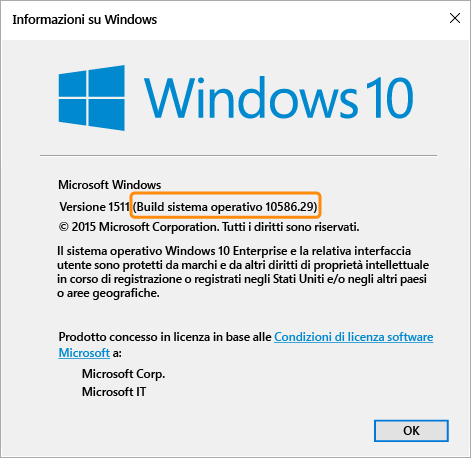

# Impostazioni dei criteri di conformità per i dispositivi Windows in Microsoft Intune

[!INCLUDE[classic-portal](../includes/classic-portal.md)]

Le impostazioni dei criteri descritte in questo argomento si applicano ai dispositivi che eseguono il sistema operativo Windows. Le sezioni seguenti descrivono le versioni di Windows supportate.

Per informazioni su altre piattaforme, selezionare una delle voci seguenti:
> [!div class="op_single_selector"]
- [Impostazioni dei criteri di conformità per i dispositivi iOS](ios-compliance-policy-settings-in-microsoft-intune.md)
- [Impostazioni dei criteri di conformità per i dispositivi Android](android-compliance-policy-settings-in-microsoft-intune.md)
- [Impostazioni dei criteri di conformità per i dispositivi Android for Work](afw-compliance-policy-settings-in-microsoft-intune.md)

## Impostazioni dei criteri di conformità per i dispositivi Windows Phone
Le impostazioni elencate in questa sezione sono supportate in Windows Phone 8.1 e versioni successive.

### Impostazioni di sicurezza del sistema
#### Password
- **Richiedi una password per sbloccare i dispositivi mobili:** impostare l'opzione su **Sì** per consentire a un utente di immettere una password per poter accedere al dispositivo.

- **Consenti password semplici**: impostare l'opzione su **Sì** per consentire all'utente di creare una password semplice come **1234** o **1111**.

-  **Lunghezza minima password**: specifica il numero minimo di cifre o caratteri per la password dell'utente.
- **Tipo di password richiesto:** specificare se l'utente deve creare una password di tipo **Alfanumerico** o **Numerico**.

  Per i dispositivi che eseguono Windows e prevedono l'accesso con un account Microsoft, i criteri di conformità non eseguono correttamente la convalida se la lunghezza minima della password è maggiore di otto caratteri e il numero minimo di set di caratteri è maggiore di due.

- **Numero minimo di set di caratteri**: se **Tipo di password richiesto** è impostato su **Alfanumerico**, questa impostazione specifica il numero minimo di set di caratteri che la password deve avere. I quattro set di caratteri sono:
  -   Lettere minuscole
  -   Lettere maiuscole
  -   Simboli
  -   Numeri

  Se si imposta un numero maggiore per questa impostazione, l'utente dovrà creare una password più complessa. Per i dispositivi che eseguono Windows e prevedono l'accesso con un account Microsoft, i criteri di conformità non eseguono correttamente la convalida se la lunghezza minima della password è maggiore di otto caratteri e il numero minimo di set di caratteri è maggiore di due.

- **Minuti di inattività prima che venga richiesta la password**: questa impostazione specifica il tempo di inattività prima che l'utente debba immettere nuovamente la password.

- **Scadenza password (giorni)**: scegliere la durata in giorni della password. Dopo questo periodo di tempo, gli utenti devono crearne una nuova.

- **Ricorda cronologia password**: usare questa impostazione insieme a **Impedisci riutilizzo delle password precedenti** per impedire all'utente di creare password già usate in precedenza.

- **Impedisci riutilizzo delle password precedenti**: se l'opzione **Ricorda cronologia password** è selezionata, specificare il numero di password usate in precedenza che non è possibile usare di nuovo.
- **Richiedi una password quando il dispositivo torna attivo dopo uno stato di inattività:** questa impostazione deve essere usata insieme all'impostazione **Minuti di inattività prima che venga richiesta la password**. Agli utenti viene richiesto di immettere una password per accedere a un dispositivo che è rimasto inattivo per il tempo specificato nell'impostazione **Minuti di inattività prima che venga richiesta la password**.

  > [!NOTE]
  > Questa impostazione si applica solo ai dispositivi Windows 10 Mobile.

#### Crittografia
- **Richiedi crittografia sul dispositivo mobile**: impostare questa opzione su **Sì** per richiedere che il dispositivo sia crittografato per la connessione alle risorse.

### Impostazioni dello stato dei dispositivi
- **Richiedi che i dispositivi siano segnalati come integri**: è possibile impostare una regola per richiedere che i dispositivi **Windows 10 Mobile** vengano segnalati come integri nei criteri di conformità nuovi o esistenti.  Se questa impostazione è abilitata, i dispositivi Windows 10 vengono valutati tramite il servizio di attestazione dell'integrità in base ai punti dati seguenti:
  -  **Abilitazione della funzionalità BitLocker**: se la funzionalità BitLocker è attiva, il dispositivo può contribuire alla protezione dei dati archiviati nell'unità da accessi non autorizzati, quando il sistema è spento o passa allo stato di ibernazione. Crittografia unità BitLocker di Windows crittografa tutti i dati archiviati nel volume del sistema operativo Windows. BitLocker usa il TPM per proteggere il sistema operativo Windows e i dati utente e consente di garantire che un computer non venga manomesso anche se viene perso, rubato o lasciato incustodito. Se il computer è dotato di un TPM compatibile, BitLocker usa il TPM per bloccare le chiavi di crittografia che contribuiscono a proteggere i dati. Di conseguenza, non è possibile accedere alle chiavi finché il TPM non ha verificato lo stato del computer.
  -  **Abilitazione della funzionalità Integrità del codice**: l'integrità del codice è una funzionalità che verifica l'integrità di un driver o di un file di sistema ogni volta che viene caricato in memoria. L'integrità del codice rileva se un driver o un file di sistema non firmato viene caricato nel kernel o se un file di sistema è stato modificato da software dannoso eseguito da un account utente con privilegi di amministratore.
  - **Abilitazione della funzionalità Avvio protetto**: quando è abilitato l'avvio protetto, il sistema viene forzato a eseguire l'avvio in uno stato attendibile predefinito. Inoltre, quando è abilitato l'avvio protetto, i componenti di base usati per avviare il computer devono avere le firme di crittografia corrette considerate attendibili dall'organizzazione che ha prodotto il dispositivo. Il firmware UEFI effettua questa verifica prima dell'avvio del computer. Se un file è stato manomesso modificandone la firma, il sistema non verrà avviato.

  Per informazioni su come funziona il servizio di attestazione dell'integrità, vedere l'articolo relativo al [CSP per l'attestazione dell'integrità](https://msdn.microsoft.com/library/dn934876.aspx).
###  Impostazioni delle proprietà dei dispositivi
- **Versione minima del sistema operativo**: quando un dispositivo non soddisfa il requisito relativo alla versione minima del sistema operativo, verrà segnalato come non conforme.
    Viene visualizzato un collegamento con informazioni su come eseguire l'aggiornamento. L'utente può scegliere di aggiornare il dispositivo e quindi accedere alle risorse aziendali.

- **Versione massima del sistema operativo**: quando un dispositivo usa una versione del sistema operativo successiva rispetto a quella specificata nella regola, l'accesso alle risorse aziendali è bloccato e l'utente deve contattare l'amministratore IT. Fino a quando la regola non viene modificata in modo da consentire la versione del sistema operativo, non è possibile usare questo dispositivo per accedere alle risorse aziendali.

## Impostazioni dei criteri di conformità dei PC Windows
Le impostazioni elencate in questa sezione sono supportate sui PC Windows.
### Impostazioni di sicurezza del sistema
#### Password
- **Lunghezza minima password**: supportata in Windows 8.1.

  Specificare il numero minimo di cifre o caratteri che la password dell'utente deve avere.

  Per i dispositivi che prevedono l'accesso con un account Microsoft, i criteri di conformità non eseguono correttamente la convalida se **Lunghezza minima password** è maggiore di otto caratteri e **Numero minimo di set di caratteri** è maggiore di due caratteri.

- **Tipo di password richiesto**: supportata in Windows RT, Windows RT 8.1 e Windows 8.1.

  Specificare se l'utente deve creare una password di tipo **Alfanumerico** o **Numerico**.

- **Numero minimo di set di caratteri**: supportata in Windows RT, Windows RT 8.1 e Windows 8.1.

  Se **Tipo di password richiesto** è impostato su **Alfanumerico**, questa impostazione specifica il numero minimo di set di caratteri che la password deve avere. I quattro set di caratteri sono:
  -   Lettere minuscole
  -   Lettere maiuscole
  -   Simboli
  -   Numeri     

  Se si imposta un numero maggiore per questa impostazione, l'utente dovrà creare una password più complessa. Per i dispositivi che prevedono l'accesso con un account Microsoft, i criteri di conformità non eseguono correttamente la convalida se **Lunghezza minima password** è maggiore di otto caratteri e **Numero minimo di set di caratteri** è maggiore di due caratteri.

- **Minuti di inattività prima che venga richiesta la password**: supportata in Windows RT, Windows RT 8.1 e Windows 8.1.

  Specificare il tempo di inattività prima che l'utente debba immettere nuovamente la password.

- **Scadenza password (giorni)**: supportata in Windows RT, Windows RT 8.1 e Windows 8.1.

  Scegliere il numero di giorni che mancano alla scadenza della password attuale, quando l'utente deve creare una nuova password.

- **Ricorda cronologia password**: supportata in Windows RT, Windows RT e Windows 8.1.

  Usare questa impostazione insieme a **Impedisci riutilizzo delle password precedenti** per impedire all'utente di creare password già usate precedentemente.

- **Impedisci riutilizzo delle password precedenti**: supportata in Windows RT, Windows RT 8.1 e Windows 8.1.

  Se l'opzione **Ricorda cronologia password** è selezionata, specificare il numero di password usate in precedenza che non è possibile riusare.

### Impostazioni dello stato dei dispositivi
- **Richiedi che i dispositivi siano segnalati come integri**: supportata nei dispositivi Windows 10.
È possibile impostare una regola per richiedere che i dispositivi Windows 10 vengano riportati come integri nei criteri di conformità nuovi o esistenti. Se questa impostazione è abilitata, i dispositivi Windows 10 vengono valutati tramite il servizio di attestazione dell'integrità in base ai punti dati seguenti:
  -  **Abilitazione della funzionalità BitLocker**: se la funzionalità BitLocker è attiva, il dispositivo può contribuire alla protezione dei dati archiviati nell'unità da accessi non autorizzati, quando il sistema è spento o passa allo stato di ibernazione. Crittografia unità BitLocker di Windows crittografa tutti i dati archiviati nel volume del sistema operativo Windows. BitLocker usa il TPM per proteggere il sistema operativo Windows e i dati utente e consente di garantire che un computer non venga manomesso anche se viene perso, rubato o lasciato incustodito. Se il computer è dotato di un TPM compatibile, BitLocker usa il TPM per bloccare le chiavi di crittografia che contribuiscono a proteggere i dati. Di conseguenza, non è possibile accedere alle chiavi finché il TPM non ha verificato lo stato del computer.
  -  **Abilitazione della funzionalità Integrità del codice**: l'integrità del codice è una funzionalità che verifica l'integrità di un driver o di un file di sistema ogni volta che viene caricato in memoria. L'integrità del codice rileva se un driver o un file di sistema non firmato viene caricato nel kernel o se un file di sistema è stato modificato da software dannoso eseguito da un account utente con privilegi di amministratore.
  - **Abilitazione della funzionalità Avvio protetto**: quando è abilitato l'avvio protetto, il sistema viene forzato a eseguire l'avvio in uno stato attendibile predefinito. Inoltre, quando è abilitato l'avvio protetto, i componenti di base usati per avviare il computer devono avere le firme di crittografia corrette considerate attendibili dall'organizzazione che ha prodotto il dispositivo. Il firmware UEFI effettua questa verifica prima dell'avvio del computer. Se un file è stato manomesso modificandone la firma, il sistema non verrà avviato.
  - **Abilitazione della funzionalità Antimalware ad esecuzione anticipata**: la funzionalità Antimalware ad esecuzione anticipata fornisce protezione per i computer della rete all'avvio e prima dell'inizializzazione di driver di terze parti.

  Per informazioni su come funziona il servizio di attestazione dell'integrità, vedere l'articolo relativo al [CSP per l'attestazione dell'integrità](https://msdn.microsoft.com/library/dn934876.aspx).

### Impostazioni delle proprietà dei dispositivi
- **Versione minima richiesta del sistema operativo**: supportata in Windows 8.1 e Windows 10.

  Qui è necessario specificare il numero major.minor.build. Il numero di versione deve corrispondere alla versione che il comando **winver** restituisce.

  Quando un dispositivo ha una versione precedente rispetto alla versione del sistema operativo specificata, viene segnalato come non conforme. Viene visualizzato un collegamento con informazioni su come eseguire l'aggiornamento. L'utente può scegliere di aggiornare il dispositivo e quindi accedere alle risorse aziendali.

- **Versione massima consentita del sistema operativo**: supportata in Windows 8.1 e Windows 10.

  Quando un dispositivo usa una versione del sistema operativo successiva rispetto a quella specificata nella regola, l'accesso alle risorse aziendali risulterà bloccato e l'utente dovrà contattare l'amministratore IT. Fino a quando la regola non viene modificata in modo da consentire la versione del sistema operativo, non è possibile usare questo dispositivo per accedere alle risorse aziendali.

Per trovare la versione del sistema operativo da usare per le impostazioni **Versione minima richiesta del sistema operativo** e **Versione massima consentita del sistema operativo**, eseguire il comando **winver** dal prompt dei comandi. Il comando **winver** restituisce la versione segnalata del sistema operativo.

- I PC Windows 8.1 restituiscono la versione **6.3**. Se la regola della versione del sistema operativo è impostata su Windows 8.1 per Windows, il dispositivo risulta non conforme anche se il sistema operativo installato è Windows 8.1.

- Per i PC che eseguono Windows 10, la versione deve essere impostata come **10.0** più il numero di build del sistema operativo che il comando **winver** restituisce. Ad esempio, potrebbe essere simile a 10.0.10586.
> 

<!--HONumber=Dec16_HO3-->

