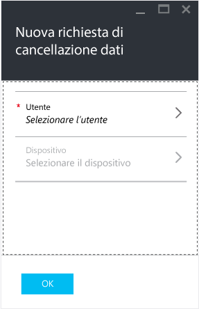
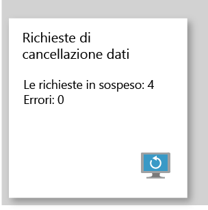

# Cancellare i dati dell'app aziendale gestita con Microsoft Intune

[!INCLUDE[classic-portal](../includes/classic-portal.md)]

Quando un dispositivo viene smarrito o rubato, o se il dipendente lascia l'azienda, è necessario assicurarsi di rimuovere dal dispositivo i dati delle app aziendali. Ma potrebbe essere necessario non rimuovere i dati personali sul dispositivo, soprattutto se si tratta di un dispositivo di proprietà del dipendente.

Per rimuovere selettivamente i dati delle app aziendali, creare una richiesta di cancellazione attenendosi alla procedura descritta in questo argomento. Al termine della richiesta, i dati aziendali verranno rimossi dall'app alla successiva esecuzione dell'app nel dispositivo.
>[!NOTE]
> I contatti sincronizzati direttamente dall'app alla Rubrica nativa vengono rimossi. Tutti i contatti sincronizzati dalla Rubrica nativa a un'altra origine esterna non possono essere cancellati. Attualmente, questa opzione è disponibile solo per l'app Microsoft Outlook.

## Creare una richiesta di cancellazione

1.  Accedere al portale di Azure e scegliere **Altri servizi** > **Altro** > **Intune**.

2.  Nel pannello Intune, scegliere **Gestisci le app**.

3.  Scegliere **Nuova richiesta di cancellazione dati**. Verrà aperto il pannello **Nuova richiesta di cancellazione dati**.

    

4.  Scegliere **Utente** per aprire il pannello **Utente** e selezionare l'utente di cui cancellare i dati dell'app.

5.  Scegliere **Dispositivo**.  Si apre il pannello **Dispositivo** che elenca tutti i dispositivi associati all'utente selezionato.  Selezionare il dispositivo da cancellare.

6.  Verrà visualizzato nuovamente il riquadro **Nuova richiesta di cancellazione dati**. Scegliere **OK** per eseguire una richiesta di cancellazione. Il servizio crea e tiene traccia di una richiesta di cancellazione dati separata per ogni app protetta nel dispositivo.

## Monitorare le richieste di cancellazione dati

Il riquadro **Richiesta di cancellazione dati** include un rapporto di riepilogo che mostra lo stato generale della richiesta di cancellazione dati e indica il numero di richieste in sospeso ed errori. Per ottenere ulteriori dettagli, seguire questa procedura:

1.  Nel pannello Intune, scegliere **Gestisci le app**.

2.  Nel pannello **Richiesta di cancellazione dati** scegliere il riquadro **Richiesta di cancellazione dati** per aprire il pannello **Richiesta di cancellazione dati**.

3.  Nel pannello **Richiesta di cancellazione dati** è possibile visualizzare l'elenco delle richieste raggruppate in base agli utenti. Dal momento che il sistema crea una richiesta di cancellazione dati per ciascuna applicazione protetta in esecuzione nel dispositivo, è possibile visualizzare più richieste per un utente. Lo stato indica se una richiesta di cancellazione dati è **in sospeso**, **non riuscita** o **completata**.

L'utente deve aprire l'app affinché venga eseguita la cancellazione dati e l'operazione può richiedere fino a 30 minuti dopo la richiesta.

Le cancellazioni dati con stato in sospeso rimangono visualizzate fino all'eliminazione manuale.  Per eliminare manualmente una richiesta di cancellazione dati, fare clic con il pulsante destro del mouse e scegliere Elimina.

### Vedere anche
[Proteggere i dati delle app usando i criteri di gestione delle app mobili](protect-app-data-using-mobile-app-management-policies-with-microsoft-intune.md)

[Uso del portale di Azure](azure-portal-for-microsoft-intune-mam-policies.md)

<!--HONumber=Jan17_HO2-->

