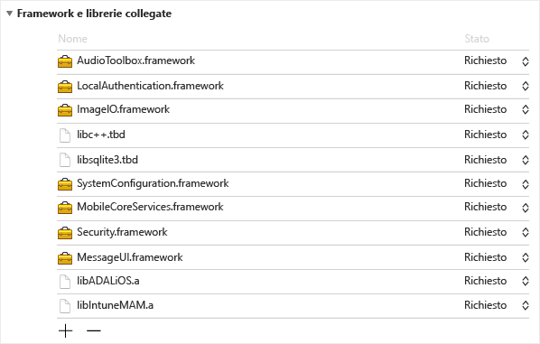
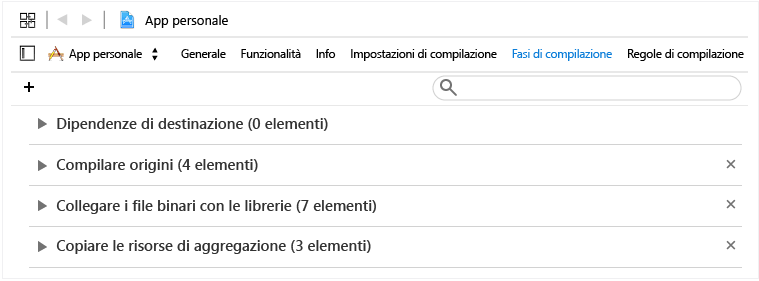
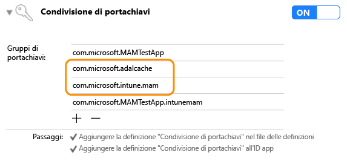

# <a name="microsoft-intune-app-sdk-for-ios-developer-guide"></a>Guida per gli sviluppatori di Microsoft Intune App SDK per iOS

> [!NOTE]
> Può essere utile leggere prima l'articolo [Introduzione a Microsoft Intune App SDK](intune-app-sdk-get-started.md), che spiega come preparare l'integrazione in ogni piattaforma supportata.

Microsoft Intune App SDK per iOS consente di integrare i criteri di protezione delle app di Intune, noti anche come criteri MAM, nell'app iOS. Un'applicazione abilitata per MAM è integrata con Intune App SDK. Consente agli amministratori IT di distribuire i criteri di protezione delle app nell'app per dispositivi mobili quando Intune gestisce attivamente l'app.

## <a name="prerequisites"></a>Prerequisiti

* È necessario un computer Mac OS che esegue OS X 10.8.5 o versioni successive e con il set di strumenti XCode versione 5 o successive.

* Rivedere le [Condizioni di licenza di Intune App SDK per iOS](https://github.com/msintuneappsdk/ms-intune-app-sdk-ios/blob/master/Microsoft%20License%20Terms%20Intune%20App%20SDK%20for%20iOS%20.pdf). Stampare e conservare una copia delle condizioni di licenza. Scaricando e usando Intune App SDK per iOS, l'utente accetta tali condizioni di licenza.  Qualora l'utente non le accetti, non potrà usare il software.

* Scaricare i file per Intune App SDK per iOS in [GitHub](https://github.com/msintuneappsdk/ms-intune-app-sdk-ios).

## <a name="whats-in-the-sdk"></a>Contenuto dell'SDK

Intune App SDK per iOS include una libreria statica, file di risorse, intestazioni API, un file con estensione plist di impostazioni di debug e uno strumento di configurazione. Le app per dispositivi mobili possono includere semplicemente i file di risorse e un collegamento statico alle librerie per l'applicazione della maggior parte dei criteri. Le funzionalità MAM di Intune avanzate vengono applicate tramite API.

Questa guida illustra l'uso dei componenti seguenti di Intune App SDK per iOS:

* **libIntuneMAM.a**: libreria statica di Intune App SDK. Se l'app non usa le estensioni, collegare la libreria al progetto per abilitare l'app per la gestione delle applicazioni mobili di Intune.

* **IntuneMAM.framework**: framework di Intune App SDK. Collegare questo framework al progetto per abilitare l'app per la gestione delle applicazioni mobili di Intune. Usare il framework anziché la libreria statica se l'app usa le estensioni, in modo che il progetto non crei più copie della libreria statica.

* **IntuneMAMResources.bundle**: bundle di risorse contenente le risorse usate dall'SDK.

* **Intestazioni**: espongono le API di Intune App SDK. Se si usa un'API, è necessario includere il file di intestazione contenente l'API. I file di intestazione seguenti includono le chiamate di funzioni API necessarie per abilitare le funzionalità di Intune App SDK:

    * IntuneMAMAsyncResult.h
    * IntuneMAMDataProtectionInfo.h
    * IntuneMAMDataProtectionManager.h
    * IntuneMAMFileProtectionInfo.h
    * IntuneMAMFileProtectionManager.h
    * IntuneMAMPolicyDelegate.h
    * IntuneMAMLogger.h


## <a name="how-the-intune-app-sdk-works"></a>Funzionamento di Intune App SDK

L'obiettivo di Intune App SDK per iOS è quello di aggiungere funzionalità di gestione per le applicazioni iOS con modifiche minime al codice. Riducendo la quantità di modifiche al codice, si accelerano i tempi di immissione sul mercato, preservando nel contempo la coerenza e la stabilità dell'applicazione per dispositivi mobili.


## <a name="build-the-sdk-into-your-mobile-app"></a>Compilare l'SDK nell'app per dispositivi mobili

Per abilitare Intune App SDK, procedere come segue:

1. **Opzione 1**: eseguire il collegamento alla libreria `libIntuneMAM.a`. Trascinare la libreria `libIntuneMAM.a` e rilasciarla nell'elenco **Linked Frameworks and Libraries** (Framework e librerie collegate) della destinazione del progetto.
    

    > [!NOTE]
    > Se si intende rilasciare l'app nell'App Store, usare la versione di `libIntuneMAM.a` creata per il rilascio e non la versione di debug. La versione per il rilascio si trova nella cartella **release**. La versione di debug offre un output dettagliato utile per la risoluzione di problemi con Intune App SDK.

    **Opzione 2**: collegare `IntuneMAM.framework` al progetto. Trascinare `IntuneMAM.framework` nell'elenco **Linked Frameworks and Libraries** (Framework e librerie collegate) della destinazione del progetto.

    > [!NOTE]
    > Se si usa il framework, prima di inviare l'app all'App Store, è necessario eliminare manualmente le architetture del simulatore dal framework universale. Vedere la sezione intitolata "Invio dell'app all'App Store".

2. Aggiungere i framework iOS seguenti al progetto:
    * MessageUI.framework
    * Security.framework
    * MobileCoreServices.framework
    * SystemConfiguration.framework
    * libsqlite3.dylib
    * libc++.dylib
    * ImageIO.framework
    * LocalAuthentication.framework
    * AudioToolbox.framework

    > [!NOTE]
    > Se l'applicazione è destinata a iOS 7, impostare l'attributo `Status` di `LocalAuthentication.framework` su Optional (Facoltativo). Se `Status` non è impostato, l'applicazione non verrà avviata in iOS 7.
    >
    > Inoltre, con Xcode 7 le estensioni `.dylib` vengono sostituite da `.tbd`.

3. Aggiungere il bundle di risorse `IntuneMAMResources.bundle` al progetto trascinandolo in **Copy Bundle Resources** (Copia le risorse del bundle) in **Build Phases** (Crea fasi).


4. Aggiungere `-force_load {PATH_TO_LIB}/libIntuneMAM.a` in una delle posizioni seguenti, sostituendo `{PATH_TO_LIB}` con il percorso di Intune App SDK:
    * Impostazione di configurazione della build `OTHER_LDFLAGS` del progetto
    * Opzione **Other Linker Flags** (Altri contrassegni del linker) nell'interfaccia utente<br>

    > [!NOTE]
    > Per trovare `PATH_TO_LIB`, selezionare il file `libIntuneMAM.a` e scegliere **Get Info** (Ottieni informazioni) dal menu **File**. Copiare e incollare le informazioni indicate in **Where** (Dove), ovvero il percorso, dalla sezione **General** (Generale) della finestra **Info** (Informazioni).

5. Se l'app per dispositivi mobili definisce un file NIB o uno storyboard principale in Info.plist, rimuovere il campo per lo **storyboard** o il file **NIB** principale. Aggiungere i valori dello storyboard o del file NIB, rimossi in precedenza, in un nuovo dizionario denominato IntuneMAMSettings, con i nomi chiave seguenti, in base alle esigenze:
    * MainStoryboardFile
    * MainStoryboardFile~ipad
    * MainNibFile
    * MainNibFile~ipad

    > [!NOTE]
    > Se l'app per dispositivi mobili non definisce un file NIB o uno storyboard principale in Info.plist, queste impostazioni non sono necessarie.

    È possibile visualizzare il file Info.plist in formato non elaborato per vedere i nomi chiave facendo clic con il pulsante destro del mouse in un punto qualsiasi nel corpo del documento e modificando il tipo di visualizzazione in **Show Raw Keys/Values** (Visualizza chiavi/valori non elaborati).

6. Abilitare la condivisione Keychain, se non è già abilitata, facendo clic su **Capabilities** (Funzionalità) in ogni destinazione del progetto e abilitando l'opzione **Keychain Sharing** (Condivisione Keychain). La condivisione Keychain è necessaria per procedere con il passaggio successivo.

    > [!NOTE]
    > Il profilo di provisioning deve supportare i nuovi valori di condivisione Keychain. I gruppi di accesso a Keychain devono supportare un carattere jolly. Per verificarlo, aprire il file .mobileprovision in un editor di testo, cercare **keychain-access-groups** e verificare che sia presente un carattere jolly. Ad esempio:
    ```xml
    <key>keychain-access-groups</key>
    <array>
    <string>YOURBUNDLESEEDID.*</string>
    </array>
    ```

7. Dopo avere abilitato la condivisione Keychain, completare i passaggi seguenti per creare un gruppo di accesso separato in cui verranno archiviati i dati di Intune App SDK. È possibile creare un gruppo di accesso a Keychain usando l'interfaccia utente o il file dei diritti.

    Se si usa l'interfaccia utente per creare un gruppo di accesso a Keychain:

    a. Se per l'app per dispositivi mobili non sono definiti gruppi di accesso a Keychain, aggiungere l'ID bundle dell'app come primo gruppo.

    b. Aggiungere il gruppo Keychain condiviso `com.microsoft.intune.mam`. Questo gruppo di accesso è usato da Intune App SDK per archiviare i dati.

    c. Aggiungere `com.microsoft.adalcache` ai gruppi di accesso esistenti.

    

    Se si usa il file dei diritti per creare il gruppo di accesso a Keychain, è necessario anteporre il prefisso `$(AppIdentifierPrefix)` al gruppo di accesso a Keychain nel file dei diritti. Ad esempio:  

    * `$(AppIdentifierPrefix)com.microsoft.intune.mam`
    * `$(AppIdentifierPrefix)com.microsoft.adalcache`

    > [!NOTE]
    > Un file dei diritti è un file XML univoco per l'applicazione per dispositivi mobili. Consente di specificare autorizzazioni e funzionalità speciali nell'app per iOS.

8. Se l'app definisce schemi URL nel file Info.plist, aggiungere un altro schema, con un suffisso `-intunemam`, per ogni schema URL.

9. Per le app per dispositivi mobili sviluppate in iOS 9 o versione successiva, includere ogni protocollo passato dall'app a `UIApplication canOpenURL` nella matrice `LSApplicationQueriesSchemes` del file Info.plist dell'app. Inoltre, per ogni protocollo elencato è necessario aggiungere un nuovo protocollo seguito da `-intunemam`. Nella matrice è anche necessario includere `http-intunemam`, `https-intunemam` e `ms-outlook-intunemam`.

10. Se nei diritti dell'app sono definiti gruppi di app, aggiungere questi gruppi al dizionario IntuneMAMSettings nella chiave `AppGroupIdentifiers` come matrice di stringhe.

11. Collegare l'applicazione mobile ad Azure Directory Authentication Library (ADAL). La libreria ADAL per Objective C è [disponibile in GitHub](https://github.com/AzureAD/azure-activedirectory-library-for-objc).

    > [!NOTE]
    > Intune App SDK è stato testato con il codice del ramo broker ADAL del 19 giugno 2015. Assicurarsi di collegarsi alla versione funzionante/più recente della libreria ADAL.

12. Includere il bundle di risorse `ADALiOSBundle.bundle` nel progetto trascinandolo in **Copy Bundle Resources** (Copia le risorse del bundle) nella scheda **Build Phases** (Crea fasi).

13. Usare l'opzione linker `-force_load PATH_TO_ADAL_LIBRARY` per il collegamento alla libreria.

    Aggiungere `-force_load {PATH_TO_LIB}/libADALiOS.a` all'impostazione di configurazione della build `OTHER_LDFLAGS` del progetto o a **Other Linker Flags** (Altri contrassegni del linker) nell'interfaccia utente. `PATH_TO_LIB` deve essere sostituito con la posizione dei file binari ADAL.


## <a name="set-up-azure-directory-authentication-library"></a>Configurare Active Directory Authentication Library

Intune App SDK usa ADAL per lo scenario di autenticazione e avvio condizionale. Si basa inoltre su ADAL per registrare l'identità dell'utente al servizio di gestione delle applicazioni mobili per la gestione senza scenari di registrazione dei dispositivi.

ADAL richiede in genere che le app eseguano la registrazione con Azure Active Directory e ottengano un ID univoco, noto come ID client, e altri identificatori per garantire la sicurezza dei token concessi all'app. Intune App SDK usa i valori di registrazione predefiniti per contattare Azure AD.  

Se usa ADAL per lo scenario di autenticazione, l'app deve usare i valori di registrazione esistenti e sostituire i valori predefiniti di Intune App SDK. In questo modo agli utenti non viene richiesta la doppia autenticazione, una di Intune App SDK e una dell'app.

### <a name="adal-faqs"></a>Domande frequenti su Active Directory Authentication Library

**Quali file binari di ADAL è necessario usare?**

Intune App SDK usa attualmente il ramo broker di [ADAL su GitHub](https://github.com/AzureAD/azure-activedirectory-library-for-objc) per supportare le app che richiedono l'accesso condizionale. Queste applicazioni dipendono di conseguenza dall'app Microsoft Authenticator. Tuttavia, l'SDK è ancora compatibile con il ramo master di ADAL. Usare il ramo più adatto per l'applicazione.

**Come si esegue il collegamento ai file binari di ADAL?**

Aggiungere `-force_load {PATH_TO_LIB}/libADALiOS.a` all'impostazione di configurazione della build `OTHER_LDFLAGS` del progetto o a **Other Linker Flags** (Altri contrassegni del linker) nell'interfaccia utente. `PATH_TO_LIB` deve essere sostituito con la posizione dei file binari ADAL. Assicurarsi inoltre di copiare il bundle ADAL nell'app.  

Per altre informazioni dettagliate, vedere le istruzioni di [ADAL su GitHub](https://github.com/AzureAD/azure-activedirectory-library-for-objc).

**Come si condivide la cache ADAL con altre app registrate con lo stesso profilo di provisioning?**

Se per l'app non sono definiti gruppi di accesso a Keychain, aggiungere l'ID bundle dell'app come primo gruppo.

Abilitare Single Sign-On (SSO) di ADAL aggiungendo i gruppi di accesso `com.microsoft.adalcache` e `com.microsoft.workplacejoin` ai diritti di Keychain.

Nel caso in cui si stia impostando in modo esplicito il gruppo Keychain della cache condivisa di ADAL, assicurarsi di impostarlo su `<app_id_prefix>.com.microsoft.adalcache`. ADAL eseguirà questa operazione per conto dell'utente se quest'ultimo non esegue la sostituzione. Se si vuole specificare un gruppo Keychain personalizzato per sostituire `com.microsoft.adalcache`, specificarlo nel file Info.plist in IntuneMAMSettings usando la chiave `ADALCacheKeychainGroupOverride`.

**Com'è possibile forzare Intune App SDK affinché usi le impostazioni ADAL già in uso nell'app?**

Se l'app usa già ADAL, vedere [Configurare Intune App SDK](#configure-settings-for-the-intune-app-sdk) per informazioni sulla compilazione delle impostazioni seguenti:  

* ADALClientId
* ADALAuthority
* ADALRedirectUri
* ADALRedirectScheme
* ADALCacheKeychainGroupOverride


**Come si sostituisce l'URL dell'autorità di Azure AD con un URL specifico del tenant fornito in fase di runtime?**

Impostare la proprietà `aadAuthorityUriOverride` nell'istanza IntuneMAMPolicyManager.

> [!NOTE]
> Nella gestione di applicazioni mobili senza scenario di registrazione dei dispositivi questa impostazione è utile per consentire all'SDK di riutilizzare il token di aggiornamento ADAL recuperato dall'app.

L'SDK continuerà a usare questo URL dell'autorità per l'aggiornamento dei criteri ed eventuali richieste di registrazione successive a meno che il valore non venga cancellato o modificato.  È quindi importante cancellare il valore quando un utente aziendale si disconnette dall'app e reimpostarlo quando accede un nuovo utente aziendale.

**Cosa fare se l'app usa ADAL per l'autenticazione?**

Se l'app usa già ADAL per l'autenticazione, sono necessarie le azioni seguenti:

1. Nel file Info.plist del progetto, in un dizionario IntuneMAMSettings con il nome chiave `ADALClientId`, specificare l'ID client da usare per le chiamate ADAL.

2. Nel dizionario IntuneMAMSettings con il nome di chiave `ADALAuthority`, specificare inoltre l'autorità di Azure AD.

3. Nel dizionario IntuneMAMSettings con il nome di chiave `ADALRedirectUri`, specificare inoltre l'URI di reindirizzamento da usare per le chiamate a ADAL. Può essere necessario specificare anche `ADALRedirectScheme`, a seconda del formato dell'URI di reindirizzamento dell'app.

**Se l'applicazione non usa già ADAL per l'autenticazione**

Se l'app non usa ADAL, Intune App SDK fornisce i valori predefiniti per i parametri ADAL e gestisce l'autenticazione con Azure AD.

## <a name="register-your-app-with-the-intune-mam-service"></a>Registrare l'app con il servizio MAM di Intune

### <a name="use-the-apis"></a>Usare le API
Intune App SDK offre ora la possibilità per le app per iOS di ricevere i criteri di protezione delle app da Intune senza registrarsi in Intune con la gestione dei dispositivi mobili (MDM). Per supportare questa nuova funzionalità, l'SDK fornisce nuove API che consentono all'app di ricevere i criteri di protezione delle app. Per usare le nuove API, seguire questi passaggi:

1. Usare la versione più recente di Intune App SDK che supporta la gestione delle app con o senza la registrazione del dispositivo. .

2. Aggiungere IntuneMAMEnrollment.h a qualsiasi file che chiamerà le API.

### <a name="register-accounts"></a>Registrare gli account

Un'app può ricevere criteri di protezione delle app dal servizio Intune se l'app viene registrata per conto di un account utente specificato. L'app deve registrare tutti gli utenti che eseguono l'accesso con Intune App SDK. Al termine dell'autenticazione del nuovo account utente, l'app deve chiamare il metodo `registerAndEnrollAccount` in Headers/IntuneMAMEnrollment.h:

```objc
/**


 *  This method will add the account to the list of registered accounts.
 *  An enrollment request will immediately be started.
 *  @param identity The UPN of the account to be registered with the SDK
 */

(void)registerAndEnrollAccount:(NSString *)identity;

```
Chiamando il metodo `registerAndEnrollAccount`, l'SDK registra l'account utente e prova a registrare l'app per conto di questo account. Se la registrazione non riesce per qualsiasi motivo, l'SDK riproverà automaticamente la registrazione dopo 24 ore. A scopo di debug, l'app può ricevere le notifiche sui risultati di tutte le richieste di registrazione attraverso un delegato.

Dopo aver richiamato l'API, l'app può continuare a funzionare normalmente. Se la registrazione riesce, l'SDK notificherà all'utente che è necessario un riavvio dell'app. A questo punto, l'utente può riavviare l'app.

### <a name="deregister-accounts"></a>Annullare la registrazione degli account

Prima della disconnessione di un utente da un'app, questa deve annullare la registrazione dell'utente dall'SDK. In questo modo:

1. Non si verificheranno nuovi tentativi di registrazione per l'account utente.

2. Se l'utente ha registrato correttamente l'applicazione, la registrazione dell'utente e dell'app verrà annullata dal servizio MAM di Intune e i criteri di protezione delle app verranno rimossi.

3. Se l'app avvia una cancellazione selettiva facoltativa, tutti i dati aziendali o dell'istituto di istruzione vengono eliminati.

Prima della disconnessione dell'utente, l'app deve chiamare l'API seguente in Headers/IntuneMAMEnrollment.h:

```objc
/*
 *  This method will remove the provided account from the list of
 *  registered accounts.  Once removed, if the account has enrolled
 *  the application, the account will be un-enrolled.
 *  @note In the case where an un-enroll is required, this method will block
 *  until the Intune MAM AAD token is acquired, then return.  This method must be called before  
 *  the user is removed from the application (so that required AAD tokens are not purged
 *  before this method is called).
 *  @param identity The UPN of the account to be removed.
 *  @param doWipe   If YES, a selective wipe if the account is un-enrolled
 */

(void)deRegisterAndUnenrollAccount:(NSString *)identity withWipe:(BOOL)doWipe;
```

Questo metodo deve essere chiamato prima che i token di Azure AD dell'account utente vengano eliminati. L'SDK richiede che il token dell'app dell'utente effettui richieste specifiche al servizio MAM di Intune per conto dell'utente.

Se l'app elimina i dati aziendali o dell'istituto di istruzione dell'utente in modo autonomo, il contrassegno `doWipe` può essere impostato su false. In caso contrario, l'SDK può avviare automaticamente una cancellazione selettiva. Ciò comporta una chiamata al delegato per la cancellazione selettiva dell'app.

```objc
[[IntuneMAMEnrollmentManager instance] deRegisterAndUnenrollAccount:@”user@foo.com” withWipe:YES];
```

### <a name="enroll-without-prior-sign-in"></a>Eseguire la registrazione senza accesso preventivo

Un'app che non esegue l'accesso dell'utente con Azure Active Directory può comunque ricevere criteri di protezione delle app dal servizio Intune chiamando l'API in modo che l'SDK gestisca l'autenticazione. Le app devono usare questa tecnica quando l'utente non è stato autenticato con Azure AD, ma è comunque necessario recuperare i criteri di protezione delle app per proteggere i dati. Ad esempio, viene applicata quando viene usato un altro servizio di autenticazione per l'accesso dell'app o se l'app non supporta l'accesso. A tale scopo, l'applicazione deve chiamare il metodo `loginAndEnrollAccount` in Headers/IntuneMAMEnrollment.h:

```objc
/**
 *  Creates an enrollment request which is started immediately.
 *  If no token can be retrieved for the identity, the user will be prompted
 *  to enter their credentials, after which enrollment will be retried.
 *  @param identity The UPN of the account to be logged in and enrolled.
 */
 (void)loginAndEnrollAccount: (NSString *)identity;

```

Chiamando questo metodo, l'SDK chiederà le credenziali dell'utente se non viene trovato alcun token esistente. L'SDK prova quindi a registrare l'applicazione per conto di questo account. Il metodo può essere chiamato con l'identità "nil". In questo caso l'SDK eseguirà la registrazione con l'utente MAM esistente nel dispositivo o chiederà un nome all'utente se non trova utenti esistenti.

Se la registrazione ha esito negativo, l'app deve prendere in considerazione la necessità di chiamare l'API in un secondo momento, a seconda dei dettagli dell'errore. L'app può ricevere le notifiche sui risultati di tutte le richieste di registrazione attraverso un delegato.

Dopo aver chiamato l'API, l'app può continuare a funzionare normalmente. Se la registrazione riesce, l'SDK notificherà all'utente che è necessario un riavvio dell'app.

## <a name="status-result-and-debug-notifications"></a>Notifiche di stato, risultato e debug

L'app può ricevere notifiche di stato, risultato e debug sulle richieste seguenti al servizio MAM di Intune:

 - Richieste di registrazione
 - Richieste di aggiornamento dei criteri
 - Richieste di annullamento della registrazione

Le notifiche vengono presentate con metodi delegato in Headers/IntuneMAMEnrollmentDelegate.h:

```objc
/**
 *  Called when an enrollment request operation is completed.
 * @param status status object containing debug information
 */

(void)enrollmentRequestWithStatus:(IntuneMAMEnrollmentStatus *)status;

/**
 *  Called when a MAM policy request operation is completed.
 *  @param status status object containing debug information
 */
(void)policyRequestWithStatus:(IntuneMAMEnrollmentStatus *)status;

/**
 *  Called when a un-enroll request operation is completed.
 *  @Note: when a user is un-enrolled, the user is also de-registered with the SDK
 *  @param status status object containing debug information
 */

(void)unenrollRequestWithStatus:(IntuneMAMEnrollmentStatus *)status;

```

Questi metodi delegato restituiscono un oggetto `IntuneMAMEnrollmentStatus` che contiene le informazioni seguenti:

- Identità dell'account associate alla richiesta
- Codice di stato che indica il risultato della richiesta
- Stringa di errore con una descrizione del codice di stato
- Oggetto `NSError`

Questo oggetto viene definito in IntuneMAMEnrollmentStatus.h con gli specifici codici di stato che possono essere restituiti.


### <a name="sample-code"></a>Codice di esempio

Di seguito sono illustrate implementazioni di esempio dei metodi delegato:

```objc
- (void)enrollmentRequestWithStatus:(IntuneMAMEnrollmentStatus *)status
{
    NSLog(@"enrollment result for identity %@ with status code %ld", status.identity, (unsigned long)status.statusCode);
    NSLog(@"Debug Message: %@", status.errorString);
}


- (void)policyRequestWithStatus:(IntuneMAMEnrollmentStatus *)status
{
    NSLog(@"policy check-in result for identity %@ with status code %ld", status.identity, (unsigned long)status.statusCode);
    NSLog(@"Debug Message: %@", status.errorString);
}

- (void)unenrollRequestWithStatus:(IntuneMAMEnrollmentStatus *)status
{
    NSLog(@"un-enroll result for identity %@ with status code %ld", status.identity, (unsigned long)status.statusCode);
    NSLog(@"Debug Message: %@", status.errorString);
}

```

## <a name="app-restart"></a>Riavvio dell'app

Quando un'app riceve i criteri di protezione delle app per la prima volta, deve riavviarsi per applicare gli hook obbligatori. Per informare l'app che è necessario un riavvio, l'SDK fornisce un metodo delegato in Headers/IntuneMAMPolicyDelegate.h.

```objc
 - (BOOL) restartApplication
```
Il valore restituito da questo metodo indica all'SDK se l'applicazione gestirà il riavvio richiesto:   

 - Se viene restituito true, l'applicazione gestirà il riavvio.   

 - Se viene restituito false, l'SDK riavvierà l'applicazione. L'SDK mostra immediatamente una finestra di dialogo che indica all'utente di riavviare l'applicazione.

## <a name="customize-your-apps-behavior"></a>Personalizzare il comportamento dell'app

Intune App SDK include varie API che è possibile chiamare per ottenere informazioni sui criteri di protezione delle app di Intune distribuiti all'app. È possibile usare questi dati per personalizzare il comportamento dell'app. La maggior parte delle impostazioni dei criteri di protezione delle app viene applicata automaticamente dall'SDK e non dall'applicazione. L'unica impostazione che deve implementare l'app è il controllo di salvataggio.

### <a name="get-the-app-protection-policy-settings"></a>Ottenere le impostazioni dei criteri di protezione delle app

#### <a name="intunemampolicymanagerh"></a>IntuneMAMPolicyManager.h
La classe IntuneMAMPolicyManager espone i criteri di protezione delle app di Intune distribuiti all'applicazione. In particolare, espone le API utili per l'[abilitazione di identità multiple](#-enable-multi-identity-optional).

#### <a name="intunemampolicyh"></a>IntuneMAMPolicy.h
La classe IntuneMAMPolicy espone i criteri di protezione delle app di Intune distribuiti all'applicazione. La maggior parte delle impostazioni dei criteri esposte in questa classe viene applicata dall'SDK, ma è sempre possibile personalizzare il comportamento dell'app in base alla modalità di applicazione delle impostazioni dei criteri.

Questa classe espone alcune API necessarie per implementare i controlli di salvataggio, descritti in dettaglio nella sezione successiva.

### <a name="implement-save-as-controls"></a>Implementare i controlli di salvataggio

Intune consente agli amministratori IT di selezionare le posizioni di archiviazione in cui possono essere salvati i dati di un'app gestita. Le app possono eseguire una query in Intune App SDK per recuperare le posizioni di archiviazione consentite usando l'API **isSaveToAllowedForLocation** definita in **IntuneMAMPolicy.h**.

Prima di salvare i dati gestiti in un'archiviazione cloud o in percorsi locali, le app devono usare l'API **isSaveToAllowedForLocation** per verificare se l'amministratore IT ha consentito il salvataggio dei dati in quel percorso.

Quando si usa l’API **isSaveToAllowedForLocation**, le app devono passare l’UPN usato per la posizione di archiviazione, se disponibile.

#### <a name="supported-save-locations"></a>Percorsi di salvataggio supportati

L'API **isSaveToAllowedForLocation** specifica delle costanti per verificare se l'amministratore IT ha autorizzato il salvataggio dei dati nei percorsi seguenti definiti in IntuneMAMPolicy.h:

* IntuneMAMSaveLocationOther
* IntuneMAMSaveLocationOneDriveForBusiness
* IntuneMAMSaveLocationSharePoint
* IntuneMAMSaveLocationBox
* IntuneMAMSaveLocationDropbox
* IntuneMAMSaveLocationGoogleDrive
* IntuneMAMSaveLocationLocalDrive

Le app devono usare le costanti nell’API **isSaveToAllowedForLocation** per verificare se i dati possano essere salvati in percorsi considerati "gestiti", come ad esempio OneDrive for Business, o "personali". L'API deve essere usata anche quando l'app non riesce a determinare se un percorso è "gestito" o "personale".

I percorsi notoriamente personali sono rappresentati dalla costante `IntuneMAMSaveLocationOther`.

La costante `IntuneMAMSaveLocationLocalDrive` deve essere usata quando l'app salva i dati in qualsiasi percorso nel dispositivo locale.

## <a name="configure-settings-for-the-intune-app-sdk"></a>Configurare le impostazioni per Intune App SDK

Per installare e configurare Intune App SDK viene usato il dizionario **IntuneMAMSettings** incluso nel file Info.plist dell'applicazione. La tabella seguente elenca tutte le impostazioni supportate.

Alcune di queste impostazioni possono essere state descritte nelle sezioni precedenti e alcune non riguardano tutte le app.

Impostazioni  | Tipo  | Definizione | Necessaria?
--       |  --   |   --       |  --
ADALClientId  | Stringa  | Identificatore del client Azure AD dell'app. | Obbligatoria se l'app usa ADAL. |
ADALAuthority | String | Autorità di Azure AD dell'app in uso. È necessario usare l'ambiente specifico in cui sono stati configurati gli account Azure AD. | Obbligatoria se l'app usa ADAL. Se questo valore è assente, viene usato un valore predefinito di Intune.|
ADALRedirectUri  | Stringa  | URI di reindirizzamento di Azure AD dell'app. | ADALRedirectUri o ADALRedirectScheme è obbligatoria se l'app usa ADAL.  |
ADALRedirectScheme  | Stringa  | Schema di reindirizzamento di Azure AD dell'app. Questa impostazione può essere usata al posto di ADALRedirectUri se l'URI di reindirizzamento dell'applicazione è nel formato `scheme://bundle_id`. | ADALRedirectUri o ADALRedirectScheme è obbligatoria se l'app usa ADAL. |
ADALLogOverrideDisabled | Boolean  | Specifica se l'SDK indirizzerà tutti i log ADAL, incluse le eventuali chiamate ADAL dall'app, al proprio file di log. L'impostazione predefinita è NO. Impostare il valore su YES se l'app imposta la richiamata al log ADAL. | Facoltativa. |
ADALCacheKeychainGroupOverride | Stringa  | Specifica il gruppo Keychain da usare per la cache ADAL al posto di "com.microsoft.adalcache". Si noti che non contiene il prefisso app-id. che verrà aggiunto alla stringa fornita in fase di runtime. | Facoltativa. |
AppGroupIdentifiers | Matrice di stringhe  | Matrice di gruppi di app della sezione com.apple.security.application-groups dei diritti dell'app. | Necessaria se l'applicazione usa i gruppi di applicazioni. |
ContainingAppBundleId | Stringa | Specifica l'ID bundle dell'applicazione che contiene l'estensione. | Necessaria per le estensioni iOS. |
DebugSettingsEnabled| Boolean | Se impostata su Sì, è possibile applicare i criteri di test nell'ambito del bundle delle impostazioni. Le applicazioni *non* dovrebbero essere inviate con questa impostazione abilitata. | Facoltativa. |
MainNibFile<br>MainNibFile~ipad  | Stringa  | Questa impostazione deve avere il nome del file NIB principale dell'applicazione.  | È obbligatoria se l'applicazione definisce MainNibFile in Info.plist. |
MainStoryboardFile<br>MainStoryboardFile~ipad  | Stringa  | Questa impostazione deve avere il nome del file di storyboard principale dell'applicazione. | È obbligatoria se l'applicazione definisce UIMainStoryboardFile in Info.plist. |
MAMPolicyRequired| Boolean| Specifica se viene impedito l'avvio dell'app se non ha i criteri di protezione delle app di Intune. L'impostazione predefinita è NO. <br><br> Nota: le app non possono essere inviate ad App Store se MAMPolicyRequired è impostato su YES. | Facoltativa. |
MAMPolicyWarnAbsent | Boolean| Specifica se l'app avvisa l'utente durante l'avvio se non ha i criteri di protezione delle app di Intune. Le app non possono essere inviate all'archivio se per questa impostazione è specificato YES. | Facoltativa. |
MultiIdentity | Boolean| Specifica se l'app è compatibile con identità multiple. | Facoltativa. |
SplashIconFile <br>SplashIconFile~ipad | Stringa  | Specifica il file dell'icona per la schermata iniziale (avvio) di Intune. | Facoltativa. |
SplashDuration | Numero | Quantità minima di tempo, in secondi, per la visualizzazione della schermata iniziale di Intune all'avvio dell'applicazione. Il valore predefinito è 1,5. | Facoltativa. |
BackgroundColor| Stringa| Specifica il colore di sfondo per le schermate di avvio e PIN. Accetta una stringa RGB esadecimale nel formato #XXXXXX, dove X può variare da 0 a 9 o da A a F. Il segno di cancelletto può essere omesso.   | Facoltativa. L'impostazione predefinita è grigio chiaro. |
ForegroundColor| Stringa| Specifica il colore di primo piano per le schermate di avvio e PIN, come colore del testo. Accetta una stringa RGB esadecimale nel formato #XXXXXX, dove X può variare da 0 a 9 o da A a F. Il segno di cancelletto può essere omesso.  | Facoltativa. L'impostazione predefinita è nero. |
AccentColor | Stringa| Specifica il colore principale della schermata del PIN, ad esempio il colore del testo del pulsante e il colore di evidenziazione della casella. Accetta una stringa RGB esadecimale nel formato #XXXXXX, dove X può variare da 0 a 9 o da A a F. Il segno di cancelletto può essere omesso.| Facoltativa. L'impostazione predefinita è blu. |
MAMTelemetryDisabled| Boolean| Specifica se l'SDK non invierà i dati di telemetria al relativo back-end.| Facoltativa. |

> [!NOTE]
> Se l'app verrà rilasciata per l'App Store, `MAMPolicyRequired` deve essere impostato su "NO" come previsto dagli standard per App Store.

## <a name="telemetry"></a>Telemetria

Per impostazione predefinita, Intune App SDK per iOS registra i dati di telemetria sugli eventi di utilizzo seguenti. Questi dati vengono inviati a Microsoft Intune.

* **Avvio dell'app**: per fornire informazioni a Microsoft Intune sull'utilizzo dell'app abilitata per MAM in base al tipo di gestione (MAM con MDM, MAM senza registrazione MDM e così via).

* **Chiamate di registrazione**: per fornire a Microsoft Intune informazioni sulla frequenza di esecuzioni riuscite e diverse altre metriche sulle prestazioni delle chiamate di registrazione avviate dal lato client.

> [!NOTE]
> Se si sceglie di non inviare i dati di telemetria di Intune App SDK a Microsoft Intune dall'applicazione per dispositivi mobili, è necessario disabilitare l'acquisizione della telemetria di Intune App SDK. Impostare la proprietà `MAMTelemetryDisabled` su YES nel dizionario IntuneMAMSettings.

## <a name="enable-multi-identity-optional"></a>Abilitare identità multiple (facoltativo)

Per impostazione predefinita, l'SDK applicherà i criteri all'app nel suo complesso. La funzionalità MAM per l'uso delle identità multiple può essere abilitata per applicare un criterio a livello delle singole identità. Ciò richiede una partecipazione dell'app più attiva rispetto ad altre funzionalità di gestione delle applicazioni mobili.

L'app deve informare l'SDK dell'app quando intende modificare l'identità attiva. L'SDK invierà anche una notifica all'app quando è necessaria una modifica di identità. Attualmente è supportata solo l'identità gestita. Dopo che l'utente registra il dispositivo o l'app, l'SDK usa questa identità e la considera l'identità primaria gestita. Gli altri utenti dell'app verranno trattati come non gestiti con impostazioni di criteri limitate.

Si noti che un'identità viene semplicemente definita come stringa. Le identità non fanno distinzione tra maiuscole e minuscole. Le richieste di identità all'SDK potrebbero non restituire la stessa distinzione usata originariamente durante l'impostazione dell'identità.

### <a name="identity-overview"></a>Panoramica dell'identità

Un'identità è costituita semplicemente dal nome utente di un account (ad esempio, user@contoso.com). Gli sviluppatori possono impostare l'identità dell'app sui livelli seguenti:

* **Identità del processo**: imposta l'identità a livello di processo e viene usata principalmente per applicazioni a identità singola. Questa identità influisce su attività, file e interfaccia utente.

* **Identità dell'interfaccia utente**: determina quali criteri vengono applicati alle attività dell'interfaccia utente nel thread principale, ad esempio taglia/copia/incolla, PIN, autenticazione e condivisione dati. L'identità dell'interfaccia utente non influisce sulle attività di file come crittografia e backup.

* **Identità del thread**: influisce sui criteri applicati al thread corrente. Questa identità influisce su attività, file e interfaccia utente.

L'app deve impostare le identità in modo appropriato, indipendentemente dal fatto che l'utente sia gestito.

In qualsiasi momento, ogni thread ha un'identità effettiva per le attività dell'interfaccia utente e le attività di file. Si tratta dell'identità usata per determinare i criteri da applicare, se presenti. Se l'identità non esiste o l'utente non è gestito, non verrà applicato alcun criterio. I diagrammi seguenti mostrano come vengono determinate le identità effettive.

  

### <a name="thread-queues"></a>Code di thread

Le app inviano spesso attività sincrone e asincrone alle code del thread. L'SDK intercetta le chiamate a Grand Central Dispatch (GCD) e associa l'identità del thread corrente alle attività inviate. Al termine delle attività, l'SDK modifica temporaneamente l'identità del thread nell'identità associata alle attività, esegue le attività e quindi ripristina l'identità del thread originale.


`NSOperationQueue` si basa su GCD, di conseguenza `NSOperations` verrà eseguito sull'identità del thread nel momento in cui sono state aggiunte le attività a `NSOperationQueue`. `NSOperations` o le funzioni inviate direttamente con GCD possono anche modificare l'identità del thread corrente durante l'esecuzione. Questa identità sovrascrive l'identità ereditata dal thread di invio.

### <a name="file-owner"></a>Proprietario del file

L'SDK tiene traccia delle identità dei proprietari dei file locali e applica i criteri di conseguenza. Un proprietario del file viene stabilito al momento della creazione del file o quando un file viene aperto in modalità di troncamento. Il proprietario viene impostato sull'identità dell'attività di file effettiva del thread che esegue l'operazione.

In alternativa, le app possono impostare l'identità del proprietario del file in modo esplicito usando `IntuneMAMFilePolicyManager`. Le app possono usare `IntuneMAMFilePolicyManager` per recuperare il proprietario del file e impostare l'identità dell'interfaccia utente prima di visualizzare il contenuto del file.

### <a name="shared-data"></a>Dati condivisi

Se l'app crea file che contengono dati di utenti gestiti e non gestiti, l'app deve crittografare i dati dell'utente gestito. È possibile crittografare i dati usando le API `protect` e `unprotect` in `IntuneMAMDataProtectionManager`.

Il metodo `protect` accetta un'identità che può corrispondere a un utente gestito o non gestito. Se l'utente è gestito, i dati verranno crittografati. Se l'utente non è gestito, verrà aggiunta un'intestazione ai dati per la codifica dell'identità, ma i dati non verranno crittografati. Il metodo `protectionInfo` può essere usato per recuperare il proprietario dei dati.

### <a name="share-extensions"></a>Condividere estensioni

Se l'app contiene un'estensione di condivisione, il proprietario dell'elemento condiviso può essere recuperato con il metodo `protectionInfoForItemProvider` in `IntuneMAMDataProtectionManager`. Se l'elemento condiviso è un file, l'SDK gestirà l'impostazione del proprietario del file. Se l'elemento condiviso è costituito da dati, l'app deve impostare il proprietario del file se questi dati vengono archiviati in un file e deve chiamare l'API `setUIPolicyIdentity` prima di visualizzare i dati nell'interfaccia utente.

### <a name="turning-on-multi-identity"></a>Attivazione delle identità multiple

Per impostazione predefinita, tutte le app sono considerate a identità singola. L'SDK imposta l'identità del processo per l'utente registrato. Per abilitare il supporto per le identità multiple, un'impostazione booleana denominata `MultiIdentity` e con un valore YES al dizionario IntuneMAMSettings nel file Info.plist delle app.

> [!NOTE]
> Quando vengono abilitate le identità multiple, l'identità del processo, l'identità dell'interfaccia utente e le identità del thread vengono impostate su nil. L'app deve impostare correttamente questi elementi.

### <a name="switching-identities"></a>Passaggio da un'identità all'altra

* **Cambio di identità avviato dall'app**:

    All'avvio, si considera che le app con identità multiple sono in esecuzione con un account sconosciuto e non gestito. L'interfaccia utente di avvio condizionale non verrà eseguita e all'app non verrà applicato alcun criterio. L'app deve notificare l'SDK ogni volta che l'identità deve essere modificata. In genere, ciò si verifica ogni volta che l'app sta per visualizzare i dati di un account utente specifico,

    ad esempio, quando l'utente prova ad aprire un documento, una cassetta postale o una scheda in un notebook. L'app deve notificare l'SDK prima che il file, la cassetta postale o la scheda venga effettivamente aperta. Questa operazione viene eseguita tramite l'API `setUIPolicyIdentity` in `IntuneMAMPolicyManager`. Questa API deve essere chiamata indipendentemente dal fatto che l'utente sia gestito. Se l'utente è gestito, l'SDK eseguirà le verifiche di avvio condizionale, ad esempio rilevamento jailbreak, PIN e autenticazione.

    Il risultato del cambio d'identità viene restituito all'app in modo sincrono tramite un gestore di completamento. L'app deve rimandare l'apertura del documento, della cassetta postale o della scheda finché non viene restituito un codice risultato di esito positivo. Se il cambio di identità non riesce, l'app deve annullare l'attività.

* **Cambio di identità avviato dall'SDK**:

    In alcuni casi l'SDK deve richiedere all'app di passare a un'identità specifica. Le app con identità multiple devono implementare il metodo `identitySwitchRequired` in `IntuneMAMPolicyDelegate` per gestire la richiesta.

    Quando viene chiamato questo metodo, se l'app riesce a gestire la richiesta per passare all'identità specificata, deve passare `IntuneMAMAddIdentityResultSuccess` al gestore di completamento. Se l'app non riesce a gestire il cambio di identità, deve passare `IntuneMAMAddIdentityResultFailed` al gestore di completamento.

    L'applicazione non deve chiamare `setUIPolicyIdentity` in risposta a questa chiamata. Se l'SDK richiede all'app di passare a un account utente non gestito, la stringa vuota verrà passata alla chiamata `identitySwitchRequired`.

* **Cancellazione selettiva**:

    Quando all'app viene applicata la cancellazione selettiva, l'SDK chiama il metodo `wipeDataForAccount` in `IntuneMAMPolicyDelegate`. L'app deve rimuovere l'account dell'utente specificato ed eventuali dati associati. L'SDK può rimuovere tutti i file dell'utente e può eseguire questa operazione se l'app restituisce FALSE dalla chiamata a `wipeDataForAccount`.

    Questo metodo viene chiamato da un thread in background. L'app non deve restituire un valore finché non vengono rimossi tutti i dati dell'utente, ad eccezione dei file, se l'applicazione restituisce FALSE.

## <a name="debug-the-intune-app-sdk-in-xcode"></a>Eseguire il debug di Intune App SDK in Xcode

Prima di testare manualmente l'app abilitata per MAM con Microsoft Intune, è possibile usare il file Settings.bundle in Xcode. In questo modo, sarà possibile impostare criteri di test senza che sia necessaria una connessione a Intune. Per abilitare lo scenario:

1. Aggiungere un file Settings.bundle facendo clic con il pulsante destro del mouse sulla cartella di livello principale nel progetto. Selezionare **Add** > **New File** (Aggiungi > Nuovo file) dal menu. Selezionare il modello **Settings Bundle** (Bundle impostazioni) in **Resources** (Risorse) per aggiungerlo.

2. Solo nelle build di debug, copiare il file MAMDebugSettings.plist in Settings.bundle.

3. In Root.plist, che si trova in Settings.bundle, aggiungere una preferenza con `Type` = `Child Pane` e `FileName` = `MAMDebugSettings`.

4. In **Settings** > **Your-App-Name** (Impostazioni > Nome app) attivare **Enable Test Policies** (Abilita criteri di test).

5. Avviare l'app, all'interno o all'esterno di Xcode.

6. In **Settings** > **Your-App-Name** > **Enable Test Policies** (Impostazioni > Nome app > Abilita criteri di test) attivare un criterio, ad esempio **PIN**.

7. Avviare l'app, all'interno o all'esterno di Xcode. Verificare che il PIN funzioni come previsto.

> [!NOTE]
> È possibile usare **Settings** > **Your-App-Name** > **Enable Test Policies** (Impostazioni > Nome app > Abilita criteri di test) per abilitare e attivare/disattivare le impostazioni.

## <a name="ios-best-practices"></a>Procedure consigliate per iOS

Ecco alcune procedure consigliate per lo sviluppo per iOS:

* Il file system iOS fa distinzione tra maiuscole e minuscole. Verificare che l'uso di minuscole e maiuscole sia corretto per i nomi di file come `libIntuneMAM.a` e `IntuneMAMResources.bundle`.

* Se Xcode non trova `libIntuneMAM.a`, è possibile correggere il problema aggiungendo il percorso di questa libreria nei percorsi di ricerca del linker.

## <a name="faq"></a>Domande frequenti


**Tutte le API sono indirizzabili tramite Swift nativo o l'interoperabilità tra Objective-C e Swift?**

Le API di Intune App SDK sono solo in Objective-C e non supportano Swift.  


**Tutti gli utenti dell'applicazione devono essere registrati con il servizio di gestione delle applicazioni mobili?**

No. Solo gli account aziendali o dell'istituto di istruzione devono essere registrati con Intune App SDK. Le app devono determinare se un account viene usato in un contesto aziendale o dell'istituto di istruzione.   

**Gli utenti che hanno già eseguito l'accesso all'applicazione devono essere registrati?**

L'applicazione deve registrare gli utenti dopo che sono stati autenticati correttamente. L'applicazione deve anche registrare tutti gli account esistenti presenti prima che l'applicazione includesse la funzionalità MAM senza MDM.   

A tale scopo, l'applicazione deve usare il metodo `registeredAccounts:`. Questo metodo restituisce NSDictionary che contiene tutti gli account registrati nel servizio MAM di Intune. Se eventuali account esistenti nell'applicazione non sono presenti nell'elenco, l'applicazione deve registrarli con `registerAndEnrollAccount:`.

**Con quale frequenza l'SDK ritenta l'esecuzione delle registrazioni?**

L'SDK ritenterà automaticamente tutte le registrazioni non riuscite in precedenza in un intervallo di 24 ore. L'SDK esegue questa operazione per verificare che l'utente registri e riceva correttamente i criteri se l'organizzazione ha abilitato MAM dopo l'accesso dell'utente all'applicazione.

L'SDK interrompe ulteriori tentativi quando rileva che un utente ha registrato correttamente l'applicazione. Questo perché solo un utente può registrare un'applicazione in un determinato momento. Se viene annullata la registrazione di un utente, i nuovi tentativi inizieranno nuovamente nello stesso intervallo di 24 ore.

**Perché è necessario annullare la registrazione dell'utente?**

L'SDK eseguirà queste azioni in background periodicamente:

 - Se l'applicazione non è ancora registrata, l'SDK tenterà di registrare tutti gli account registrati ogni 24 ore.
 - Se l'applicazione è registrata, l'SDK controllerà la presenza di aggiornamenti dei criteri di protezione delle app ogni 8 ore.

Annullando la registrazione di un utente, viene inviata una notifica all'SDK che indica che l'utente non userà più l'applicazione, quindi l'SDK può arrestare gli eventi periodici per l'account utente. Se necessario, viene anche attivata una procedura di annullamento della registrazione e di cancellazione selettiva.

**È necessario impostare il contrassegno doWipe su true nel metodo deregister?**

Questo metodo deve essere chiamato prima che l'utente venga disconnesso dall'applicazione.  Se i dati dell'utente vengono eliminati dall'applicazione durante la disconnessione, è possibile impostare `doWipe` su false. Tuttavia, se l'applicazione non rimuove i dati dell'utente, `doWipe` deve essere impostato su true in modo che l'SDK possa eliminare i dati.

**Sono disponibili altre modalità di annullamento della registrazione dell'applicazione?**

Sì. L'amministratore IT può inviare un comando di cancellazione selettiva all'applicazione. Il comando annulla la registrazione dell'utente e cancella selettivamente i dati dell'utente. L'SDK gestisce questo scenario automaticamente e invia una notifica usando un metodo delegato di annullamento della registrazione.


## <a name="submit-your-app-to-the-app-store"></a>Inviare l'app all'App Store

Sia la libreria statica che le build del framework di Intune App SDK sono file binari universali. Ciò significa che hanno un codice per tutte le architetture del dispositivo e del simulatore. Apple rifiuterà le app inviate all'App Store se contengono codice del simulatore. Durante la compilazione con la libreria statica per le build solo dispositivo, il linker rimuoverà automaticamente il codice del simulatore. Seguire la procedura seguente per rimuovere tutto il codice simulatore prima di caricare l'app in App Store.

1. Assicurarsi che `IntuneMAM.framework` sia presente nel desktop.

2. Eseguire questi comandi:

    ```bash
    lipo ~/Desktop/IntuneMAM.framework/IntuneMAM -remove i386 -remove x86_64 -output ~/Desktop/IntuneMAM.device_only
    ```

    ```bash
    cp ~/Desktop/IntuneMAM.device_only ~/Desktop/IntuneMAM.framework/IntuneMAM
    ```
    Il primo comando rimuove le architetture del simulatore dal file DYLIB del framework. Il secondo comando copia il file DYLIB del dispositivo nella directory del framework.

