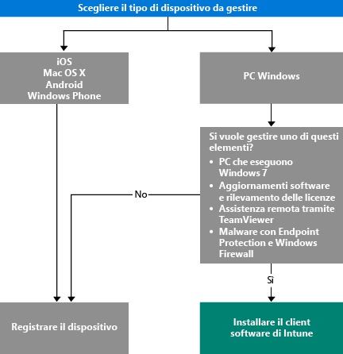

# Scegliere come gestire i dispositivi

[!INCLUDE[classic-portal](../includes/classic-portal.md)]

Per sfruttare i vantaggi delle numerose funzionalità di Intune, ad esempio la distribuzione di app e il controllo delle impostazioni del dispositivo, i dispositivi devono essere *gestiti*. La modalità di gestione dei dispositivi dipende dalle funzionalità di Intune che si vuole usare. Questo argomento fornisce indicazioni per scegliere il metodo più adatto alle esigenze specifiche.

Per gestire i dispositivi che eseguono iOS, Mac OS X, Android o Windows Phone, è necessario *registrarli*.

Per gestire i PC Windows, sono disponibili due opzioni:

1. Registrare il dispositivo **o**
2. Installare il *client software di Intune*.

## Scegliere il metodo da usare
Per decidere come gestire i propri dispositivi, usare questo flusso decisionale.

Registrare i PC Windows per ottenere la maggior parte delle funzionalità. Tuttavia, il client software di Intune può risultare più adatto per:

- Windows 7
- Aggiornamenti software Windows e l'utilizzo delle licenze
- Endpoint Protection e Windows Firewall
- Assistenza remota agli utenti con il software TeamViewer

Per un elenco dettagliato delle funzionalità di gestione che si ottengono con ogni metodo, vedere [Mobile device management capabilities](mobile-device-management-capabilities-in-microsoft-intune.md) (Funzionalità di gestione dei dispositivi mobili) e [Funzionalità del client software per PC di Intune](windows-pc-management-capabilities-in-microsoft-intune.md).
Per informazioni sui dispositivi e i PC supportati da Intune, vedere [Dispositivi mobili e computer supportati](https://docs.microsoft.com/intune/get-started/what-to-know-before-you-start-microsoft-intune#intune-supported-devices).

## Passaggi successivi

- [Scegliere come registrare i dispositivi mobili](/intune/get-started/choose-how-to-enroll-devices1)
- [Gestire i PC Windows con il software client per PC di Intune](/intune/deploy-use/manage-windows-pcs-with-microsoft-intune)
- [Gestione dei dispositivi mobili con Exchange ActiveSync e Microsoft Intune](/intune/deploy-use/mobile-device-management-with-exchange-activesync-and-microsoft-intune).

<!--HONumber=Dec16_HO3-->

