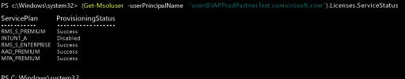

# Gestire le licenze di Intune

[!INCLUDE[classic-portal](../includes/classic-portal.md)]

Prima che gli utenti possano accedere per usare il servizio Intune o registrare i propri dispositivi nella gestione, è necessario innanzitutto assegnare a ogni utente una licenza per la sottoscrizione di Intune usando il [portale di Office 365](http://go.microsoft.com/fwlink/p/?LinkId=698854).

Le organizzazioni che usano Microsoft Enterprise Mobility Suite + Security (EMS) possono contenere utenti che necessitano solo di Azure Active Directory Premium o dei servizi di Intune nel pacchetto EMS. È possibile assegnare un servizio o un sottoinsieme di servizi tramite i [cmdlet di PowerShell per Azure Active Directory](https://msdn.microsoft.com/library/jj151815.aspx). Per altre informazioni, vedere [Manage Intune licenses using PowerShell](start-with-a-paid-subscription-to-microsoft-intune-step-4-posh.md) (Gestire le licenze Intune tramite PowerShell).

## Come vengono assegnate le licenze di Intune
Quando gli account utente vengono sincronizzati da Active Directory locale o aggiunti manualmente alla sottoscrizione per i servizi cloud tramite il [portale di Office 365](http://go.microsoft.com/fwlink/p/?LinkId=698854), a essi non viene assegnata automaticamente una licenza di Intune. In un secondo momento, un amministratore tenant di Intune dovrà modificare l'account utente per assegnare una licenza all'utente dal portale di Office 365.

Quando la propria sottoscrizione condivide Azure AD con altri servizi cloud associati alla sottoscrizione, l'utente ottiene accesso anche agli utenti aggiunti a quei servizi. Questi utenti non dispongono di una licenza per [!INCLUDE[wit_nextref](../includes/wit_nextref_md.md)] finché non ne viene assegnata una a ciascuno di loro.

> [!TIP]
> Se l'opzione per assegnare o revocare una licenza di [!INCLUDE[wit_nextref](../includes/wit_nextref_md.md)] è disabilitata, è probabile che la sottoscrizione includa opzioni multilicenza, come quelle disponibili quando si usa [Enterprise Mobility Suite + Security](https://www.microsoft.com/en-us/server-cloud/enterprise-mobility/overview.aspx). Per informazioni su come assegnare o revocare le licenze, vedere la documentazione per le proprie opzioni di licenza.

## Assegnare una licenza utente di Intune

Usare il [portale di Office 365](http://go.microsoft.com/fwlink/p/?LinkId=698854) per aggiungere manualmente gli utenti basati su cloud e assegnare licenze sia ad account utente basati su cloud che ad account sincronizzati con Azure AD da Active Directory locale.

1.  Accedere al [portale di gestione di Office 365](http://go.microsoft.com/fwlink/p/?LinkId=698854) usando le credenziali di amministratore tenant e quindi selezionare **Persone** > **Tutti gli utenti**.

2.  Selezionare l'account utente a cui si vuole assegnare una licenza utente di Intune e quindi selezionare **Microsoft Intune** (autonomo) o **Enterprise Mobility Suite**.

3.  L'account utente dispone ora delle autorizzazioni necessarie per usare il servizio e registrare dispositivi nella gestione.

> [!NOTE]
> Gli utenti verranno visualizzati nella console dopo aver registrato un dispositivo.

### Usare PowerShell per gestire in modo selettivo le licenze utente di EMS
Le organizzazioni che usano Microsoft Enterprise Mobility Suite + Security (precedentemente noto come Enterprise Mobility Suite) possono contenere utenti che necessitano solo di Azure Active Directory Premium o dei servizi di Intune nel pacchetto EMS. È possibile assegnare un servizio o un sottoinsieme di servizi tramite i [cmdlet di PowerShell per Azure Active Directory](https://msdn.microsoft.com/library/jj151815.aspx).

Per assegnare in modo selettivo le licenze utente per i servizi EMS, aprire PowerShell come amministratore su un computer dotato del [Modulo di Azure Active Directory per Windows PowerShell](https://msdn.microsoft.com/library/jj151815.aspx#bkmk_installmodule). È possibile installare PowerShell su un computer locale o su un server ADFS.

È necessario creare una nuova definizione dello SKU della licenza da applicare solo ai piani del servizio desiderati. A tale scopo, disabilitare i piani a cui non si desidera applicare la nuova definizione. Ad esempio, è possibile creare una definizione dello SKU che non assegna una licenza di Intune. Per visualizzare un elenco dei servizi disponibili, digitare:

    (Get-MsolAccountSku | Where {$_.SkuPartNumber -eq "EMS"}).ServiceStatus

È possibile eseguire il comando seguente per escludere il piano di servizio di Intune. È possibile usare lo stesso metodo per espandere un intero gruppo di sicurezza o usare filtri più granulari.

**Esempio 1** 
Creare un nuovo utente nella riga di comando e assegnare una licenza di EMS senza abilitare la parte di Intune della licenza:

    Connect-MsolService

    New-MsolUser -DisplayName “Test User” -FirstName FName -LastName LName -UserPrincipalName user@<TenantName>.onmicrosoft.com –Department DName -UsageLocation US

    $CustomEMS = New-MsolLicenseOptions -AccountSkuId "<TenantName>:EMS" -DisabledPlans INTUNE_A
    Set-MsolUserLicense -UserPrincipalName user@<TenantName>.onmicrosoft.com -AddLicenses <TenantName>:EMS -LicenseOptions $CustomEMS

Verificare con:

    (Get-MsolUser -UserPrincipalName "user@<TenantName>.onmicrosoft.com").Licenses.ServiceStatus

**Esempio 2** 
Disabilitare la parte di Intune della licenza EMS per un utente a cui è già stata assegnata una licenza:

    Connect-MsolService

    Set-MsolUserLicense -UserPrincipalName user@<TenantName>.onmicrosoft.com -RemoveLicenses IAPProdPartnerTest:EMS

    $CustomEMS = New-MsolLicenseOptions -AccountSkuId "<TenantName>:EMS" -DisabledPlans INTUNE_A
    Set-MsolUserLicense -UserPrincipalName user@<TenantName>.onmicrosoft.com -AddLicenses <TenantName>:EMS -LicenseOptions $CustomEMS

Verificare con:

    (Get-MsolUser -UserPrincipalName "user@<TenantName>.onmicrosoft.com" .Licenses.ServiceStatus

>[!div class="step-by-step"]

>[&larr; **Sync users to Intune**](.\start-with-a-paid-subscription-to-microsoft-intune-step-2.md) (Sincronizzare utenti su Intune) [**Organize users and devices** (Organizzare utenti e dispositivi) &rarr;](.\start-with-a-paid-subscription-to-microsoft-intune-step-5.md)  

<!--HONumber=Jan17_HO2-->

