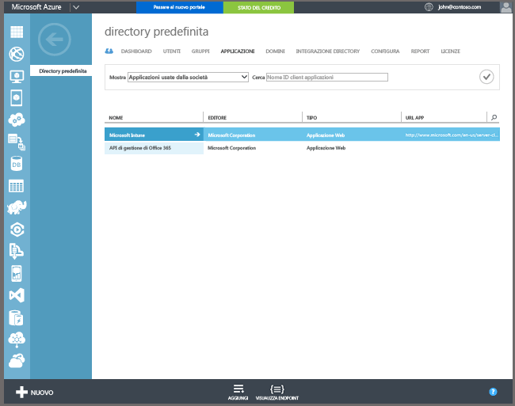

## Configurare la registrazione automatica di Windows 10 e Windows 10 Mobile con Azure Active Directory Premium

La registrazione automatica consente agli utenti di registrare dispositivi e PC di proprietà dell'azienda o personali Windows 10 e 10 Windows Mobile in Intune aggiungendo un account aziendale o dell'istituto di istruzione e accettandone la gestione. La procedura è molto semplice: in background, il dispositivo dell'utente si registra e unisce ad Azure Active Directory. Dopo la registrazione, il dispositivo viene gestito con Intune.

**Prerequisiti**
- Sottoscrizione di Azure Active Directory Premium ([sottoscrizione di prova](http://go.microsoft.com/fwlink/?LinkID=816845))
- Sottoscrizione di Microsoft Intune

### Configurare la registrazione MDM automatica

1. Nel [portale di gestione di Azure](https://manage.windowsazure.com) (https://manage.windowsazure.com) passare al nodo **Active Directory** e selezionare la directory.

2. Selezionare la scheda **Applicazioni**. Nell'elenco delle applicazioni viene visualizzato **Microsoft Intune**.

    

3. Selezionare la freccia per **Microsoft Intune**. Verrà visualizzata una pagina che consente di configurare Microsoft Intune.

4. Selezionare **Configura** per avviare la configurazione della registrazione MDM automatica con Microsoft Intune.

5. Specificare gli URL per Intune:

  - **URL di registrazione MDM**: usare il valore predefinito.
  - **URL delle condizioni di utilizzo MDM**: usare il valore predefinito. Questo URL consente di visualizzare le condizioni di utilizzo per gli utenti durante la registrazione dei dispositivi.
  - **URL di conformità MDM**: usare il valore predefinito. Se viene rilevato un dispositivo non conforme, con questo URL viene visualizzato un messaggio di **accesso negato**. L'URL punta a una pagina che consente agli utenti di comprendere perché il dispositivo non è conforme ai criteri e come è possibile ristabilirne la conformità.

6.  Specificare i dispositivi degli utenti che devono essere gestiti da Microsoft Intune. I dispositivi utente Windows 10 vengono registrati automaticamente per essere gestiti con Microsoft Intune.

  - **Tutti**
  - **Gruppi**
  - **Nessuno**

7. Scegliere **Salva**.

<!--HONumber=Feb17_HO2-->

