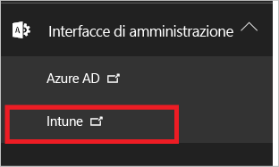
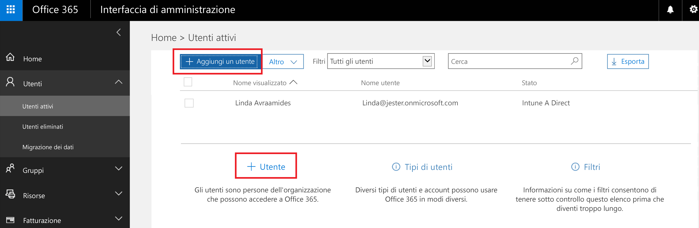
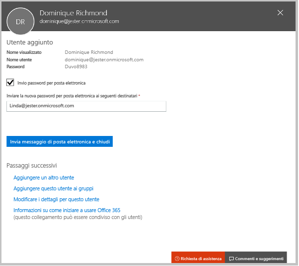
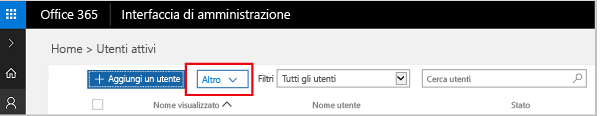

# Iscriversi per una versione di valutazione gratuita di Microsoft Intune
Questo articolo illustra come iscriversi per ottenere una versione di valutazione di Intune. Tale versione viene quindi preparata per l'uso con alcuni utenti, in modo che sia possibile seguire la guida di valutazione associata per comprendere il modo in cui Intune gestisce i dispositivi mobili. <!---or app data when devices are not enrolled in Intune.--->

## Presupposti
Nella sezione relativa all'iscrizione e nella guida di valutazione si presuppone che la versione gratuita venga usata soltanto a scopo di valutazione. Si presuppone inoltre che, quando si esegue la sottoscrizione, si inizi con un ambiente "pulito".

Per facilitare l'utilizzo della versione di valutazione, viene impostato un ambiente molto semplice che usa esclusivamente Intune e presuppone che quest'ultimo sia l'unico metodo di gestione dei dispositivi (noto anche come autorità di gestione dei dispositivi mobili). Nel corso della guida, tuttavia, verranno forniti collegamenti a contenuti tecnici, da usare per uno studio più approfondito.

Con la versione di valutazione è possibile eseguire le stesse operazioni consentite da una versione in abbonamento. L'unica differenza è che la versione di valutazione è limitata a 100 account utente.

## Iscriversi per la versione di valutazione gratuita
Visitare la pagina di [iscrizione a Intune](https://portal.office.com/Signup/Signup.aspx?OfferId=40BE278A-DFD1-470a-9EF7-9F2596EA7FF9&dl=INTUNE_A&ali=1#0%20) e compilare il modulo per richiedere una sottoscrizione di valutazione.

Se si dispone già di un account aziendale o dell'istituto di istruzione e si vuole usare tale account per la versione di valutazione di Intune, seguire [queste istruzioni di iscrizione](https://docs.microsoft.com/en-us/intune/get-started/start-with-a-paid-subscription-to-microsoft-intune-step-1). Questo articolo e la guida di valutazione, tuttavia, presuppongono che non venga usato questo tipo di account.

> [!TIP]
> Se per la maggior parte delle operazioni IT viene usata una lingua diversa dalla propria, è necessario specificare per la versione di valutazione le impostazioni locali appropriate, così da poter eseguire il test delle prestazioni.

### Considerazioni successive all'iscrizione
Quando si esegue l'iscrizione per una versione di valutazione, all'indirizzo di posta elettronica specificato in fase di iscrizione verrà inviato un messaggio contenente le informazioni sul proprio account. Questo messaggio conferma che la versione di valutazione è attiva.

Dopo aver completato il processo di iscrizione, si verrà indirizzati a una pagina usata per aggiungere utenti e assegnare loro licenze tramite l'interfaccia di amministrazione di Office 365. Al successivo accesso a Intune, l'utente verrà automaticamente indirizzato alla console di amministrazione di Intune.

## Utilizzo dell'interfaccia di amministrazione e della console di amministrazione di Intune
Per Intune vengono usati due portali: l'interfaccia di amministrazione di Office 365 ([portal.office.com](https://portal.office.com)) e la console di amministrazione di Intune ([manage.microsoft.com](https://manage.microsoft.com)).

In genere le operazioni vengono eseguite nella console di amministrazione di Intune, illustrata di seguito. Questa console consente infatti di impostare e gestire i gruppi, i criteri, i dispositivi e le app.

Per aggiungere e gestire gli utenti e per altri aspetti dell'account, inclusi la fatturazione e il supporto, viene tuttavia usata l'interfaccia di amministrazione di Office 365, illustrata di seguito.

È possibile passare dall'interfaccia di amministrazione di Office 365 alla console di amministrazione di Intune. Le interfacce di amministrazione si trovano sotto l'ultimo elemento nel riquadro si spostamento a sinistra. Scegliere **Intune** per aprire la console di amministrazione di Intune in una nuova scheda.

Per passare da Intune all'interfaccia di amministrazione di Office 365 Admin, scegliere l'attività **Aggiungi utenti** nella pagina Panoramica gruppi.

## Aggiungere utenti
Prima di passare dall'interfaccia di amministrazione di Office 365 a Intune, è necessario aggiungere alcuni utenti all'account di valutazione.

Nell'interfaccia di amministrazione di Office 365 è possibile aggiungere utenti, sia singolarmente che in blocco, caricando un file con estensione csv. Per impostare la versione di valutazione verranno eseguite entrambe le operazioni. Nell'ambiente di produzione, tuttavia, è probabilmente preferibile usare gli account utente di Azure Active Directory. Per altre informazioni, vedere le sezioni [Guida introduttiva](https://docs.microsoft.com/en-us/intune/get-started/start-with-a-paid-subscription-to-microsoft-intune-step-3) e [Passaggi successivi](#Next-steps) di questo articolo.

### Aggiungere un singolo utente
1. Scegliere una delle due opzioni per l'aggiunta di un utente per aprire un modulo che consente di creare un utente. Sono obbligatori soltanto gli elementi contrassegnati da un asterisco (\*).

2.  Quando si aggiunge un utente, come ultimo passaggio è necessario inviare a tale utente un messaggio di posta elettronica con la password temporanea di Intune. Ai fini di questa versione di valutazione, usare il proprio indirizzo di posta elettronica aziendale, così da ricevere le informazioni di accesso e visualizzare il messaggio che verrà inviato agli utenti. È quindi possibile usare queste identità utente per registrare i dispositivi di test. 

 

3. Se, dopo aver creato un utente, si vuole assegnargli un ruolo, è possibile modificare il ruolo nell'interfaccia di amministrazione di Office 365 selezionando il nome utente dall'elenco degli utenti e quindi scegliendo **Modifica** nella riga Ruolo. Viene visualizzato l'elenco dei ruoli da cui selezionare quello da assegnare all'utente.

 

### Importare più utenti
1. La procedura guidata per l'importazione di più utenti è disponibile nell'elenco **More** (Altro).

 

2. Per impostare più facilmente il file con estensione CSV, è possibile scaricare un file modello da popolare con i dati degli utenti. Scaricare il file con estensione csv contenente le intestazioni e le informazioni utente di esempio per visualizzare esattamente il tipo di dati richiesto per ciascun campo.

 

3. Dopo aver creato e salvato il file con estensione csv, scegliere **Sfoglia** per selezionare il file. Verificare e scegliere **Avanti**. Gli utenti verranno caricati e aggiunti all'elenco di utenti attivi.

A questo punto, è necessario passare alla console di amministrazione di Intune per iniziare a gestire gli utenti, i loro dispositivi e le loro applicazioni.

> [!NOTE]
> Gli utenti non vengono visualizzati in Intune fino a quando non hanno registrato un dispositivo da gestire.

## Passaggi successivi
Scenario di valutazione: [Valutare la gestione dei dispositivi mobili in Microsoft Intune](mobile-device-management-trial-guide-microsoft-intune.md)

Per altre informazioni sull'uso degli account utente di Azure Active Directory con Intune, vedere:
- [Identity requirements](https://docs.microsoft.com/en-us/active-directory/active-directory-hybrid-identity-design-considerations-overview#design-considerations-overview) (Requisiti di identità)
- [Determinare i requisiti di sincronizzazione delle directory](https://docs.microsoft.com/en-us/active-directory/active-directory-hybrid-identity-design-considerations-directory-sync-requirements)
- [Determinare i requisiti dell'autenticazione a più fattori](https://docs.microsoft.com/en-us/active-directory/active-directory-hybrid-identity-design-considerations-multifactor-auth-requirements)

Altre informazioni sull'uso di [Intune con System Center Configuration Manager](https://docs.microsoft.com/en-us/sccm/mdm/understand/hybrid-mobile-device-management)

<!--HONumber=Dec16_HO2-->

