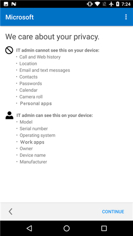
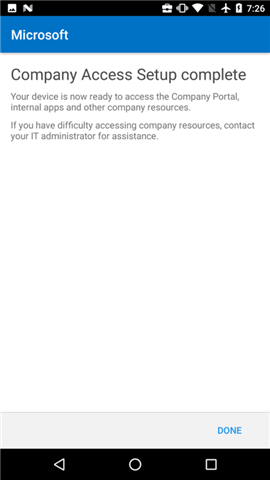

# Create a work profile and enroll your device in Intune (Creare un profilo di lavoro e registrare il dispositivo in Intune)

La registrazione del dispositivo Android consente di accedere a posta elettronica, app e dati aziendali. Come parte della registrazione, è possibile impostare un profilo di lavoro, che separa i dati personali che si trovano sul dispositivo dai dati aziendali. L'amministratore IT può gestire solo il profilo aziendale, che contiene i dati di lavoro. L'amministratore IT non può gestire i dati personali sul dispositivo. Altri dettagli sono disponibili in [Cosa accade quando si crea un profilo di lavoro](what-happens-when-you-create-a-work-profile-android.md).

Per creare un profilo di lavoro:

1.  Nella **schermata iniziale** del Portale aziendale Android toccare **Accedi** e accedere con l'account aziendale o dell'istituto di istruzione. Se non è stata ancora installata l'app gratuita, scaricarla da [Google Play](http://play.google.com/store/apps/details?id=com.microsoft.windowsintune.companyportal) e installarla.

    

2. Nella schermata **Configurazione dell'accesso aziendale** toccare **INIZIA**.

    

3.  Nella schermata **Why create a work profile?** (Perché creare un profilo di lavoro) leggere quali operazioni è possibile eseguire e toccare **CONTINUA**.

    

4.  Esaminare l'elenco dei dati che l'amministratore IT può o meno visualizzare e quindi toccare **CONTINUA**.

    

5.  Nella schermata **Operazioni successive** leggere quali saranno le operazioni successive e toccare **CONTINUA**.

    

6. Nella schermata **Set up work profile** (Configura profilo di lavoro) toccare **AVANTI** per consentire all'app Portale aziendale di accedere al profilo di lavoro.

    

7. Rivedere la schermata di Google che descrive le operazioni che può eseguire l'amministratore IT durante la creazione di un profilo di lavoro e toccare **OK**.

    

    Verranno visualizzati alcuni messaggi riguardanti la configurazione del profilo di lavoro e la registrazione del dispositivo.

8. Nella schermata **Operazione quasi completata** attendere alcuni secondi finché non viene aperta l'app Portale aziendale.

    

9. Nella **schermata iniziale** del Portale aziendale per Android toccare **Accedi** e accedere con lo stesso account aziendale o dell'istituto di istruzione usato per accedere precedentemente in questo processo.

10. Nella schermata **Configurazione dell'accesso aziendale** è possibile notare che il profilo di lavoro è stato configurato. A questo punto toccare **CONTINUA**.

    

    Per un attimo sarà visualizzato il messaggio "Registrazione del dispositivo in corso".

11. Se la schermata **Configurazione dell'accesso aziendale** indica che è stato tutto configurato, toccare **CONTINUA**.

    

12. Nella schermata **Configurazione dell'accesso aziendale completato** toccare **FINE**. Potrebbe essere necessario completare altri passaggi se l'amministratore IT ha aggiunto altri requisiti.

    

    È possibile ora ottenere app aziendali da Play Store for work.

    

Serve ancora assistenza? Contattare l'amministratore IT. Per informazioni sul contatto vedere il [sito Web del portale aziendale](http://portal.manage.microsoft.com).
