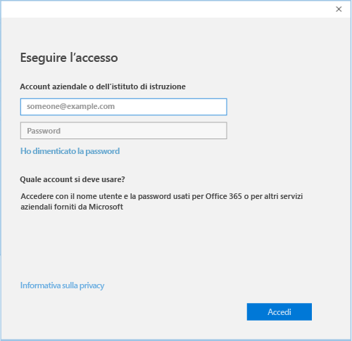

# Registrare i dispositivi Windows 10 con il portale aziendale di Intune

Usare il portale aziendale di Intune per registrare il dispositivo Windows 10 gestiti dell'organizzazione. Questo articolo descrive come registrare i dispositivi con Windows 10 versione 1607 e versioni successive e Windows 10 versione 1511 e versioni precedenti. Prima di iniziare, assicurarsi [verificare la versione sul dispositivo](windows-enrollment-company-portal.md#find-windows-10-version-number) in modo che è possibile seguire la procedura appropriata.  

Windows 10 è supportato in vari tipi di dispositivo, inclusi desktop, telefono e tablet. La procedura di registrazione è gli stessi su qualsiasi dispositivo in uso. Tuttavia, la schermata potrebbe essere leggermente diversa dalle immagini illustrate in questo articolo.  

> [!VIDEO https://channel9.msdn.com/Series/IntuneEnrollment/Windows-Enrollment/player]  

## Registrazione di Windows 10 versione 1607 e successive dispositivo 
Questi passaggi illustrano come registrare un dispositivo che esegue Windows 10, versione 1607 e versioni successive.  

1. Fare clic su **Start**. Se si usa un dispositivo Windows 10 Mobile, continuare per il **tutte le app** elenco.

2. Aprire l'app **Impostazioni**. Se l'app non è prontamente disponibile nell'elenco di App, passare alla barra di ricerca e digitare "impostazioni".

3. Selezionare **Account** > **Accedi all'azienda o all'istituto di istruzione** > **Connetti**.  

      

4. Immettere l'indirizzo di posta elettronica dell'azienda o dell'istituto di istruzione e quindi selezionare **Avanti**.  

     

5. Accedere a Intune con l'account aziendale o dell'istituto di istruzione.  

      

    Verrà infine visualizzato un messaggio che la società o l'istituto di istruzione sta registrando il dispositivo.

6. Se l'organizzazione richiede di configurare un PIN di Windows Hello, verrà chiesto di immettere un codice di verifica. Immettere il codice e continuare con le istruzioni visualizzate per creare un PIN.  

7. Nella schermata **La configurazione è completata** selezionare **Fine**. Il dispositivo è ora registrato.  

8. Per verificare la connessione, tornare alla **le impostazioni** > **account** > **accesso azienda o dell'istituto di istruzione**.  L'account dovrebbe ora essere elencato.  

      

Non è ancora possibile accedere agli indirizzi di posta elettronica, ai file o ad altri dati aziendali o dell'istituto di istruzione? Informazioni su come [risolvere i problemi dell'account](troubleshoot-your-windows-10-device-windows.md#troubleshooting-steps-to-follow-if-you-see-access-work-or-school).  

## Registrazione di Windows 10 versione 1511 e precedenti dispositivo  
Questi passaggi illustrano come registrare un dispositivo che esegue Windows 10, versione 1511 e versioni precedenti.  

1. Fare clic su **Start**. Se si usa un dispositivo Windows 10 Mobile, continuare per il **tutte le app** elenco.

2. Aprire l'app **Impostazioni**. Se l'app non è prontamente disponibile nell'elenco di App, passare alla barra di ricerca e digitare "impostazioni".

3. Selezionare **conti** > **all'account**.  

      

5. Selezionare **Aggiungi un account aziendale o dell'istituto di istruzione**.  

      

6. Accedere con le credenziali aziendali o dell'istituto di istruzione.  

      

Non è ancora possibile accedere agli indirizzi di posta elettronica, ai file o ad altri dati aziendali o dell'istituto di istruzione? Informazioni su come [risolvere i problemi dell'account](troubleshoot-your-windows-10-device-windows.md#troubleshooting-steps-to-follow-if-you-see-your-account).   

## Passaggi successivi  

Per ottenere assistenza, contattare il supporto tecnico aziendale. È possibile trovare l'organizzazione informazioni IT sul [sito Web portale aziendale](https://go.microsoft.com/fwlink/?linkid=2010980). Accedere al sito con l'account aziendale o dell'istituto di istruzione.  

 

