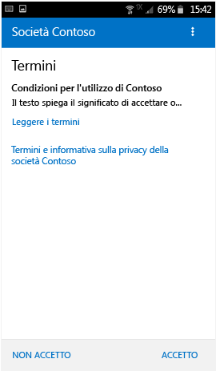
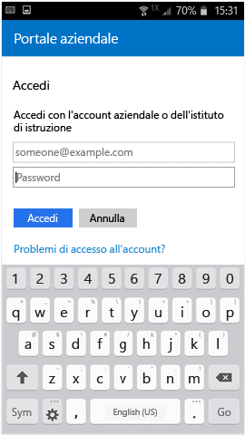

# Registrare il dispositivo Android in Intune

Se l'azienda o l'istituto di istruzione usa Microsoft Intune, è possibile registrare il dispositivo Android per poter accedere a posta elettronica, file e altre risorse aziendali. La registrazione dei dispositivi consente al reparto IT di gestire e proteggere le risorse aziendali o dell'istituto di istruzione, offrendo al tempo stesso la possibilità di scegliere il dispositivo più adatto per svolgere il proprio lavoro. Per altre informazioni sulla registrazione, vedere [What happens when I install the Company Portal app and enroll my device?](what-happens-if-you-install-the-Company-Portal-app-and-enroll-your-device-in-intune-android.md) (Cosa succede se si installa l'app Portale aziendale e si registra il dispositivo?)

> [!VIDEO https://channel9.msdn.com/Series/IntuneEnrollment/Android-Enrollment/player]

Queste istruzioni sono valide per la registrazione di dispositivi Android nativi e Samsung Knox. Samsung Knox è un tipo di sicurezza che alcuni dispositivi Samsung usano per fornire protezione aggiuntiva oltre all'offerta prevista per i dispositivi Android nativi. Per determinare se il dispositivo è di tipo Samsung Knox, passare a **Impostazioni** > **Informazioni sul dispositivo**. Se non viene visualizzata la versione Knox, significa che il dispositivo è un dispositivo Android nativo.

Prima o dopo la registrazione potrebbe essere necessario scegliere la categoria che descrive meglio come viene usato il dispositivo. Questa categoria consente al supporto tecnico aziendale di controllare le app a cui è possibile accedere.

**Per registrare il dispositivo Android:**

1. Installare l'app Portale aziendale di Intune da [Google Play](http://play.google.com/store/apps/details?id=com.microsoft.windowsintune.companyportal).

2. Aprire l'app Portale aziendale.

3. Nella **schermata iniziale** del portale aziendale toccare **Accedi** e quindi accedere con l'account aziendale o dell'istituto di istruzione.

      

4. Se il supporto tecnico aziendale ha configurato i termini e le condizioni della società, toccare **ACCETTO** per accettarli. Questa schermata può differire leggermente dall'immagine riportata di seguito in base alla versione di Android in uso.

   

5. Accedere all'app Portale aziendale usando l'account e la password aziendali o dell'istituto di istruzione e toccare **Accedi**.

   

6. Nella schermata **Configurazione dell'accesso aziendale** toccare **CONTINUA**.

   

   > [!NOTE]
   > I triangoli gialli non indicano che si è già verificato un errore, ma che alcuni passaggi del processo di registrazione devono ancora essere completati.

7. Rivedere l'elenco di cosa può e di cosa non può essere visualizzato sul dispositivo dal personale del supporto tecnico aziendale e quindi toccare **CONTINUA**.

   

8. Nella schermata **Operazioni successive** leggere cosa accade durante la registrazione e quindi toccare **REGISTRA**.

   

9. Se si usa Android 6.0 o versione successiva, eseguire questo passaggio. In caso contrario, andare al passaggio successivo.

   Se il supporto tecnico aziendale ha configurato criteri specifici, possono essere visualizzati i messaggi seguenti:
   - **Allow Company Portal to make and manage phone calls? (Consentire a Portale aziendale di effettuare e gestire chiamate telefoniche?)**

     

   Se viene visualizzato questo messaggio, toccare **CONSENTI**. È consigliabile scegliere questa opzione perché **Microsoft non effettua né gestisce le chiamate telefoniche**. Il testo del messaggio è controllato da Google, quindi Microsoft non può modificarlo. Quando si consente l'accesso, il dispositivo può inviare il codice IMEI (International Mobile Station Equipment Identity) a Intune. Il codice IMEI è un numero, simile a un numero di serie, che identifica in modo univoco un dispositivo mobile.

   Se si nega l'accesso, il messaggio sarà di nuovo visualizzato quando si accederà di nuovo al Portale aziendale. È tuttavia possibile disattivare la visualizzazione futura dei messaggi selezionando la casella **Non visualizzare più questo messaggio**. Se si decide successivamente di consentire l'accesso, andare a **Impostazioni** &gt; **App** &gt; **Portale aziendale** &gt; **Autorizzazioni** &gt; **Telefono**, quindi attivare l'autorizzazione.

   - **Allow Company Portal to access your contacts? (Consentire a Portale aziendale di accedere ai contatti?)**

     

     Se viene visualizzato questo messaggio, toccare **CONSENTI**. È consigliabile scegliere questa opzione perché **Microsoft non può mai accedere ai contatti**. Il testo del messaggio è controllato da Google, quindi Microsoft non può modificarlo. Quando si concede l'accesso, si consente solo all'app Portale aziendale di creare, usare e gestire il proprio account aziendale.

     Se si nega l'accesso, il messaggio sarà di nuovo visualizzato quando si accederà di nuovo al Portale aziendale. È tuttavia possibile disattivare la visualizzazione futura dei messaggi selezionando la casella **Non visualizzare più questo messaggio**. Se si decide successivamente di consentire l'accesso, andare a **Impostazioni** &gt; **App** &gt; **Portale aziendale** &gt; **Autorizzazioni** &gt; **Telefono**, quindi attivare l'autorizzazione.

10. Nella schermata relativa all'**attivazione dell'amministratore del dispositivo** toccare **Attiva**.

    

    Il ruolo di amministratore del dispositivo è un ruolo necessario all'app Portale aziendale per gestire il dispositivo. Consente all'amministratore di osservare determinati comportamenti, come il numero di tentativi di sblocco dello schermo, e di eseguire alcune azioni.

    Il concetto chiave da tenere presente consiste nel fatto che le azioni vengono eseguite a tutela della sicurezza. Il supporto tecnico aziendale non cerca di violare la privacy degli utenti né di cancellare le informazioni senza motivo, ma vuole garantire la sicurezza dei dati aziendali.

    Microsoft non controlla questo messaggio ed è consapevole che la sua formulazione può sembrare piuttosto drastica. L'app Portale aziendale non può visualizzare solo le restrizioni e i diritti di accesso che sono rilevanti per l'organizzazione. Tutti i diritti vengono concessi contemporaneamente in questa schermata. Per domande specifiche sulla prassi adottata nella propria organizzazione e per altre informazioni, contattare il supporto tecnico aziendale tramite le informazioni sul contatto riportate nel [sito Web Portale aziendale](https://portal.manage.microsoft.com#HelpDeskDialog).

11. Seguire le istruzioni per immettere un PIN o una password. Se sul dispositivo è già stato impostato un PIN o una password, questa schermata non verrà visualizzata o verrà richiesto di immettere un nuovo PIN o una nuova password.

    

12. Se si usa un dispositivo Samsung Knox, toccare **Conferma** per visualizzare un messaggio che conferma la registrazione del dispositivo. Se si usa un dispositivo Android nativo, viene visualizzata semplicemente la schermata seguente che conferma la registrazione del dispositivo.

    

    Questa schermata indica che dispositivo è in fase di registrazione.

    

13. Quando viene visualizzata la schermata **Configurazione dell'accesso aziendale** toccare **CONTINUA**. Se viene visualizzato un messaggio che indica che il dispositivo non è conforme, seguire le istruzioni per risolvere il problema e toccare **CONTINUA**.

    

    

    È possibile trovare altre informazioni sui problemi riscontrati toccando le voci corrispondenti.

    

      

14. Nella schermata **Configurazione dell'accesso aziendale completato** toccare **FINE**. Il dispositivo è ora registrato.

    

Prima di installare app aziendali, andare in **Impostazioni**&gt;**Sicurezza** e attivare **Origini sconosciute**. Se non si attiva questa opzione prima di installare le app, viene visualizzato un messaggio che indica che l'installazione è bloccata. per motivi di sicurezza che impediscono di installare nel dispositivo app ottenute da origini sconosciute. È possibile toccare **Impostazioni** nella finestra di dialogo di errore per visualizzare l'opzione **Origini sconosciute**.

> [!Note]
> Se la propria organizzazione usa software per la gestione delle spese per telecomunicazioni, sarà necessario eseguire alcuni passaggi aggiuntivi prima che la registrazione del dispositivo sia completata. Per altre informazioni, vedere [qui](enroll-your-device-with-telecom-expense-management-android.md).

Se si verifica un errore durante la registrazione del dispositivo in Intune, è possibile [inviare gli errori di registrazione al supporto tecnico aziendale](send-enrollment-errors-to-your-it-admin-android.md).

Serve ancora assistenza? Contattare il supporto tecnico aziendale (accedere al [sito Web Portale aziendale](https://portal.manage.microsoft.com#HelpDeskDialog) per informazioni sul contatto) oppure scrivere al <a href="mailto:wintunedroidfbk@microsoft.com?subject=I'm having trouble with enrolling my Android device&body=Describe the issue you're experiencing here.">team Microsoft Android</a>.
