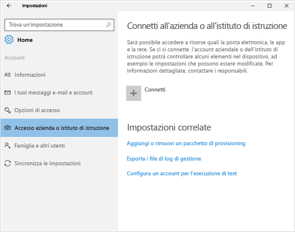
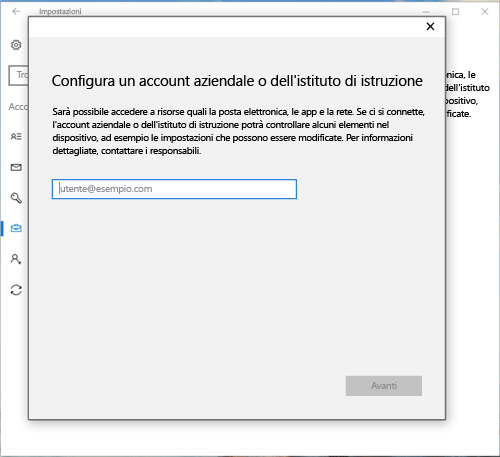
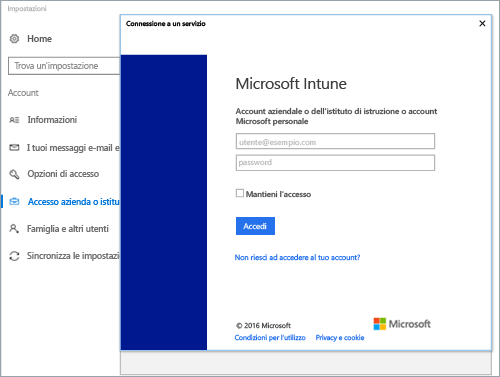
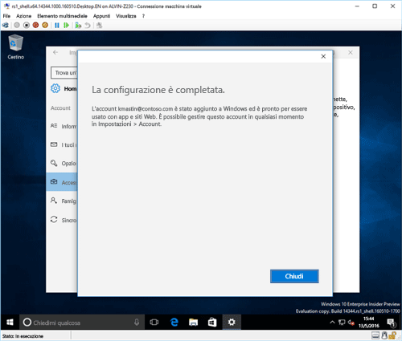
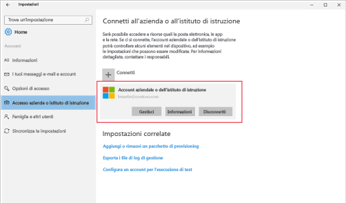

# Registrare il dispositivo Windows 10 in Intune

> [!NOTE]
> Windows 10 funziona in tutti i tipi di dispositivi. Su desktop, telefono o tablet, i passaggi da seguire sono gli stessi, anche se sembrano leggermente diversi dalle immagini in questa pagina.

> [!VIDEO https://channel9.msdn.com/Series/IntuneEnrollment/Windows-Enrollment/player]

1. Fare clic su **Start**.

  - Se si usa un dispositivo **Windows 10 Desktop** andare al **menu Start**.
  - Se si usa un dispositivo **Windows 10 Mobile**, andare alla **schermata Start** e quindi scorrere verso l'elenco **Tutte le app**.

2.  Aprire l'app **Impostazioni** di Windows cercando "impostazioni" nella barra di ricerca.

3. Selezionare **Account** > **Accedi all'azienda o all'istituto di istruzione** > **Connetti**.

    

3.  Immettere l'indirizzo di posta elettronica dell'azienda o dell'istituto di istruzione e quindi selezionare **Avanti**.

    

4. Accedere a Intune con l'account aziendale o dell'istituto di istruzione.

    

    Verrà visualizzato un messaggio che indica che la società o l'istituto di istruzione sta registrando il dispositivo.

5. Quando viene visualizzata la schermata **La configurazione è completata**, selezionare **Chiudi**. La procedura è stata completata.

  

6. Se si vuole verificare che la connessione sia corretta, tornare a **Impostazioni** dove si dovrebbe ora visualizzare l'account aziendale o dell'istituto di istruzione.

    

Se i passaggi precedenti sono stati seguiti, ma non è ancora possibile accedere ai file e agli account di posta elettronica aziendali o dell'istituto di istruzione, seguire i passaggi in [Passaggi di risoluzione dei problemi da seguire se si visualizza Accedi all'azienda o all'istituto di istruzione](troubleshoot-your-windows-10-device-windows.md#troubleshooting-steps-to-follow-if-you-see-access-work-or-school).
