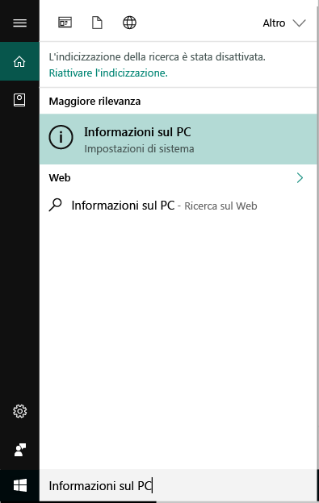
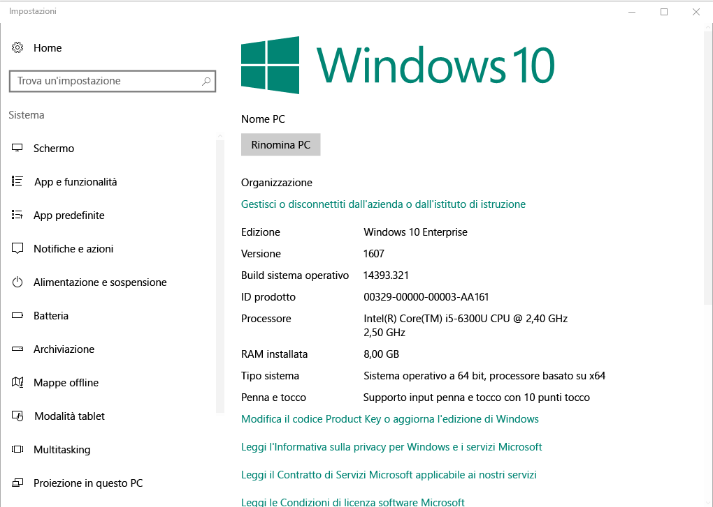

# Registrare i dispositivi Windows 10 in Intune

La registrazione dei dispositivi in Microsoft Intune consente ai dispositivi Windows di 10 accedere ai dati protetti dell'organizzazione, inclusi posta elettronica, file e altre risorse. Questo vale sia per i dispositivi Windows 10 Desktop che per quelli Windows 10 Mobile. La registrazione dei dispositivi contribuisce a proteggere l'accesso per l'utente e per la propria organizzazione e consente di mantenere i dati di lavoro distinti da quelli personali.

Per saperne di più Altre informazioni su cosa accade quando si [registra il dispositivo in Intune](what-happens-if-you-install-the-company-portal-app-and-enroll-your-device-in-intune-windows.md) e cosa significa per le [informazioni sul dispositivo](what-info-can-your-company-see-when-you-enroll-your-device-in-intune.md).

## Dispositivi Windows 10 Desktop
1.    Fare clic su __Start__.

 .

2. Digitare la frase "informazioni sul PC" nella __barra di ricerca__ e quindi selezionare __Informazioni sul PC__.

 

2.    In __Impostazioni__ verrà visualizzato un elenco di informazioni sulla versione di Windows 10 installata nel PC. In questo elenco individuare la __Versione__.

 

3.    Se la versione è __1607__, continuare con [questa procedura](enroll-your-w10-device-access-work-or-school.md). Se la versione è __1511 o precedente__, continuare con [questa procedura](enroll-your-w10-device-your-account.md).

## Dispositivi Windows 10 Mobile

1.    In __Start__ scorrere verso l'elenco __Tutte le app__ e quindi selezionare l'app __Impostazioni__.
2.    Toccare __Sistema__ e quindi __Informazioni su__.
3.    In __Informazioni sul dispositivo__ toccare __Altre informazioni__. Verrà visualizzato un elenco di informazioni sul dispositivo. In questo elenco individuare la __Versione__.
4.    Se la versione è __1607__, continuare con [questa procedura](enroll-your-w10-device-access-work-or-school.md). Se la versione è __1511 o precedente__, continuare con [questa procedura](enroll-your-w10-device-your-account.md).

Serve ancora assistenza? Contattare l'amministratore IT. Per informazioni sul contatto vedere il [sito Web del portale aziendale](http://portal.manage.microsoft.com).

