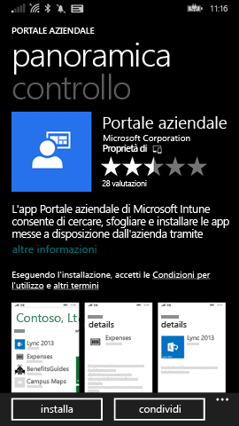
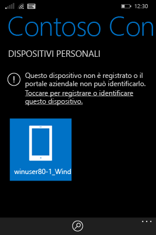
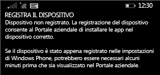
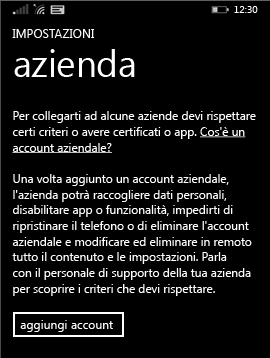

# Registrare il dispositivo Windows Phone 8.1 in Intune  

Registrare i dispositivi per accedere al lavoro o dell'istituto di istruzione, file e altre risorse. La registrazione dei dispositivi consente all'azienda di proteggere i suoi dati. Per altre informazioni sulla registrazione, vedere [Che cosa avviene quando si installa l'app Portale aziendale e si registra il dispositivo Windows in Intune?](what-happens-if-you-install-the-company-portal-app-and-enroll-your-device-in-intune-windows.md) e [Cosa può e cosa non può essere visualizzato dal supporto tecnico aziendale sul dispositivo](what-info-can-your-company-see-when-you-enroll-your-device-in-intune.md).  

Per registrare il dispositivo in Intune, seguire le istruzioni che soddisfano le autorizzazioni o lo stato dell'account corrente.

## Effettuare l'iscrizione tramite portale aziendale  
È possibile installare l'app portale aziendale da di Microsoft Store, seguire questa procedura. 

1.  Toccare **Start** > **Store**.  

2.  Toccare **Cerca** e quindi digitare **portale aziendale**.  

3.  Nell'elenco dei risultati toccare **Portale aziendale**.  

      

4.  Toccare **Portale aziendale**  &gt; **Installa**.  

      

Registrare il dispositivo:  

1.  Nel dispositivo aprire l'app **Portale aziendale di Microsoft Intune**.  

2.  Immettere le credenziali. Se necessario, potrebbe essere visualizzata la richiesta di accettare termini e condizioni aziendali.  

3.  Passare a **Dispositivi personali**.  

4.  Selezionare **Toccare per registrare o identificare questo dispositivo**.  

      

5.  Toccare **Registra il dispositivo**.  

      

6.  Toccare **Aggiungi account**.  

      

7.  Immettere le altre informazioni richieste e toccare **accedi** per completare la registrazione. L'account aziendale dovrebbe essere elencati nella pagina **Impostazioni** &gt; **Area di lavoro**.  

      

## Effettuare l'iscrizione tramite l'app impostazioni  
Se non hai accesso di Microsoft Store dal dispositivo Windows Phone o se non hai un Account Microsoft, seguire questa procedura.

1.  Toccare **Impostazioni** &gt; **area di lavoro**.  

2.  Toccare **aggiungi account** e quindi accedere con l'account aziendale.  

3.  Immettere le altre informazioni richieste e toccare **accedi** per completare la registrazione.  

4.  Se viene richiesto di installare l'app aziendale o Hub, verificare che la casella corrispondente sia selezionata e toccare **fine**.  

Se il supporto tecnico aziendale ha configurato l'app Portale aziendale in modo che venga installata durante la registrazione, l'app verrà visualizzata nell'elenco delle app.  

Serve ancora assistenza? Contattare l'amministratore IT. Per informazioni sul contatto vedere il [sito Web del portale aziendale](https://go.microsoft.com/fwlink/?linkid=2010980).
