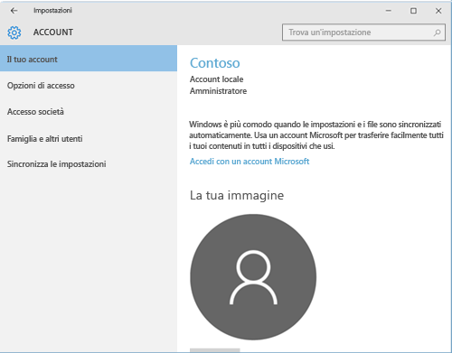

# Risolvere i problemi di registrazione dei dispositivi Windows 10
Se è stata seguita la procedura descritta in [Registrare il dispositivo Windows 10 Mobile o Windows 10 Desktop in Intune](enroll-your-w10-phone-or-w10-pc-windows.md), ma non è ancora possibile accedere alla posta elettronica e ai file dell'azienda o dell'istituto di istruzione, provare a eseguire i passaggi di risoluzione dei problemi seguenti.

1.  Esaminare le due schermate seguenti e trovare quella simile a quanto viene visualizzato sul dispositivo. Seguire i passaggi corrispondenti alla schermata visualizzata sul dispositivo.

    Se si visualizza questa schermata, seguire i passaggi in [Passaggi di risoluzione dei problemi da seguire se si visualizza Access work or school (Accesso azienda o istituto di istruzione)](#troubleshooting-steps-to-follow-if-you-see-access-work-or-school).

    

    Se si visualizza questa schermata, seguire i passaggi in [Passaggi di risoluzione dei problemi da seguire se si visualizza Il tuo account](#troubleshooting-steps-to-follow-if-you-see-your-account).

    

## Passaggi di risoluzione dei problemi da seguire se si visualizza Access work or school (Accesso azienda o istituto di istruzione)

1.  Se è stata eseguita la procedura sopra descritta, ma non è tuttavia possibile accedere alla posta elettronica e ai file dell'azienda o dell'istituto di istruzione, tornare alla schermata **Access work or school** (Accesso azienda o istituto di istruzione).

2. Eseguire una delle operazioni seguenti:

    - Se si visualizza una connessione simile all'immagine seguente, toccarla e quindi verificare se le opzioni Gestisci, Informazioni e Disconnetti sono presenti. Se si visualizzano queste opzioni, l'utente è registrato e connesso.

    

    - Se non si visualizzano le informazioni di connessione illustrate in precedenza o si visualizzano, ma mancano alcune opzioni, toccare **Connetti** e quindi accedere con le credenziali aziendali o dell'istituto di istruzione. A questo punto l'utente è connesso.

## Passaggi di risoluzione dei problemi da seguire se si visualizza Il tuo account

Se è stata eseguita la procedura sopra descritta, ma non è tuttavia possibile accedere alla posta elettronica, ai file e ad altri dati dell'azienda o dell'istituto di istruzione, tornare alla schermata **Account** e toccare **Accesso società**.

- Se viene visualizzato l'account aziendale o dell'istituto di istruzione, la connessione è attiva.

- In caso contrario, toccare **Connetti** e quindi accedere con le credenziali aziendali o dell'istituto di istruzione.

Serve ancora assistenza? Contattare l'amministratore IT. Per informazioni sul contatto vedere il [sito Web del portale aziendale](http://portal.manage.microsoft.com).

