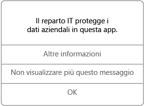

# Usare le app gestite nel dispositivo iOS

Le app gestite sono app che il supporto tecnico dell'azienda può configurare per proteggere i dati aziendali ai quali è possibile accedere dall'app stessa. Quando si accede ai dati aziendali da un'app gestita in un dispositivo iOS, è possibile notare che il funzionamento dell'app è leggermente diverso rispetto a quello previsto. Ad esempio, potrebbero non essere consentite le operazioni di copia e incolla dei dati aziendali protetti oppure il salvataggio dei dati in determinati percorsi.

Diverse app gestite possono anche interagire tra loro nel dispositivo per consentire di eseguire le attività giornaliere mantenendo protetti i dati aziendali. Ad esempio, se si apre un file aziendale in un'app gestita che richiede un'altra app gestita per visualizzare il file, questa seconda app viene aperta automaticamente. Se un'app necessaria non è disponibile, alcune azioni, come l'apertura di un documento o l'accesso a un collegamento Web in un documento gestito, potrebbero non essere disponibili.

Quando si accede ai dati aziendali in un'app gestita, viene visualizzato un messaggio simile a quello riportato di seguito, che indica che l'app che si sta aprendo è gestita.

### Come si ottengono le app gestite?
Le app gestite possono essere installate in due modi:

-   Quando il dispositivo viene registrato in Microsoft Intune, è possibile installare l'app dall'app Portale aziendale o dal sito Web del portale aziendale oppure l'installazione nel dispositivo può essere eseguita dal supporto tecnico dell'azienda. Per informazioni sulla registrazione, vedere [Registrare il dispositivo iOS in Intune](enroll-your-device-in-intune-ios.md) o [Registrare il dispositivo macOS in Intune](enroll-your-device-in-intune-macos.md).

-   L'app viene installata da App Store e quindi l'utente accede con l'account utente aziendale gestito da Intune.

È possibile a volte che il supporto tecnico dell'azienda acquisti più licenze per un'app installata. Se viene visualizzato un messaggio in cui viene richiesto di accettare il contratto di Volume Purchase Program di Apple, accettare il programma. Se non lo si accetta, non sarà possibile installare l'app.

### Che cosa può gestire il supporto tecnico dell'azienda in un'app?
Di seguito sono riportati alcuni esempi di opzioni che il supporto tecnico dell'azienda può gestire in un'app e che possono influire sulle interazioni con i dati aziendali nel dispositivo:

-   Accesso a specifici siti Web

-   Trasferimenti di dati tra applicazioni

-   Salvataggio di file

-   Operazioni di copia e incolla

-   Requisiti di accesso PIN

-   Account di accesso con le credenziali aziendali

-   Possibilità di eseguire il backup nel cloud

-   Possibilità di acquisire screenshot

-   Requisiti di crittografia dati

Per altre informazioni sulle applicazioni gestite nel dispositivo, contattare il supporto tecnico dell'azienda. Per informazioni sul contatto vedere il [sito Web del portale aziendale](https://portal.manage.microsoft.com#HelpDeskDialog).
