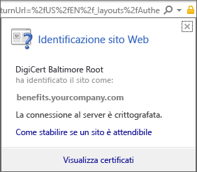
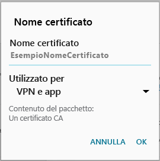

# Il dispositivo Android non ha un certificato richiesto dal supporto tecnico dell'azienda

Se il dispositivo non è registrato in Intune e non ha un determinato certificato richiesto dal supporto tecnico dell'azienda, non sarà possibile accedere all'app Portale aziendale dal dispositivo. Quando si tenta di accedere, verrà visualizzato il messaggio seguente:

Per risolvere questo problema e ottenere il certificato richiesto, è necessario eseguire due passaggi principali:

- Identificare il certificato mancante cercando in un PC della società o dell'istituto di istruzione.
- Usare il dispositivo per scaricare il certificato mancante da Internet.

## Identificare il certificato mancante cercando in un PC della società o dell'istituto di istruzione

1. In un PC aprire Internet Explorer. Se non si ha un PC da usare per questo scopo, contattare il supporto tecnico dell'azienda. Per le informazioni di contatto del supporto tecnico dell'azienda, vedere il [sito Web del portale aziendale](https://go.microsoft.com/fwlink/?linkid=2010980).

2. Passare al [sito Web del portale aziendale](https://go.microsoft.com/fwlink/?linkid=2010980) ed eseguire l'accesso con le credenziali della società o dell'istituto di istruzione.

3. All'estrema destra della barra degli indirizzi del browser, fare clic sul simbolo simile a un lucchetto, come illustrato di seguito.

    

    Se non viene visualizzato il simbolo di un lucchetto, interrompere la procedura e contattare il supporto tecnico dell'azienda. Il lucchetto indica che l'accesso viene eseguito in modalità sicura. Se quindi non si visualizza tale simbolo, è consigliabile non procedere.

4. Fare clic su **Visualizza certificati**.

    

5. Nella finestra di dialogo **Certificato** fare clic sulla scheda **Percorso certificazione** e identificare il certificato che è necessario ottenere da Internet. Il nome del certificato necessario si trova nello stesso percorso di quello evidenziato nella schermata di esempio precedente.

## Scaricare e installare il certificato mancante nel dispositivo mobile Android

1. Con un motore di ricerca come Bing o Google, cercare il nome del certificato mancante identificato nella sezione precedente. Il certificato può avere varie "estensioni", ad esempio "crt" o "pem" e così via.

2. Scaricare il certificato radice dal sito Web.

3. Dopo aver scaricato il certificato, trascinare verso il basso dalla parte superiore del dispositivo per aprire le notifiche e quindi toccare il nome del certificato nell'elenco delle notifiche.

4. Nella finestra di dialogo **Name the Certificate** (Denominare il certificato) illustrata nella schermata seguente, accettare il nome predefinito.

5. Verificare che l'uso delle **credenziali** sia impostato su **VPN e app**, quindi fare clic su **OK**.

    

6. Chiudere l'app Portale aziendale.

7. Aprire nuovamente l'app Portale aziendale. Accedere all'app Portale aziendale. Per assistenza, contattare il supporto tecnico dell'azienda.

Se viene visualizzato di nuovo il messaggio "Certificato mancante" illustrato in precedenza ed è già stata eseguita la relativa procedura, è probabile che sia necessario installare un altro certificato con l'assistenza del supporto tecnico dell'azienda. Per indicazioni sull'uso delle informazioni di contatto disponibili nel [sito Web del portale aziendale](https://go.microsoft.com/fwlink/?linkid=2010980), contattare il supporto tecnico dell'azienda.
